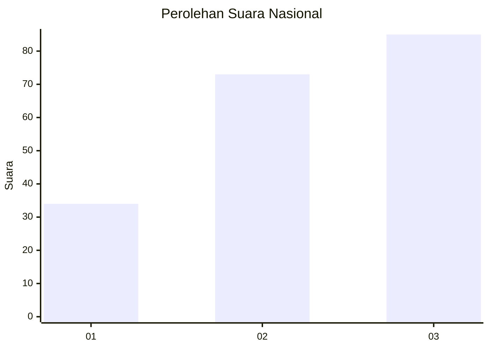
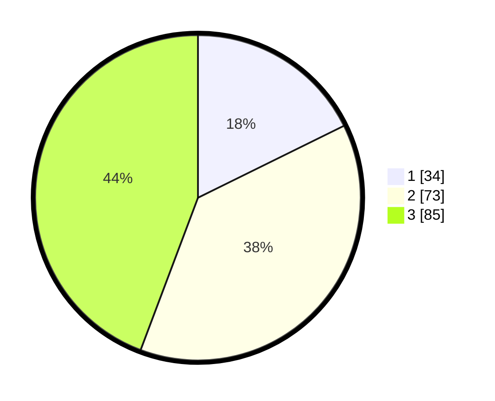

# Hasil

## Grafik

## Tabel

| No. | Nama Paslon    | Suara | Suara (raw) | Persentase |
|:--- |:-------------- | -----:| -----------:| ----------:|
| 1   | ANIES MUHAIMIN | 34    | [34][p-1]   | 17,71      |
| 2   | PRABOWO GIBRAN | 73    | [73][p-2]   | 38,02      |
| 3   | GANJAR MAHFUD  | 85    | [85][p-3]   | 44,27      |

[p-1]: https://github.com/gigit-pemilu/pemilu-2024/blob/main/pilpres/hitung-suara/sub/16-sumatera-selatan/sub/71-kota-palembang/sub/05-ilir-timur-satu/sub/1009-dua-puluh-ilir-satu/sub/020-tps/sub/paslon-1.txt
[p-2]: https://github.com/gigit-pemilu/pemilu-2024/blob/main/pilpres/hitung-suara/sub/16-sumatera-selatan/sub/71-kota-palembang/sub/05-ilir-timur-satu/sub/1009-dua-puluh-ilir-satu/sub/020-tps/sub/paslon-2.txt
[p-3]: https://github.com/gigit-pemilu/pemilu-2024/blob/main/pilpres/hitung-suara/sub/16-sumatera-selatan/sub/71-kota-palembang/sub/05-ilir-timur-satu/sub/1009-dua-puluh-ilir-satu/sub/020-tps/sub/paslon-3.txt

## Foto C Plano

https://sirekap-obj-formc.kpu.go.id/8757/pemilu/ppwp/16/71/05/10/09/1671051009020-20240215-021507--f13f59c0-4963-4043-ad7d-d856ef9354e4.jpg

https://sirekap-obj-formc.kpu.go.id/8757/pemilu/ppwp/16/71/05/10/09/1671051009020-20240215-021539--b7b9b314-6492-41d6-995f-8b7e1fb3e727.jpg

https://sirekap-obj-formc.kpu.go.id/8757/pemilu/ppwp/16/71/05/10/09/1671051009020-20240215-021614--c79bb97a-c7ef-4788-bcc6-fb6c8ab2bbac.jpg

## Metadata

| Key        | Value               |
| ---------- | ------------------- |
| Time Stamp | 2024-02-24 22:31:28 |

