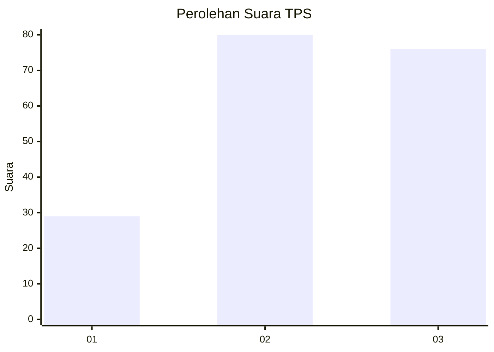
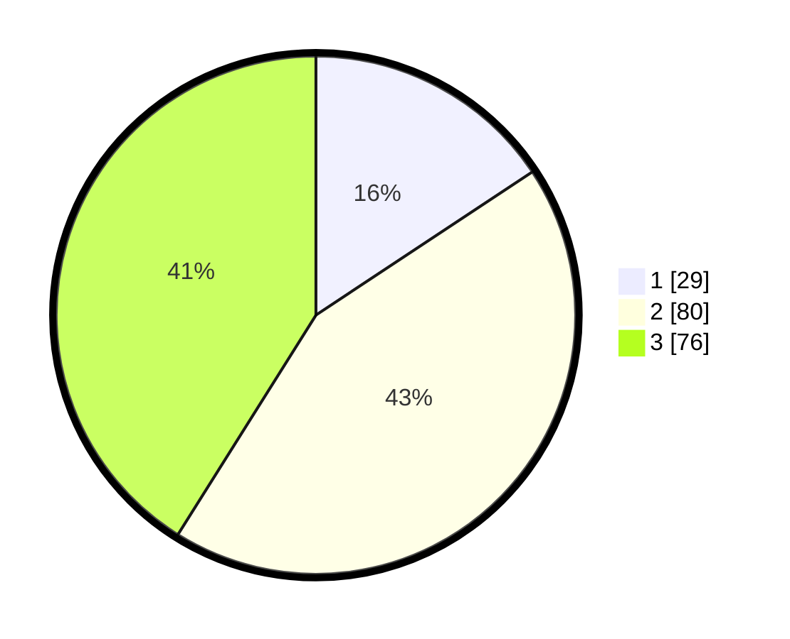

# Hasil

## Grafik

## Tabel

| No. | Nama Paslon    | Suara | Suara (raw) | Persentase |
|:--- |:-------------- | -----:| -----------:| ----------:|
| 1   | ANIES MUHAIMIN | 29    | [29][p-1]   | 15,68      |
| 2   | PRABOWO GIBRAN | 80    | [80][p-2]   | 43,24      |
| 3   | GANJAR MAHFUD  | 76    | [76][p-3]   | 41,08      |

[p-1]: https://github.com/gigit-pemilu/pemilu-2024-16-sumatera-selatan/blob/main/pilpres/hitung-suara/sub/16-sumatera-selatan/sub/71-kota-palembang/sub/05-ilir-timur-satu/sub/1011-kepandean-baru/sub/002-tps/sub/paslon-1.txt
[p-2]: https://github.com/gigit-pemilu/pemilu-2024-16-sumatera-selatan/blob/main/pilpres/hitung-suara/sub/16-sumatera-selatan/sub/71-kota-palembang/sub/05-ilir-timur-satu/sub/1011-kepandean-baru/sub/002-tps/sub/paslon-2.txt
[p-3]: https://github.com/gigit-pemilu/pemilu-2024-16-sumatera-selatan/blob/main/pilpres/hitung-suara/sub/16-sumatera-selatan/sub/71-kota-palembang/sub/05-ilir-timur-satu/sub/1011-kepandean-baru/sub/002-tps/sub/paslon-3.txt

## Foto C Plano

https://sirekap-obj-formc.kpu.go.id/dc82/pemilu/ppwp/16/71/05/10/11/1671051011002-20240215-010659--f8dc9e6c-6b4b-4635-bfc1-c18469277903.jpg

https://sirekap-obj-formc.kpu.go.id/dc82/pemilu/ppwp/16/71/05/10/11/1671051011002-20240215-010805--1492a292-4090-42f5-8aac-602af812543b.jpg

https://sirekap-obj-formc.kpu.go.id/dc82/pemilu/ppwp/16/71/05/10/11/1671051011002-20240215-010942--44e578ed-f1dc-4e08-b41b-3fe2283ce1bf.jpg

## Metadata

| Key        | Value               |
| ---------- | ------------------- |
| Time Stamp | 2024-02-25 15:00:00 |

