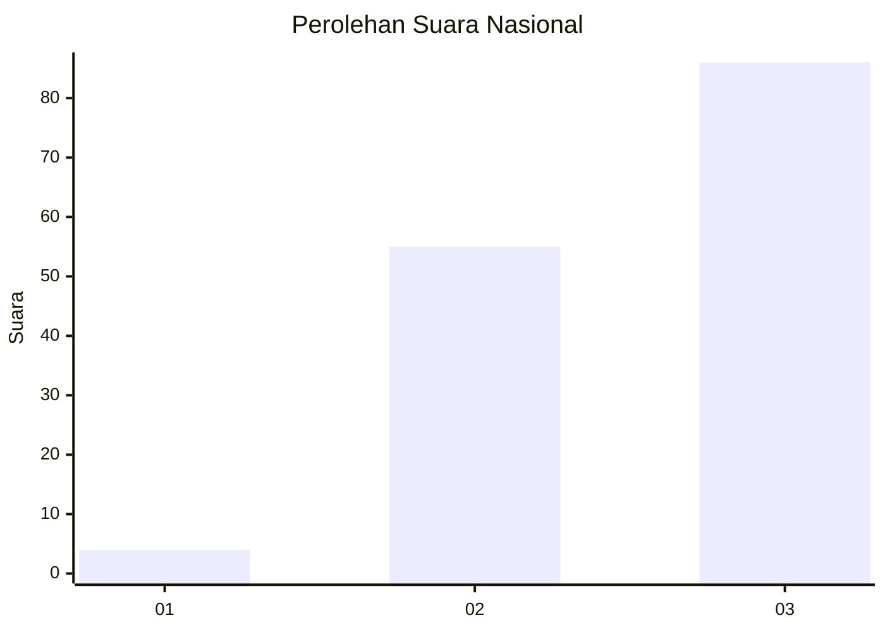
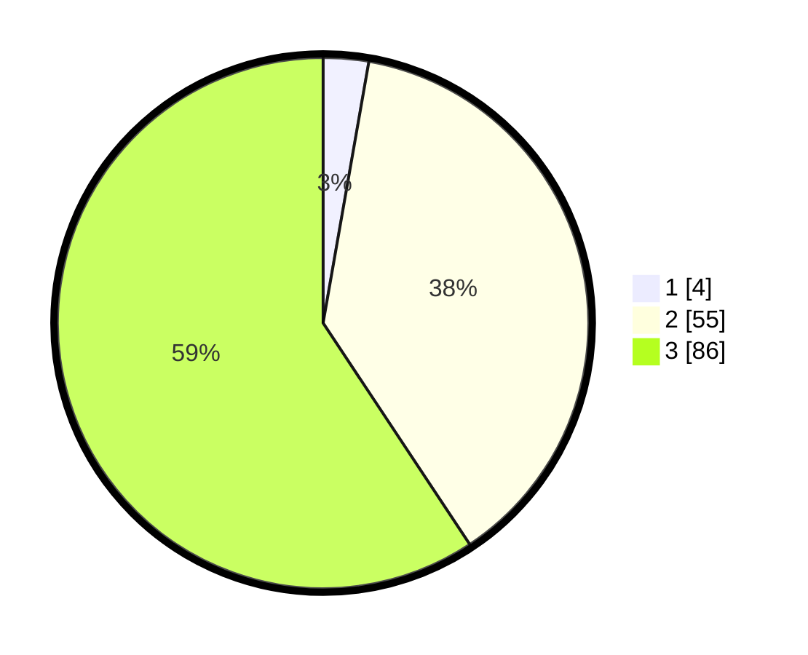

# Hasil

## Grafik

## Tabel

| No. | Nama Paslon    | Suara | Suara (raw) | Persentase |
|:--- |:-------------- | -----:| -----------:| ----------:|
| 1   | ANIES MUHAIMIN | 4     | [4][p-1]    | 2,76       |
| 2   | PRABOWO GIBRAN | 55    | [55][p-2]   | 37,93      |
| 3   | GANJAR MAHFUD  | 86    | [86][p-3]   | 59,31      |

[p-1]: https://github.com/gigit-pemilu/pemilu-2024/blob/main/pilpres/hitung-suara/sub/16-sumatera-selatan/sub/71-kota-palembang/sub/05-ilir-timur-satu/sub/1011-kepandean-baru/sub/003-tps/sub/paslon-1.txt
[p-2]: https://github.com/gigit-pemilu/pemilu-2024/blob/main/pilpres/hitung-suara/sub/16-sumatera-selatan/sub/71-kota-palembang/sub/05-ilir-timur-satu/sub/1011-kepandean-baru/sub/003-tps/sub/paslon-2.txt
[p-3]: https://github.com/gigit-pemilu/pemilu-2024/blob/main/pilpres/hitung-suara/sub/16-sumatera-selatan/sub/71-kota-palembang/sub/05-ilir-timur-satu/sub/1011-kepandean-baru/sub/003-tps/sub/paslon-3.txt

## Foto C Plano

https://sirekap-obj-formc.kpu.go.id/90da/pemilu/ppwp/16/71/05/10/11/1671051011003-20240214-211818--3cc1fbad-cf22-450f-a6a0-cacad93d8109.jpg

https://sirekap-obj-formc.kpu.go.id/90da/pemilu/ppwp/16/71/05/10/11/1671051011003-20240214-211823--a74ae9b0-50f4-48ad-8ea4-f257eab25c63.jpg

https://sirekap-obj-formc.kpu.go.id/90da/pemilu/ppwp/16/71/05/10/11/1671051011003-20240214-211828--7e8df8e2-18e6-4d90-8353-bc40aed55ef0.jpg

## Metadata

| Key        | Value               |
| ---------- | ------------------- |
| Time Stamp | 2024-02-15 12:00:28 |

