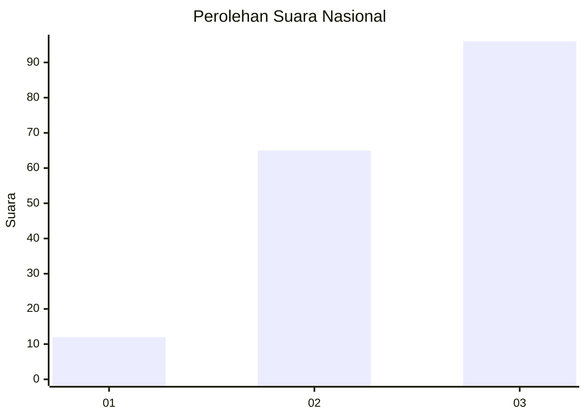
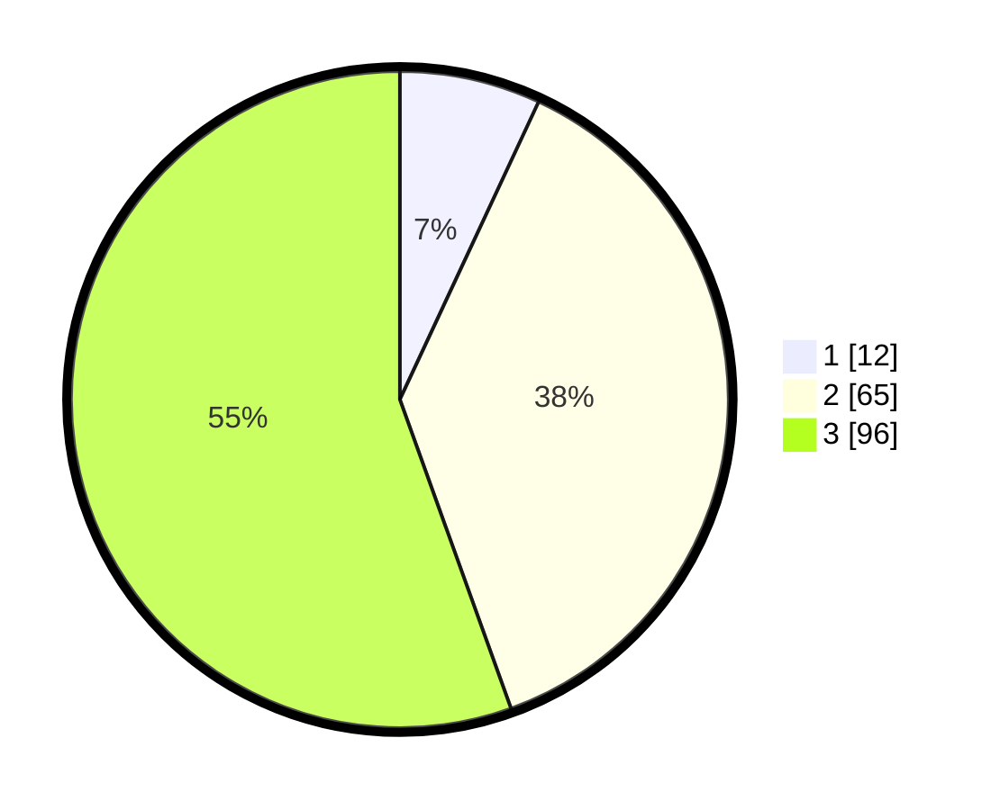

# Hasil

## Grafik

## Tabel

| No. | Nama Paslon    | Suara | Suara (raw) | Persentase |
|:--- |:-------------- | -----:| -----------:| ----------:|
| 1   | ANIES MUHAIMIN | 12    | [12][p-1]   | 6,94       |
| 2   | PRABOWO GIBRAN | 65    | [65][p-2]   | 37,57      |
| 3   | GANJAR MAHFUD  | 96    | [96][p-3]   | 55,49      |

[p-1]: https://github.com/gigit-pemilu/pemilu-2024/blob/main/pilpres/hitung-suara/sub/16-sumatera-selatan/sub/71-kota-palembang/sub/05-ilir-timur-satu/sub/1011-kepandean-baru/sub/005-tps/sub/paslon-1.txt
[p-2]: https://github.com/gigit-pemilu/pemilu-2024/blob/main/pilpres/hitung-suara/sub/16-sumatera-selatan/sub/71-kota-palembang/sub/05-ilir-timur-satu/sub/1011-kepandean-baru/sub/005-tps/sub/paslon-2.txt
[p-3]: https://github.com/gigit-pemilu/pemilu-2024/blob/main/pilpres/hitung-suara/sub/16-sumatera-selatan/sub/71-kota-palembang/sub/05-ilir-timur-satu/sub/1011-kepandean-baru/sub/005-tps/sub/paslon-3.txt

## Foto C Plano

https://sirekap-obj-formc.kpu.go.id/febf/pemilu/ppwp/16/71/05/10/11/1671051011005-20240215-012407--4dc555db-68f5-4efa-aec1-fb02a944cef7.jpg

https://sirekap-obj-formc.kpu.go.id/febf/pemilu/ppwp/16/71/05/10/11/1671051011005-20240215-012417--76f190a2-0d54-4482-9a10-08fee928725e.jpg

https://sirekap-obj-formc.kpu.go.id/febf/pemilu/ppwp/16/71/05/10/11/1671051011005-20240215-011547--e7a3cca2-8dfb-4139-bad1-ce62352f5aed.jpg

## Metadata

| Key        | Value               |
| ---------- | ------------------- |
| Time Stamp | 2024-02-25 12:00:00 |

