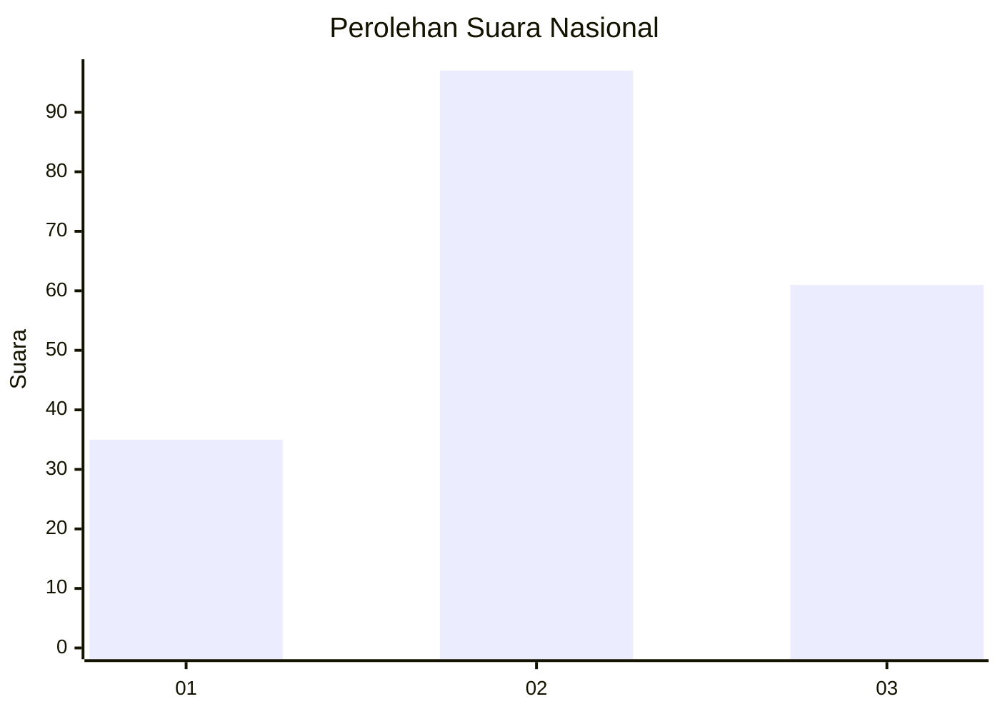
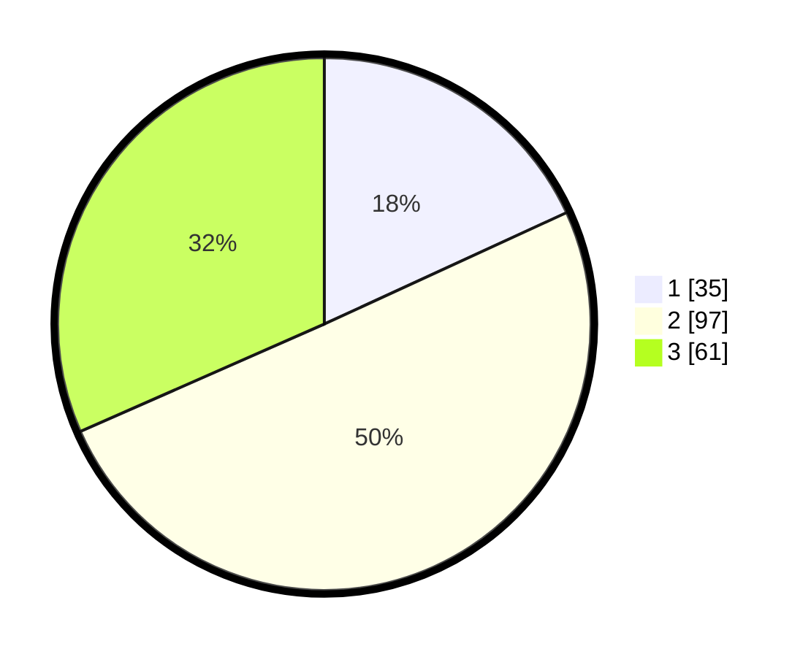

# Hasil

## Grafik

## Tabel

| No. | Nama Paslon    | Suara | Suara (raw) | Persentase |
|:--- |:-------------- | -----:| -----------:| ----------:|
| 1   | ANIES MUHAIMIN | 35    | [35][p-1]   | 18,13      |
| 2   | PRABOWO GIBRAN | 97    | [97][p-2]   | 50,26      |
| 3   | GANJAR MAHFUD  | 61    | [61][p-3]   | 31,61      |

[p-1]: https://github.com/gigit-pemilu/pemilu-2024/blob/main/pilpres/hitung-suara/sub/16-sumatera-selatan/sub/71-kota-palembang/sub/06-ilir-timur-dua/sub/1005-lima-ilir/sub/001-tps/sub/paslon-1.txt
[p-2]: https://github.com/gigit-pemilu/pemilu-2024/blob/main/pilpres/hitung-suara/sub/16-sumatera-selatan/sub/71-kota-palembang/sub/06-ilir-timur-dua/sub/1005-lima-ilir/sub/001-tps/sub/paslon-2.txt
[p-3]: https://github.com/gigit-pemilu/pemilu-2024/blob/main/pilpres/hitung-suara/sub/16-sumatera-selatan/sub/71-kota-palembang/sub/06-ilir-timur-dua/sub/1005-lima-ilir/sub/001-tps/sub/paslon-3.txt

## Foto C Plano

https://sirekap-obj-formc.kpu.go.id/f220/pemilu/ppwp/16/71/06/10/05/1671061005001-20240223-140556--c2bb64c0-157a-488f-85f4-43a176b41551.jpg

https://sirekap-obj-formc.kpu.go.id/f220/pemilu/ppwp/16/71/06/10/05/1671061005001-20240223-140523--0a58678d-b9b1-4770-9cbf-085ab4e10209.jpg

https://sirekap-obj-formc.kpu.go.id/f220/pemilu/ppwp/16/71/06/10/05/1671061005001-20240223-140627--a6ffa1cc-7aad-42bd-a5ea-cfa1e6683e07.jpg

## Metadata

| Key        | Value               |
| ---------- | ------------------- |
| Time Stamp | 2024-02-24 22:31:28 |

