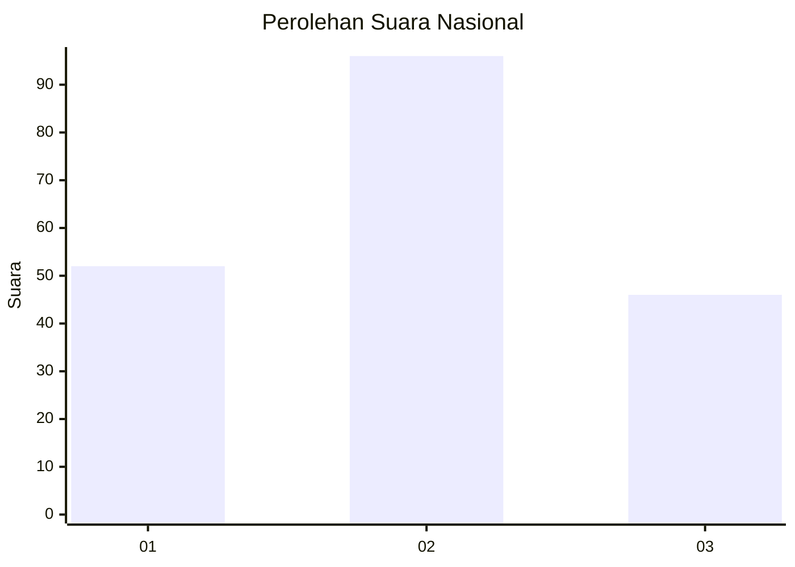
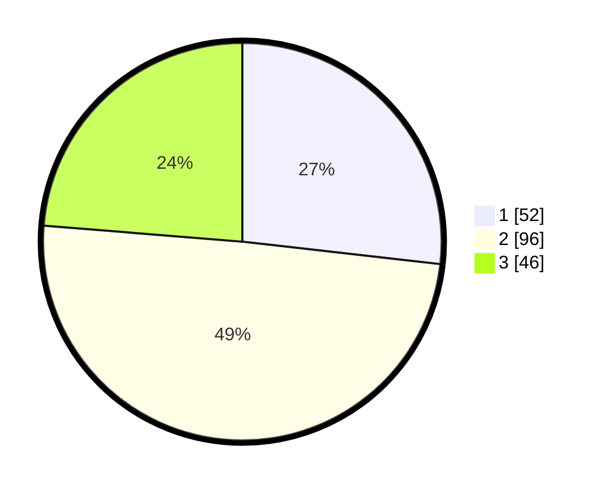

# Hasil

## Grafik

## Tabel

| No. | Nama Paslon    | Suara | Suara (raw) | Persentase |
|:--- |:-------------- | -----:| -----------:| ----------:|
| 1   | ANIES MUHAIMIN | 52    | [52][p-1]   | 26,80      |
| 2   | PRABOWO GIBRAN | 96    | [96][p-2]   | 49,48      |
| 3   | GANJAR MAHFUD  | 46    | [46][p-3]   | 23,71      |

[p-1]: https://github.com/gigit-pemilu/pemilu-2024/blob/main/pilpres/hitung-suara/sub/16-sumatera-selatan/sub/71-kota-palembang/sub/06-ilir-timur-dua/sub/1005-lima-ilir/sub/002-tps/sub/paslon-1.txt
[p-2]: https://github.com/gigit-pemilu/pemilu-2024/blob/main/pilpres/hitung-suara/sub/16-sumatera-selatan/sub/71-kota-palembang/sub/06-ilir-timur-dua/sub/1005-lima-ilir/sub/002-tps/sub/paslon-2.txt
[p-3]: https://github.com/gigit-pemilu/pemilu-2024/blob/main/pilpres/hitung-suara/sub/16-sumatera-selatan/sub/71-kota-palembang/sub/06-ilir-timur-dua/sub/1005-lima-ilir/sub/002-tps/sub/paslon-3.txt

## Foto C Plano

https://sirekap-obj-formc.kpu.go.id/a452/pemilu/ppwp/16/71/06/10/05/1671061005002-20240223-140832--c39ebb11-b4a4-460e-9488-1fb7498053ea.jpg

https://sirekap-obj-formc.kpu.go.id/a452/pemilu/ppwp/16/71/06/10/05/1671061005002-20240223-140924--46319697-d924-415f-a10e-f74dd7321b60.jpg

https://sirekap-obj-formc.kpu.go.id/a452/pemilu/ppwp/16/71/06/10/05/1671061005002-20240223-140959--35999385-4259-493d-b700-68fad0f21ab7.jpg

## Metadata

| Key        | Value               |
| ---------- | ------------------- |
| Time Stamp | 2024-02-25 17:00:00 |

