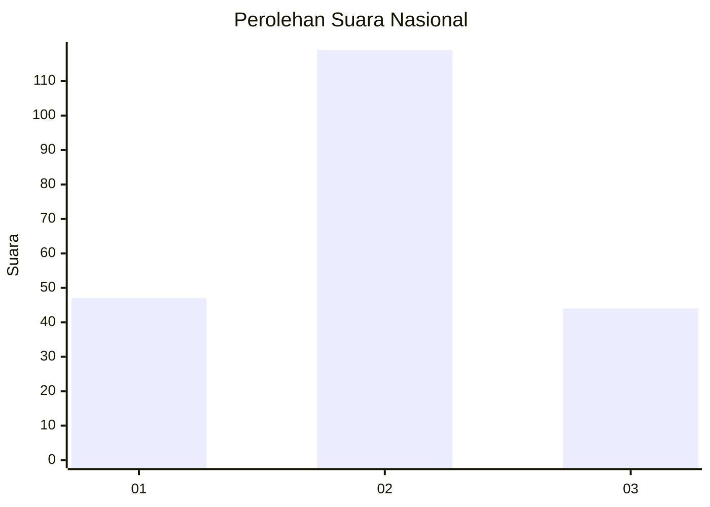
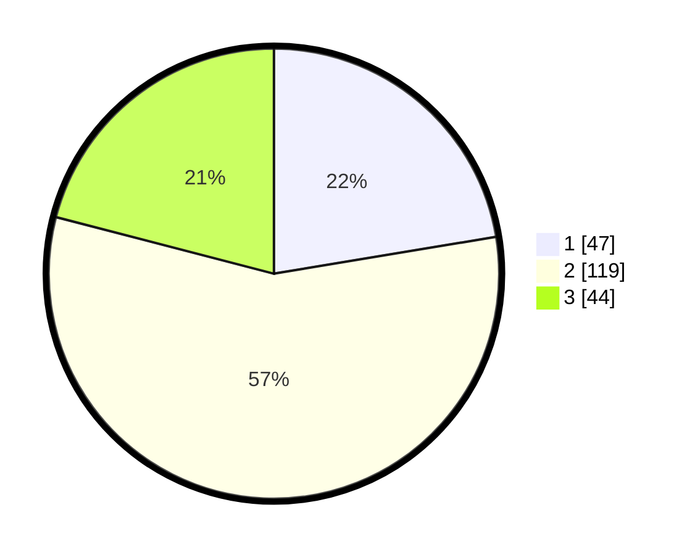

# Hasil

## Grafik

## Tabel

| No. | Nama Paslon    | Suara | Suara (raw) | Persentase |
|:--- |:-------------- | -----:| -----------:| ----------:|
| 1   | ANIES MUHAIMIN | 47    | [47][p-1]   | 22,38      |
| 2   | PRABOWO GIBRAN | 119   | [119][p-2]  | 56,67      |
| 3   | GANJAR MAHFUD  | 44    | [44][p-3]   | 20,95      |

[p-1]: https://github.com/gigit-pemilu/pemilu-2024/blob/main/pilpres/hitung-suara/sub/16-sumatera-selatan/sub/71-kota-palembang/sub/06-ilir-timur-dua/sub/1005-lima-ilir/sub/003-tps/sub/paslon-1.txt
[p-2]: https://github.com/gigit-pemilu/pemilu-2024/blob/main/pilpres/hitung-suara/sub/16-sumatera-selatan/sub/71-kota-palembang/sub/06-ilir-timur-dua/sub/1005-lima-ilir/sub/003-tps/sub/paslon-2.txt
[p-3]: https://github.com/gigit-pemilu/pemilu-2024/blob/main/pilpres/hitung-suara/sub/16-sumatera-selatan/sub/71-kota-palembang/sub/06-ilir-timur-dua/sub/1005-lima-ilir/sub/003-tps/sub/paslon-3.txt

## Foto C Plano

https://sirekap-obj-formc.kpu.go.id/bf22/pemilu/ppwp/16/71/06/10/05/1671061005003-20240223-141118--b3604789-ff4f-4a6e-9b62-4acc7b8e5ac1.jpg

https://sirekap-obj-formc.kpu.go.id/bf22/pemilu/ppwp/16/71/06/10/05/1671061005003-20240223-141136--8a1d888d-4fa2-42f0-8b2c-8bc5b8735f49.jpg

https://sirekap-obj-formc.kpu.go.id/bf22/pemilu/ppwp/16/71/06/10/05/1671061005003-20240223-141152--f7caabe1-73e7-4958-803c-a08467e07cd9.jpg

## Metadata

| Key        | Value               |
| ---------- | ------------------- |
| Time Stamp | 2024-02-25 23:00:00 |

