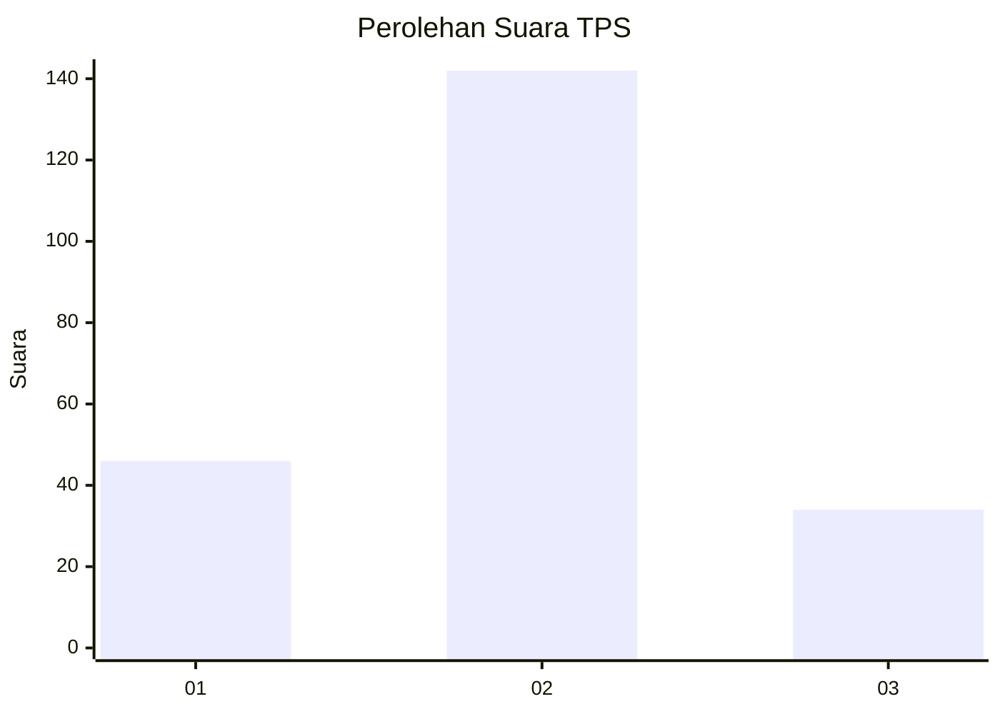
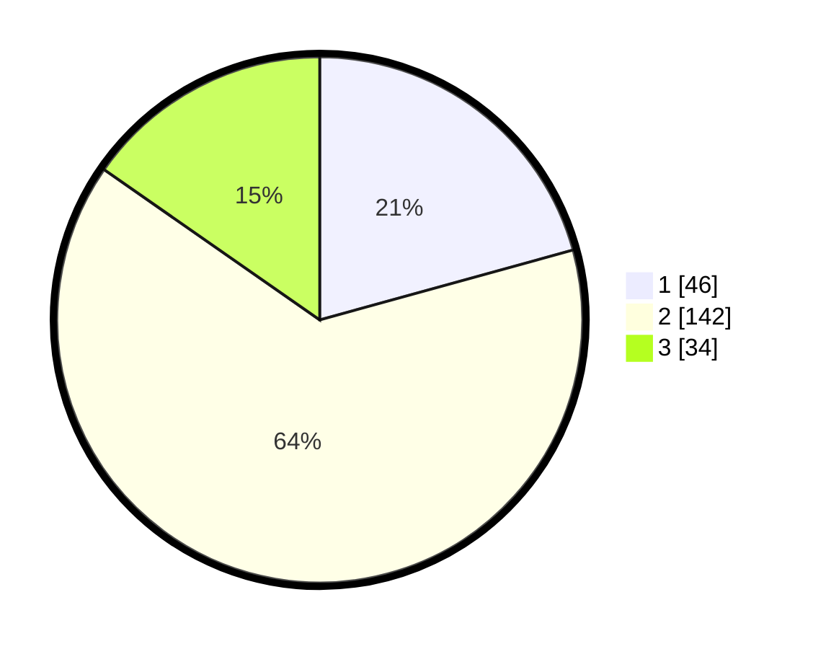

# Hasil

## Grafik

## Tabel

| No. | Nama Paslon    | Suara | Suara (raw) | Persentase |
|:--- |:-------------- | -----:| -----------:| ----------:|
| 1   | ANIES MUHAIMIN | 46    | [46][p-1]   | 20,72      |
| 2   | PRABOWO GIBRAN | 142   | [142][p-2]  | 63,96      |
| 3   | GANJAR MAHFUD  | 34    | [34][p-3]   | 15,32      |

[p-1]: https://github.com/gigit-pemilu/pemilu-2024-16-sumatera-selatan/blob/main/pilpres/hitung-suara/sub/16-sumatera-selatan/sub/71-kota-palembang/sub/06-ilir-timur-dua/sub/1005-lima-ilir/sub/004-tps/sub/paslon-1.txt
[p-2]: https://github.com/gigit-pemilu/pemilu-2024-16-sumatera-selatan/blob/main/pilpres/hitung-suara/sub/16-sumatera-selatan/sub/71-kota-palembang/sub/06-ilir-timur-dua/sub/1005-lima-ilir/sub/004-tps/sub/paslon-2.txt
[p-3]: https://github.com/gigit-pemilu/pemilu-2024-16-sumatera-selatan/blob/main/pilpres/hitung-suara/sub/16-sumatera-selatan/sub/71-kota-palembang/sub/06-ilir-timur-dua/sub/1005-lima-ilir/sub/004-tps/sub/paslon-3.txt

## Foto C Plano

https://sirekap-obj-formc.kpu.go.id/e2eb/pemilu/ppwp/16/71/06/10/05/1671061005004-20240223-155359--46665c57-7502-40e5-b2c1-9d1572be05dc.jpg

https://sirekap-obj-formc.kpu.go.id/e2eb/pemilu/ppwp/16/71/06/10/05/1671061005004-20240223-141302--1aec2ca8-23ee-4020-b7df-a4b69091302a.jpg

https://sirekap-obj-formc.kpu.go.id/e2eb/pemilu/ppwp/16/71/06/10/05/1671061005004-20240223-141333--cf555c57-bcab-411c-9845-bdf0d9ecc4ea.jpg

## Metadata

| Key        | Value               |
| ---------- | ------------------- |
| Time Stamp | 2024-02-25 12:00:00 |

