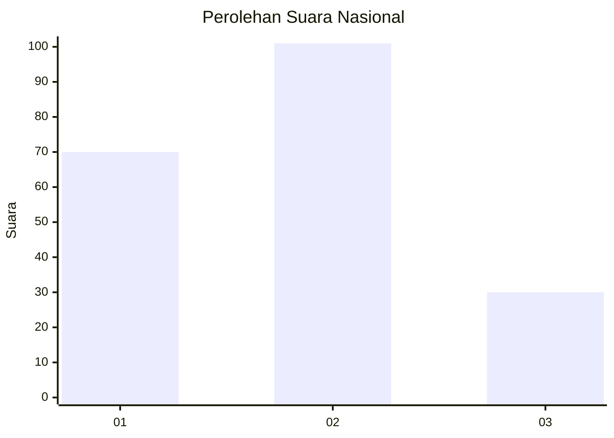
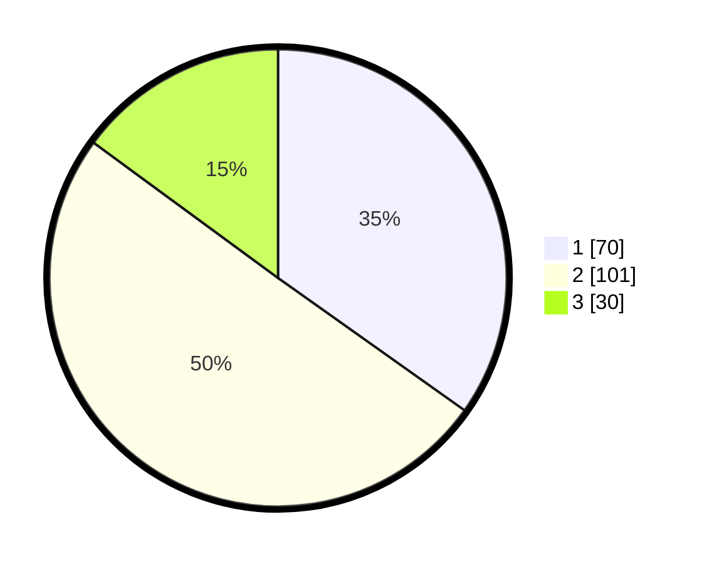

# Hasil

## Grafik

## Tabel

| No. | Nama Paslon    | Suara | Suara (raw) | Persentase |
|:--- |:-------------- | -----:| -----------:| ----------:|
| 1   | ANIES MUHAIMIN | 70    | [70][p-1]   | 34,83      |
| 2   | PRABOWO GIBRAN | 101   | [101][p-2]  | 50,25      |
| 3   | GANJAR MAHFUD  | 30    | [30][p-3]   | 14,93      |

[p-1]: https://github.com/gigit-pemilu/pemilu-2024/blob/main/pilpres/hitung-suara/sub/16-sumatera-selatan/sub/71-kota-palembang/sub/06-ilir-timur-dua/sub/1005-lima-ilir/sub/005-tps/sub/paslon-1.txt
[p-2]: https://github.com/gigit-pemilu/pemilu-2024/blob/main/pilpres/hitung-suara/sub/16-sumatera-selatan/sub/71-kota-palembang/sub/06-ilir-timur-dua/sub/1005-lima-ilir/sub/005-tps/sub/paslon-2.txt
[p-3]: https://github.com/gigit-pemilu/pemilu-2024/blob/main/pilpres/hitung-suara/sub/16-sumatera-selatan/sub/71-kota-palembang/sub/06-ilir-timur-dua/sub/1005-lima-ilir/sub/005-tps/sub/paslon-3.txt

## Foto C Plano

https://sirekap-obj-formc.kpu.go.id/2c66/pemilu/ppwp/16/71/06/10/05/1671061005005-20240223-141413--46ce495d-232e-444e-864b-a3b8eedf5538.jpg

https://sirekap-obj-formc.kpu.go.id/2c66/pemilu/ppwp/16/71/06/10/05/1671061005005-20240223-141427--dd3bd668-f555-4642-a49c-67cc9830e7ae.jpg

https://sirekap-obj-formc.kpu.go.id/2c66/pemilu/ppwp/16/71/06/10/05/1671061005005-20240223-141442--7b92ae21-655d-49bb-abc5-95c8b16cea1e.jpg

## Metadata

| Key        | Value               |
| ---------- | ------------------- |
| Time Stamp | 2024-02-26 13:00:00 |

