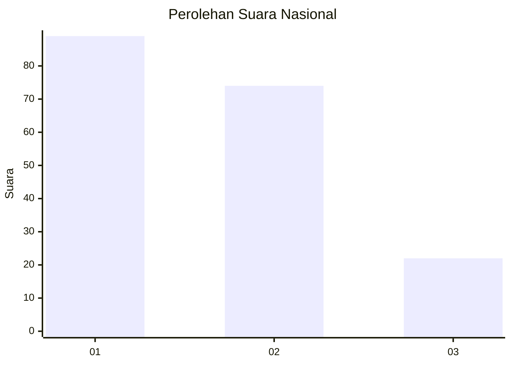
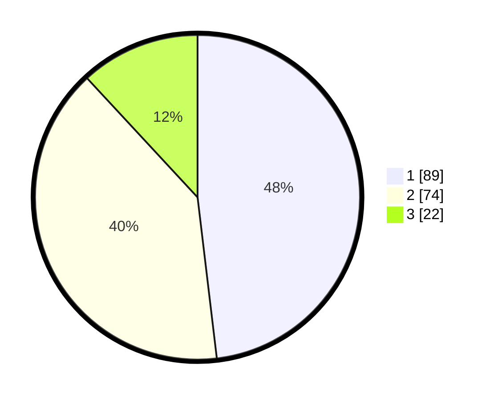

# Hasil

## Grafik

## Tabel

| No. | Nama Paslon    | Suara | Suara (raw) | Persentase |
|:--- |:-------------- | -----:| -----------:| ----------:|
| 1   | ANIES MUHAIMIN | 89    | [89][p-1]   | 48,11      |
| 2   | PRABOWO GIBRAN | 74    | [74][p-2]   | 40,00      |
| 3   | GANJAR MAHFUD  | 22    | [22][p-3]   | 11,89      |

[p-1]: https://github.com/gigit-pemilu/pemilu-2024/blob/main/pilpres/hitung-suara/sub/16-sumatera-selatan/sub/71-kota-palembang/sub/06-ilir-timur-dua/sub/1005-lima-ilir/sub/009-tps/sub/paslon-1.txt
[p-2]: https://github.com/gigit-pemilu/pemilu-2024/blob/main/pilpres/hitung-suara/sub/16-sumatera-selatan/sub/71-kota-palembang/sub/06-ilir-timur-dua/sub/1005-lima-ilir/sub/009-tps/sub/paslon-2.txt
[p-3]: https://github.com/gigit-pemilu/pemilu-2024/blob/main/pilpres/hitung-suara/sub/16-sumatera-selatan/sub/71-kota-palembang/sub/06-ilir-timur-dua/sub/1005-lima-ilir/sub/009-tps/sub/paslon-3.txt

## Foto C Plano

https://sirekap-obj-formc.kpu.go.id/e183/pemilu/ppwp/16/71/06/10/05/1671061005009-20240223-142139--8a76d0fa-a779-45ac-bd76-09e2df28be2b.jpg

https://sirekap-obj-formc.kpu.go.id/e183/pemilu/ppwp/16/71/06/10/05/1671061005009-20240223-142153--bc95e083-435b-4586-b449-9d45d0c231df.jpg

https://sirekap-obj-formc.kpu.go.id/e183/pemilu/ppwp/16/71/06/10/05/1671061005009-20240223-142207--89c9fa62-d557-49ae-87d1-b628a967adf9.jpg

## Metadata

| Key        | Value               |
| ---------- | ------------------- |
| Time Stamp | 2024-02-25 11:00:00 |

