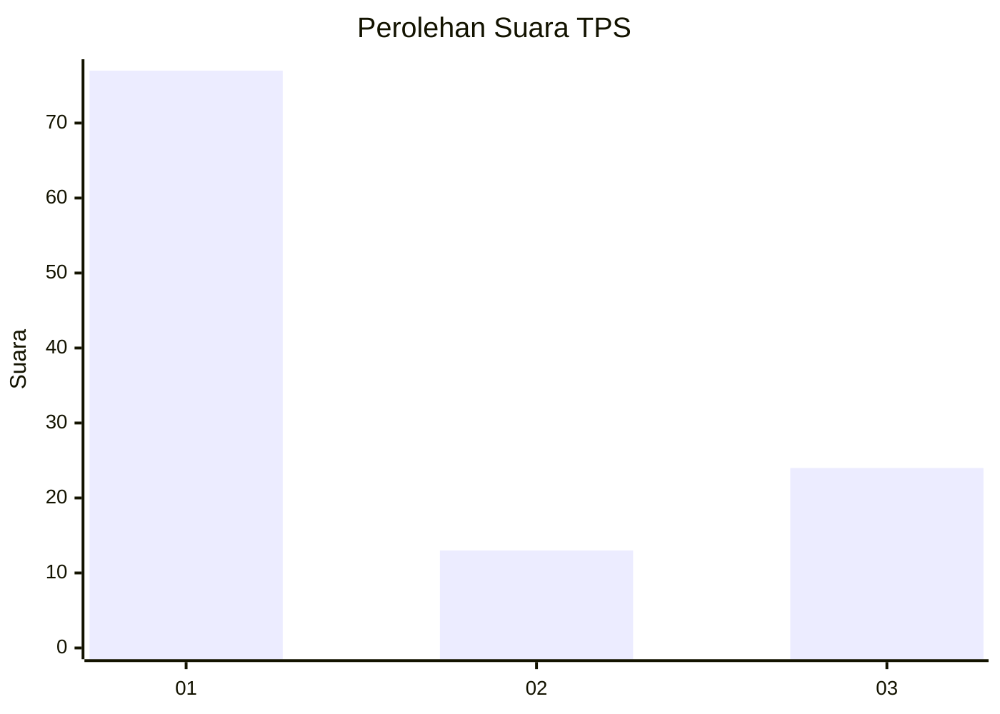
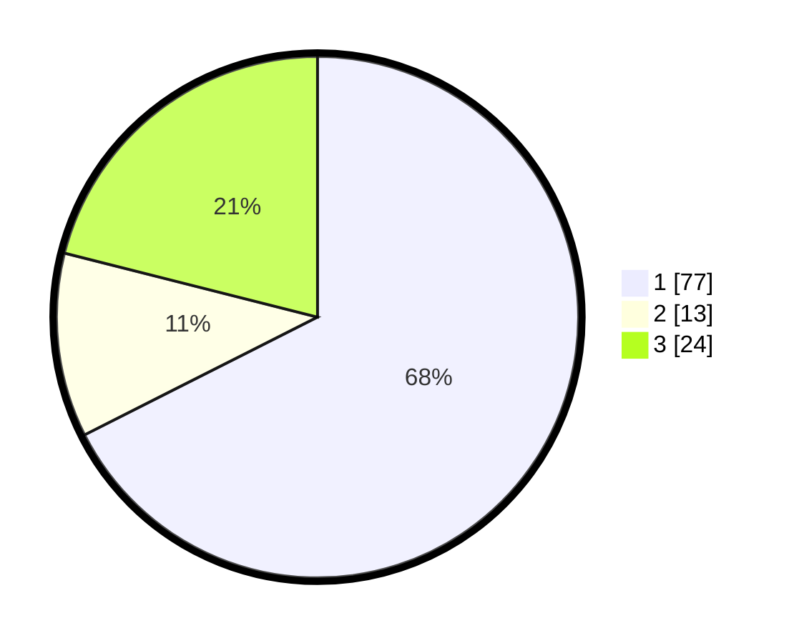

# Hasil

## Grafik

## Tabel

| No. | Nama Paslon    | Suara | Suara (raw) | Persentase |
|:--- |:-------------- | -----:| -----------:| ----------:|
| 1   | ANIES MUHAIMIN | 77    | [77][p-1]   | 67,54      |
| 2   | PRABOWO GIBRAN | 13    | [13][p-2]   | 11,40      |
| 3   | GANJAR MAHFUD  | 24    | [24][p-3]   | 21,05      |

[p-1]: https://github.com/gigit-pemilu/pemilu-2024-16-sumatera-selatan/blob/main/pilpres/hitung-suara/sub/16-sumatera-selatan/sub/71-kota-palembang/sub/06-ilir-timur-dua/sub/1005-lima-ilir/sub/010-tps/sub/paslon-1.txt
[p-2]: https://github.com/gigit-pemilu/pemilu-2024-16-sumatera-selatan/blob/main/pilpres/hitung-suara/sub/16-sumatera-selatan/sub/71-kota-palembang/sub/06-ilir-timur-dua/sub/1005-lima-ilir/sub/010-tps/sub/paslon-2.txt
[p-3]: https://github.com/gigit-pemilu/pemilu-2024-16-sumatera-selatan/blob/main/pilpres/hitung-suara/sub/16-sumatera-selatan/sub/71-kota-palembang/sub/06-ilir-timur-dua/sub/1005-lima-ilir/sub/010-tps/sub/paslon-3.txt

## Foto C Plano

https://sirekap-obj-formc.kpu.go.id/773e/pemilu/ppwp/16/71/06/10/05/1671061005010-20240223-142327--712ed95e-bba3-4e9a-a8bf-d79a25f79ae5.jpg

https://sirekap-obj-formc.kpu.go.id/773e/pemilu/ppwp/16/71/06/10/05/1671061005010-20240223-142344--102eb719-3fe1-466e-9e6f-8ee4c29e2b76.jpg

https://sirekap-obj-formc.kpu.go.id/773e/pemilu/ppwp/16/71/06/10/05/1671061005010-20240223-142405--dfc7dfcf-e370-4979-a6d4-66867bd0bba6.jpg

## Metadata

| Key        | Value               |
| ---------- | ------------------- |
| Time Stamp | 2024-02-26 11:00:00 |

