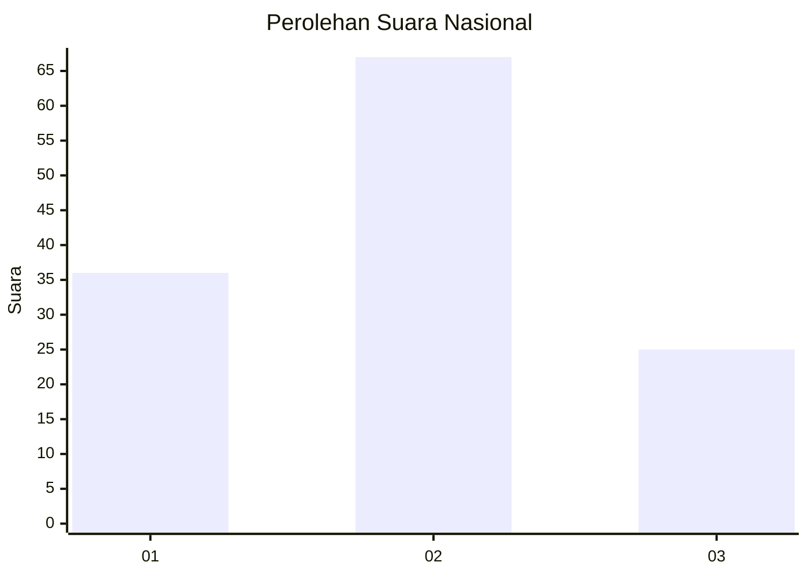
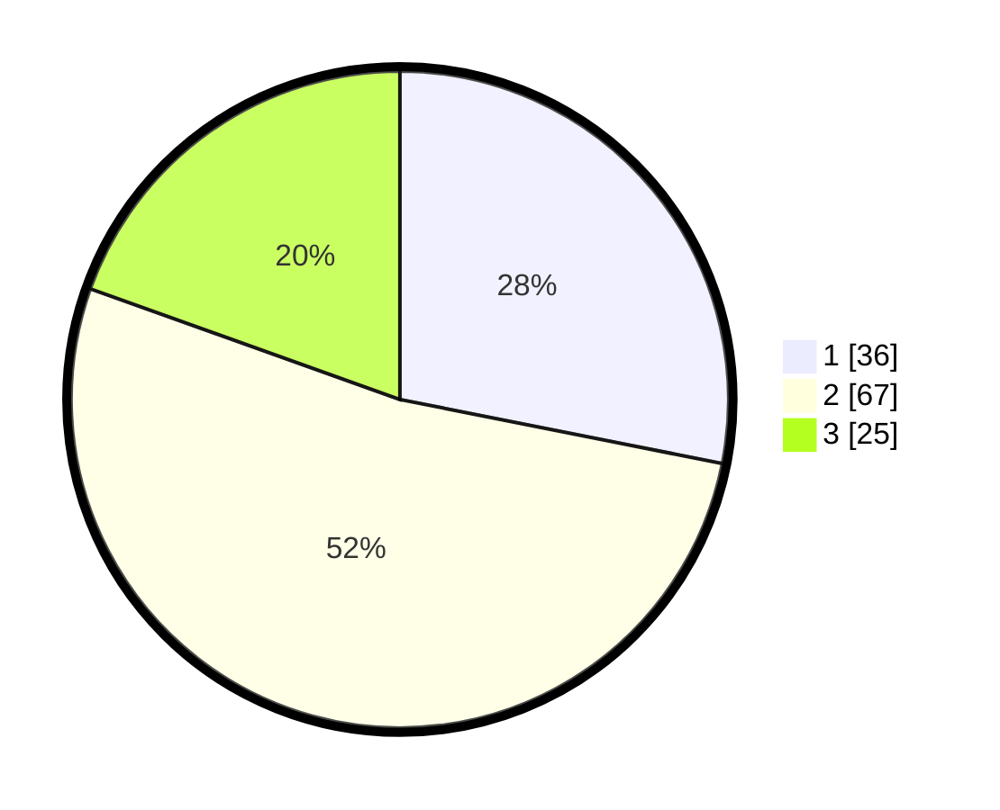

# Hasil

## Grafik

## Tabel

| No. | Nama Paslon    | Suara | Suara (raw) | Persentase |
|:--- |:-------------- | -----:| -----------:| ----------:|
| 1   | ANIES MUHAIMIN | 36    | [36][p-1]   | 28,13      |
| 2   | PRABOWO GIBRAN | 67    | [67][p-2]   | 52,34      |
| 3   | GANJAR MAHFUD  | 25    | [25][p-3]   | 19,53      |

[p-1]: https://github.com/gigit-pemilu/pemilu-2024/blob/main/pilpres/hitung-suara/sub/16-sumatera-selatan/sub/71-kota-palembang/sub/06-ilir-timur-dua/sub/1005-lima-ilir/sub/032-tps/sub/paslon-1.txt
[p-2]: https://github.com/gigit-pemilu/pemilu-2024/blob/main/pilpres/hitung-suara/sub/16-sumatera-selatan/sub/71-kota-palembang/sub/06-ilir-timur-dua/sub/1005-lima-ilir/sub/032-tps/sub/paslon-2.txt
[p-3]: https://github.com/gigit-pemilu/pemilu-2024/blob/main/pilpres/hitung-suara/sub/16-sumatera-selatan/sub/71-kota-palembang/sub/06-ilir-timur-dua/sub/1005-lima-ilir/sub/032-tps/sub/paslon-3.txt

## Foto C Plano

https://sirekap-obj-formc.kpu.go.id/82a7/pemilu/ppwp/16/71/06/10/05/1671061005032-20240223-153151--abf91324-65fd-4e42-8b11-0345ad5d1e55.jpg

https://sirekap-obj-formc.kpu.go.id/82a7/pemilu/ppwp/16/71/06/10/05/1671061005032-20240223-153242--1b8c1930-2d90-4e41-9fff-38ece8fe439b.jpg

https://sirekap-obj-formc.kpu.go.id/82a7/pemilu/ppwp/16/71/06/10/05/1671061005032-20240223-153219--ec26a98e-983b-4248-b00d-5cfe716d5b32.jpg

## Metadata

| Key        | Value               |
| ---------- | ------------------- |
| Time Stamp | 2024-02-25 14:00:00 |

