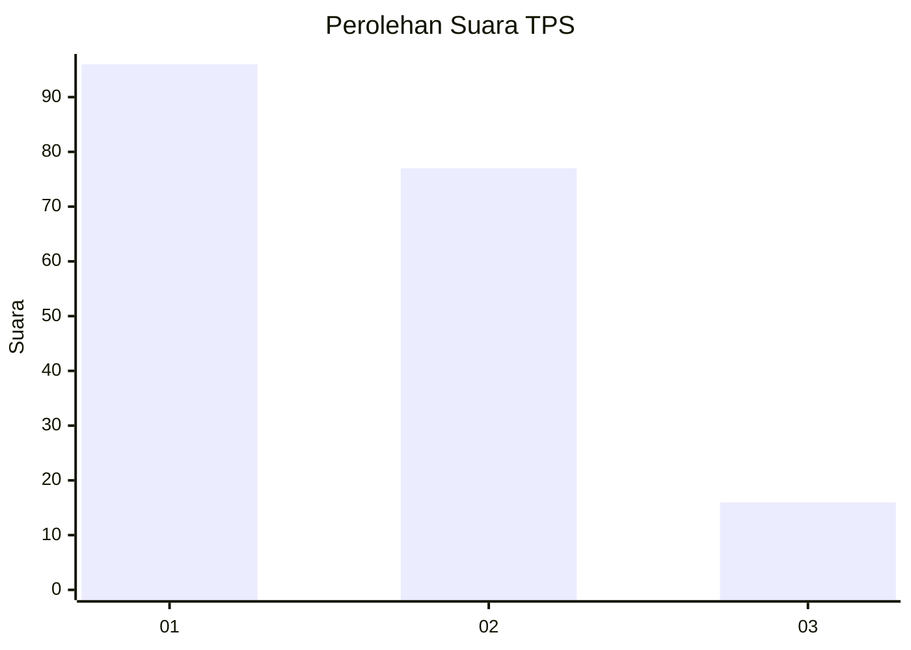
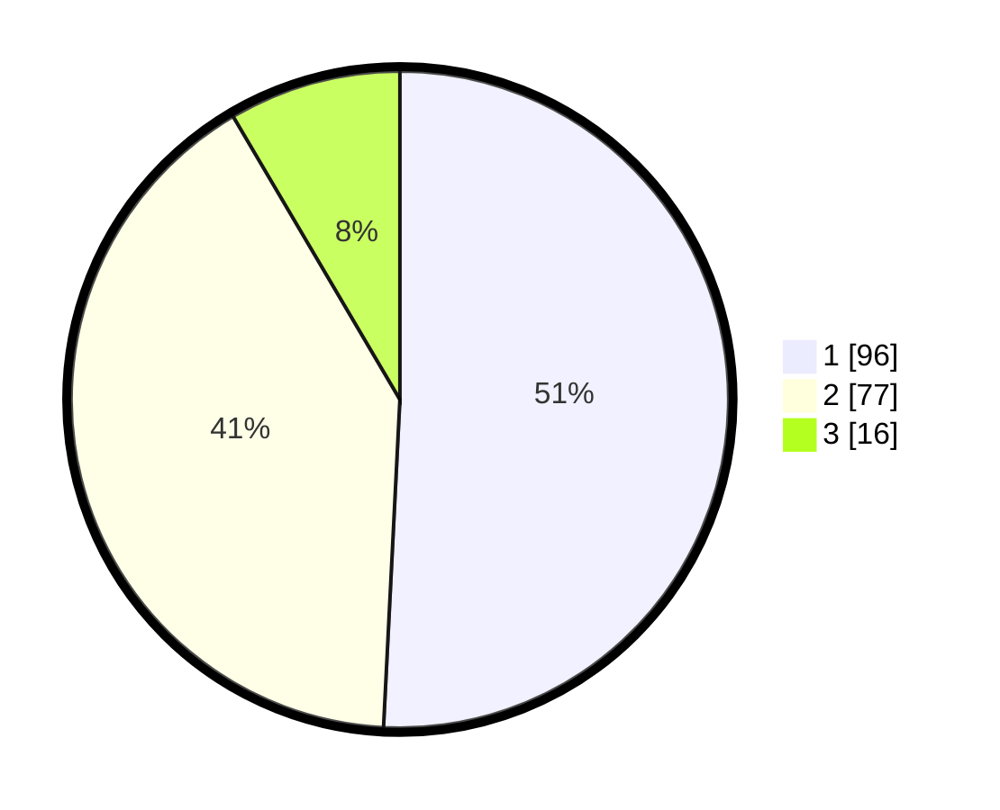

# Hasil

## Grafik

## Tabel

| No. | Nama Paslon    | Suara | Suara (raw) | Persentase |
|:--- |:-------------- | -----:| -----------:| ----------:|
| 1   | ANIES MUHAIMIN | 96    | [96][p-1]   | 50,79      |
| 2   | PRABOWO GIBRAN | 77    | [77][p-2]   | 40,74      |
| 3   | GANJAR MAHFUD  | 16    | [16][p-3]   | 8,47       |

[p-1]: https://github.com/gigit-pemilu/pemilu-2024-16-sumatera-selatan/blob/main/pilpres/hitung-suara/sub/16-sumatera-selatan/sub/71-kota-palembang/sub/06-ilir-timur-dua/sub/1006-tiga-ilir/sub/010-tps/sub/paslon-1.txt
[p-2]: https://github.com/gigit-pemilu/pemilu-2024-16-sumatera-selatan/blob/main/pilpres/hitung-suara/sub/16-sumatera-selatan/sub/71-kota-palembang/sub/06-ilir-timur-dua/sub/1006-tiga-ilir/sub/010-tps/sub/paslon-2.txt
[p-3]: https://github.com/gigit-pemilu/pemilu-2024-16-sumatera-selatan/blob/main/pilpres/hitung-suara/sub/16-sumatera-selatan/sub/71-kota-palembang/sub/06-ilir-timur-dua/sub/1006-tiga-ilir/sub/010-tps/sub/paslon-3.txt

## Foto C Plano

https://sirekap-obj-formc.kpu.go.id/c6d6/pemilu/ppwp/16/71/06/10/06/1671061006010-20240218-111603--06dd11ce-b2df-4944-9e8c-65c27ade8941.jpg

https://sirekap-obj-formc.kpu.go.id/c6d6/pemilu/ppwp/16/71/06/10/06/1671061006010-20240218-111630--f76f3766-6538-4dd6-a7bf-910493c578d9.jpg

https://sirekap-obj-formc.kpu.go.id/c6d6/pemilu/ppwp/16/71/06/10/06/1671061006010-20240218-111653--676dc3ef-3791-4049-b9c7-1febb129957f.jpg

## Metadata

| Key        | Value               |
| ---------- | ------------------- |
| Time Stamp | 2024-02-25 16:00:00 |

