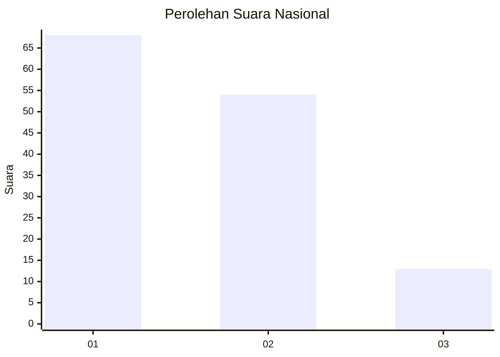
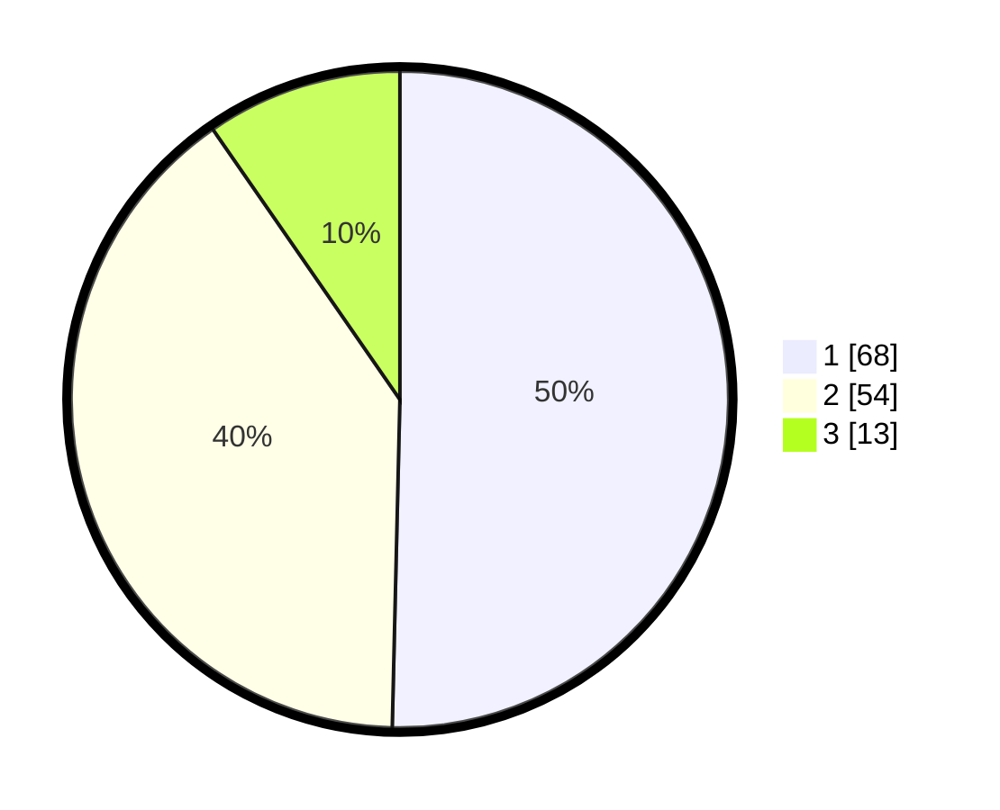

# Hasil

## Grafik

## Tabel

| No. | Nama Paslon    | Suara | Suara (raw) | Persentase |
|:--- |:-------------- | -----:| -----------:| ----------:|
| 1   | ANIES MUHAIMIN | 68    | [68][p-1]   | 50,37      |
| 2   | PRABOWO GIBRAN | 54    | [54][p-2]   | 40,00      |
| 3   | GANJAR MAHFUD  | 13    | [13][p-3]   | 9,63       |

[p-1]: https://github.com/gigit-pemilu/pemilu-2024/blob/main/pilpres/hitung-suara/sub/16-sumatera-selatan/sub/71-kota-palembang/sub/06-ilir-timur-dua/sub/1006-tiga-ilir/sub/011-tps/sub/paslon-1.txt
[p-2]: https://github.com/gigit-pemilu/pemilu-2024/blob/main/pilpres/hitung-suara/sub/16-sumatera-selatan/sub/71-kota-palembang/sub/06-ilir-timur-dua/sub/1006-tiga-ilir/sub/011-tps/sub/paslon-2.txt
[p-3]: https://github.com/gigit-pemilu/pemilu-2024/blob/main/pilpres/hitung-suara/sub/16-sumatera-selatan/sub/71-kota-palembang/sub/06-ilir-timur-dua/sub/1006-tiga-ilir/sub/011-tps/sub/paslon-3.txt

## Foto C Plano

https://sirekap-obj-formc.kpu.go.id/013c/pemilu/ppwp/16/71/06/10/06/1671061006011-20240218-121545--9a63acfd-2937-44a9-8b63-099df1a26abe.jpg

https://sirekap-obj-formc.kpu.go.id/013c/pemilu/ppwp/16/71/06/10/06/1671061006011-20240218-121658--d2e2d149-776a-488b-b1c8-8a0357423086.jpg

https://sirekap-obj-formc.kpu.go.id/013c/pemilu/ppwp/16/71/06/10/06/1671061006011-20240218-121744--fc5baf1b-40c4-4314-beb5-b56cfd95d5f6.jpg

## Metadata

| Key        | Value               |
| ---------- | ------------------- |
| Time Stamp | 2024-02-24 22:31:28 |

