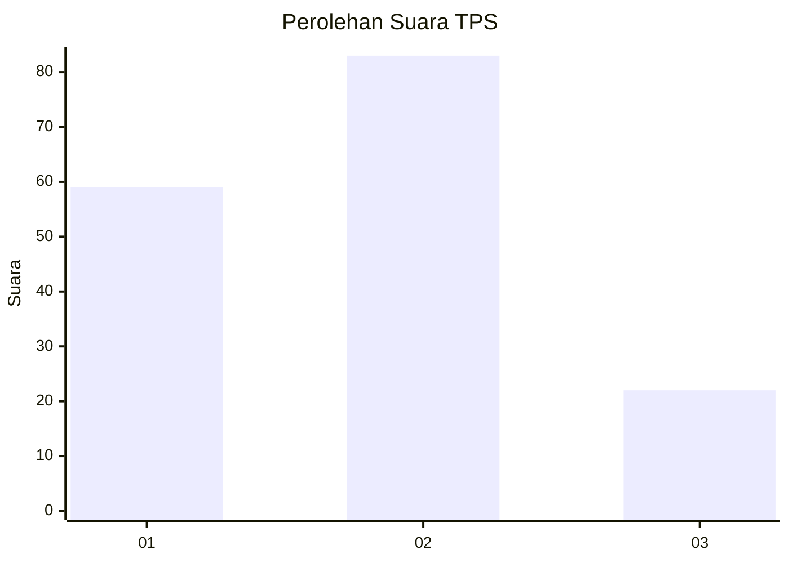
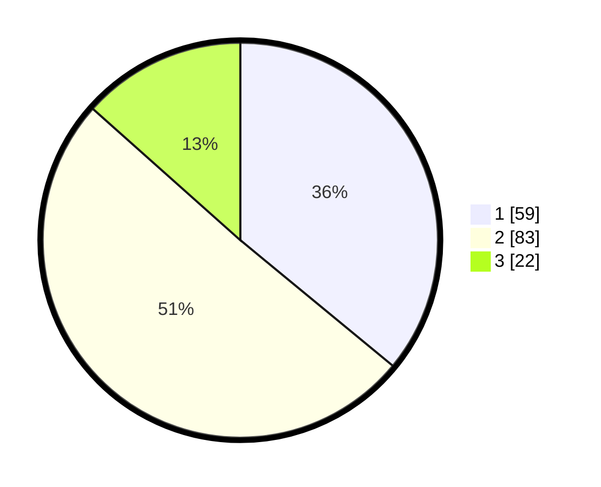

# Hasil

## Grafik

## Tabel

| No. | Nama Paslon    | Suara | Suara (raw) | Persentase |
|:--- |:-------------- | -----:| -----------:| ----------:|
| 1   | ANIES MUHAIMIN | 59    | [59][p-1]   | 35,98      |
| 2   | PRABOWO GIBRAN | 83    | [83][p-2]   | 50,61      |
| 3   | GANJAR MAHFUD  | 22    | [22][p-3]   | 13,41      |

[p-1]: https://github.com/gigit-pemilu/pemilu-2024-16-sumatera-selatan/blob/main/pilpres/hitung-suara/sub/16-sumatera-selatan/sub/71-kota-palembang/sub/06-ilir-timur-dua/sub/1006-tiga-ilir/sub/012-tps/sub/paslon-1.txt
[p-2]: https://github.com/gigit-pemilu/pemilu-2024-16-sumatera-selatan/blob/main/pilpres/hitung-suara/sub/16-sumatera-selatan/sub/71-kota-palembang/sub/06-ilir-timur-dua/sub/1006-tiga-ilir/sub/012-tps/sub/paslon-2.txt
[p-3]: https://github.com/gigit-pemilu/pemilu-2024-16-sumatera-selatan/blob/main/pilpres/hitung-suara/sub/16-sumatera-selatan/sub/71-kota-palembang/sub/06-ilir-timur-dua/sub/1006-tiga-ilir/sub/012-tps/sub/paslon-3.txt

## Foto C Plano

https://sirekap-obj-formc.kpu.go.id/881c/pemilu/ppwp/16/71/06/10/06/1671061006012-20240218-114815--a15eb81f-93a9-421e-a1d1-ca173236623a.jpg

https://sirekap-obj-formc.kpu.go.id/881c/pemilu/ppwp/16/71/06/10/06/1671061006012-20240218-114939--3ac16cef-0a3d-4c53-a3ee-c21291ab5a21.jpg

https://sirekap-obj-formc.kpu.go.id/881c/pemilu/ppwp/16/71/06/10/06/1671061006012-20240218-115012--ef8d573c-bdd0-4f1d-89f7-541982f60a6e.jpg

## Metadata

| Key        | Value               |
| ---------- | ------------------- |
| Time Stamp | 2024-02-24 22:31:28 |

