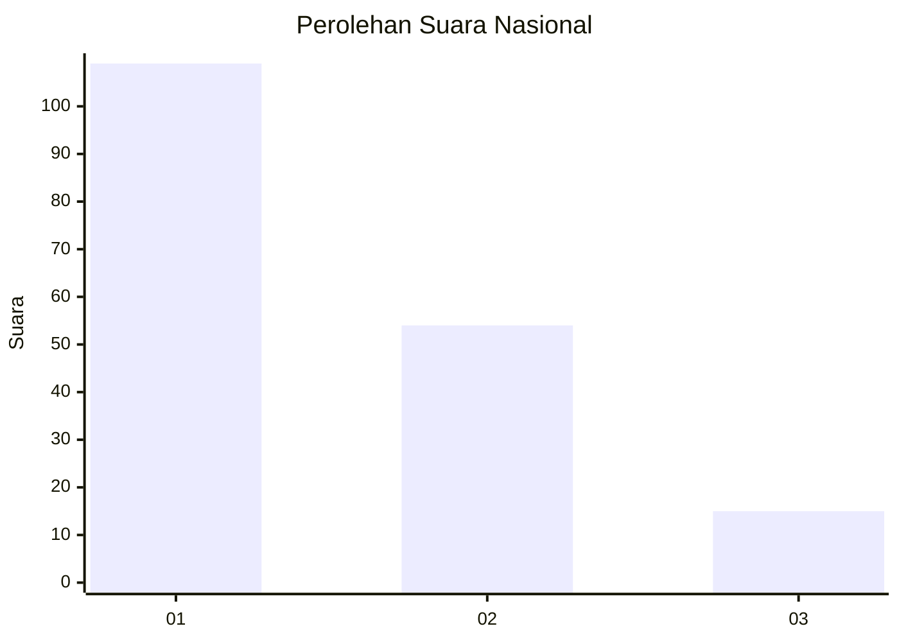
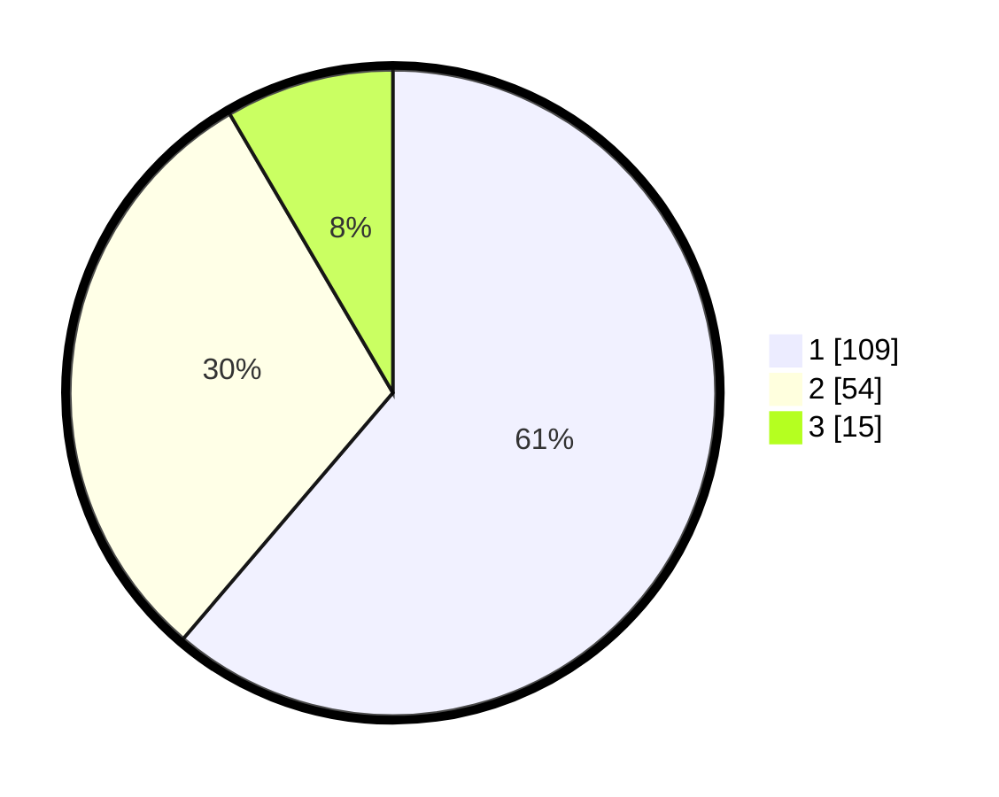

# Hasil

## Grafik

## Tabel

| No. | Nama Paslon    | Suara | Suara (raw) | Persentase |
|:--- |:-------------- | -----:| -----------:| ----------:|
| 1   | ANIES MUHAIMIN | 109   | [109][p-1]  | 61,24      |
| 2   | PRABOWO GIBRAN | 54    | [54][p-2]   | 30,34      |
| 3   | GANJAR MAHFUD  | 15    | [15][p-3]   | 8,43       |

[p-1]: https://github.com/gigit-pemilu/pemilu-2024/blob/main/pilpres/hitung-suara/sub/16-sumatera-selatan/sub/71-kota-palembang/sub/06-ilir-timur-dua/sub/1006-tiga-ilir/sub/016-tps/sub/paslon-1.txt
[p-2]: https://github.com/gigit-pemilu/pemilu-2024/blob/main/pilpres/hitung-suara/sub/16-sumatera-selatan/sub/71-kota-palembang/sub/06-ilir-timur-dua/sub/1006-tiga-ilir/sub/016-tps/sub/paslon-2.txt
[p-3]: https://github.com/gigit-pemilu/pemilu-2024/blob/main/pilpres/hitung-suara/sub/16-sumatera-selatan/sub/71-kota-palembang/sub/06-ilir-timur-dua/sub/1006-tiga-ilir/sub/016-tps/sub/paslon-3.txt

## Foto C Plano

https://sirekap-obj-formc.kpu.go.id/e922/pemilu/ppwp/16/71/06/10/06/1671061006016-20240219-101215--8658a49a-a40c-4a84-9e70-535002edcad8.jpg

https://sirekap-obj-formc.kpu.go.id/e922/pemilu/ppwp/16/71/06/10/06/1671061006016-20240219-101324--912e24c7-758a-469c-92ee-0f1aab0e3f05.jpg

https://sirekap-obj-formc.kpu.go.id/e922/pemilu/ppwp/16/71/06/10/06/1671061006016-20240219-101428--7bcbfc63-d77d-4878-ab78-72c2f6b054c1.jpg

## Metadata

| Key        | Value               |
| ---------- | ------------------- |
| Time Stamp | 2024-02-25 14:00:00 |

