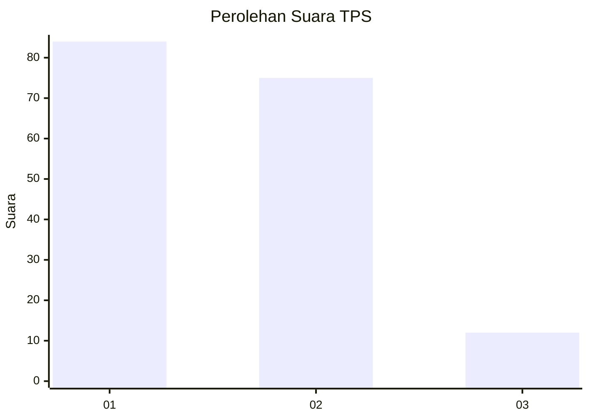
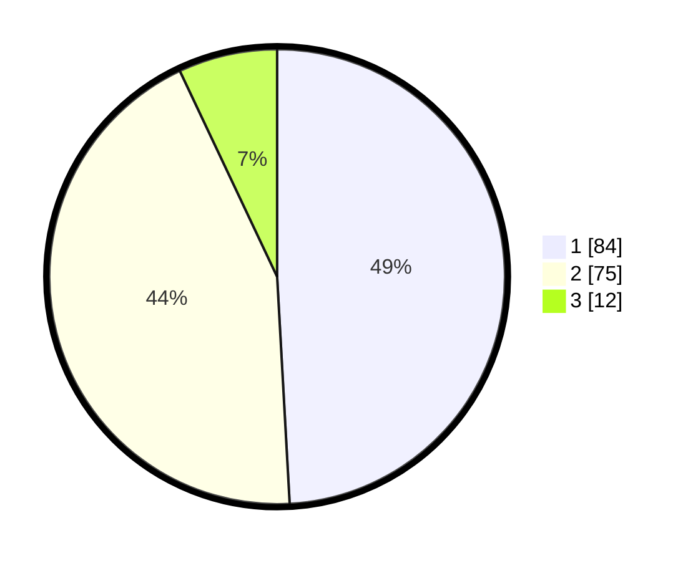

# Hasil

## Grafik

## Tabel

| No. | Nama Paslon    | Suara | Suara (raw) | Persentase |
|:--- |:-------------- | -----:| -----------:| ----------:|
| 1   | ANIES MUHAIMIN | 84    | [84][p-1]   | 49,12      |
| 2   | PRABOWO GIBRAN | 75    | [75][p-2]   | 43,86      |
| 3   | GANJAR MAHFUD  | 12    | [12][p-3]   | 7,02       |

[p-1]: https://github.com/gigit-pemilu/pemilu-2024-16-sumatera-selatan/blob/main/pilpres/hitung-suara/sub/16-sumatera-selatan/sub/71-kota-palembang/sub/06-ilir-timur-dua/sub/1006-tiga-ilir/sub/026-tps/sub/paslon-1.txt
[p-2]: https://github.com/gigit-pemilu/pemilu-2024-16-sumatera-selatan/blob/main/pilpres/hitung-suara/sub/16-sumatera-selatan/sub/71-kota-palembang/sub/06-ilir-timur-dua/sub/1006-tiga-ilir/sub/026-tps/sub/paslon-2.txt
[p-3]: https://github.com/gigit-pemilu/pemilu-2024-16-sumatera-selatan/blob/main/pilpres/hitung-suara/sub/16-sumatera-selatan/sub/71-kota-palembang/sub/06-ilir-timur-dua/sub/1006-tiga-ilir/sub/026-tps/sub/paslon-3.txt

## Foto C Plano

https://sirekap-obj-formc.kpu.go.id/6b46/pemilu/ppwp/16/71/06/10/06/1671061006026-20240218-120929--d5e49dcf-94a3-49b7-b528-bdde084fbb57.jpg

https://sirekap-obj-formc.kpu.go.id/6b46/pemilu/ppwp/16/71/06/10/06/1671061006026-20240218-121023--bb3595fa-2c20-4be0-ab8b-5fabaf4088a6.jpg

https://sirekap-obj-formc.kpu.go.id/6b46/pemilu/ppwp/16/71/06/10/06/1671061006026-20240218-121231--9859bdbb-0ada-4ecf-a808-a4ee6b41a43a.jpg

## Metadata

| Key        | Value               |
| ---------- | ------------------- |
| Time Stamp | 2024-02-25 23:00:00 |

