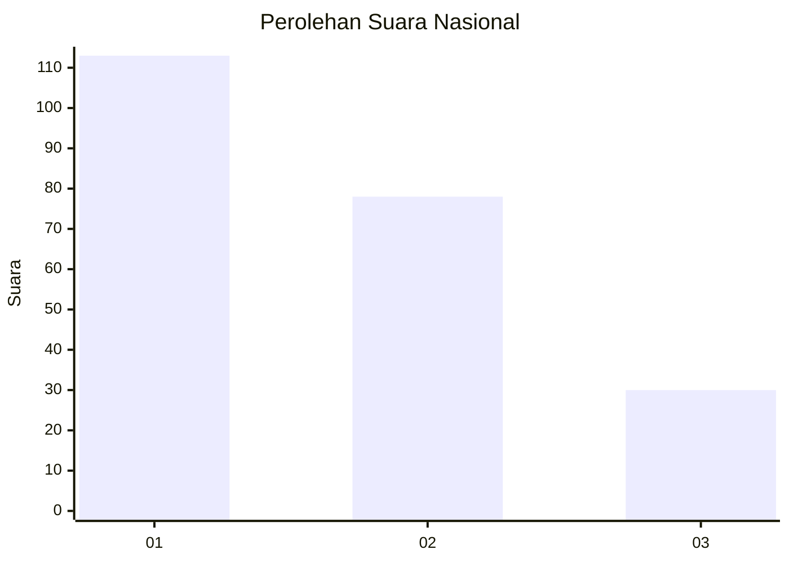
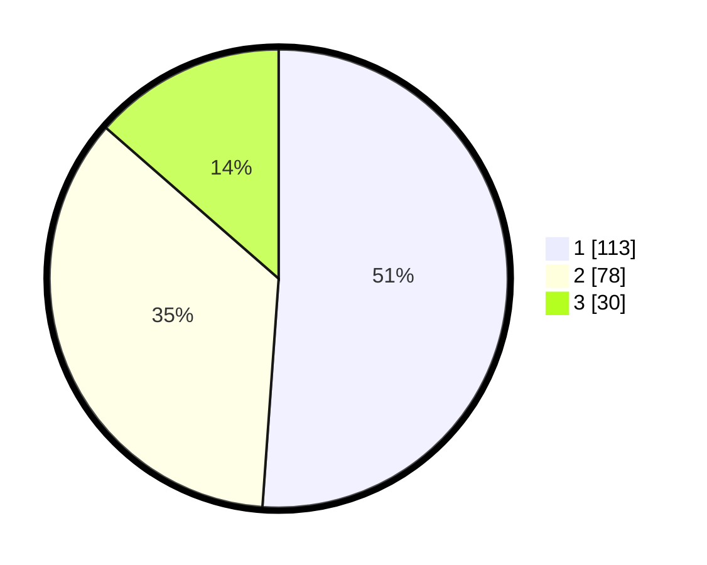

# Hasil

## Grafik

## Tabel

| No. | Nama Paslon    | Suara | Suara (raw) | Persentase |
|:--- |:-------------- | -----:| -----------:| ----------:|
| 1   | ANIES MUHAIMIN | 113   | [113][p-1]  | 51,13      |
| 2   | PRABOWO GIBRAN | 78    | [78][p-2]   | 35,29      |
| 3   | GANJAR MAHFUD  | 30    | [30][p-3]   | 13,57      |

[p-1]: https://github.com/gigit-pemilu/pemilu-2024/blob/main/pilpres/hitung-suara/sub/16-sumatera-selatan/sub/71-kota-palembang/sub/06-ilir-timur-dua/sub/1006-tiga-ilir/sub/031-tps/sub/paslon-1.txt
[p-2]: https://github.com/gigit-pemilu/pemilu-2024/blob/main/pilpres/hitung-suara/sub/16-sumatera-selatan/sub/71-kota-palembang/sub/06-ilir-timur-dua/sub/1006-tiga-ilir/sub/031-tps/sub/paslon-2.txt
[p-3]: https://github.com/gigit-pemilu/pemilu-2024/blob/main/pilpres/hitung-suara/sub/16-sumatera-selatan/sub/71-kota-palembang/sub/06-ilir-timur-dua/sub/1006-tiga-ilir/sub/031-tps/sub/paslon-3.txt

## Foto C Plano

https://sirekap-obj-formc.kpu.go.id/158a/pemilu/ppwp/16/71/06/10/06/1671061006031-20240219-131759--e46196d6-e2d5-47ca-8439-02f21707dbc1.jpg

https://sirekap-obj-formc.kpu.go.id/158a/pemilu/ppwp/16/71/06/10/06/1671061006031-20240219-132316--083d0ffd-115f-4822-9036-edeeee12451f.jpg

https://sirekap-obj-formc.kpu.go.id/158a/pemilu/ppwp/16/71/06/10/06/1671061006031-20240219-131911--76f82109-51ea-4bd3-b457-f3871c177b53.jpg

## Metadata

| Key        | Value               |
| ---------- | ------------------- |
| Time Stamp | 2024-02-25 16:00:00 |

