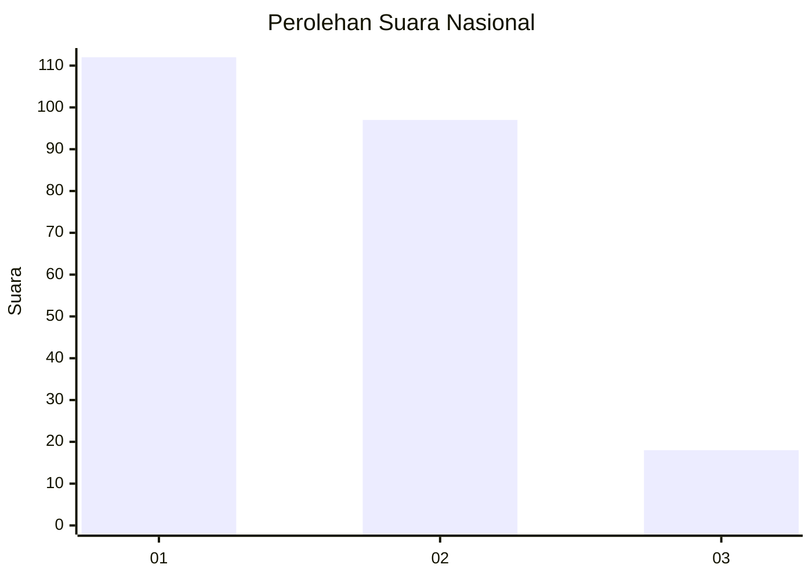
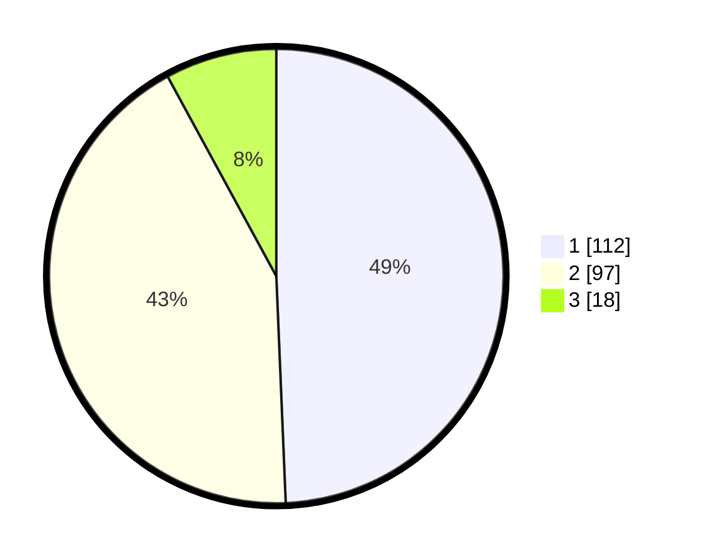

# Hasil

## Grafik

## Tabel

| No. | Nama Paslon    | Suara | Suara (raw) | Persentase |
|:--- |:-------------- | -----:| -----------:| ----------:|
| 1   | ANIES MUHAIMIN | 112   | [112][p-1]  | 49,34      |
| 2   | PRABOWO GIBRAN | 97    | [97][p-2]   | 42,73      |
| 3   | GANJAR MAHFUD  | 18    | [18][p-3]   | 7,93       |

[p-1]: https://github.com/gigit-pemilu/pemilu-2024/blob/main/pilpres/hitung-suara/sub/16-sumatera-selatan/sub/71-kota-palembang/sub/06-ilir-timur-dua/sub/1006-tiga-ilir/sub/035-tps/sub/paslon-1.txt
[p-2]: https://github.com/gigit-pemilu/pemilu-2024/blob/main/pilpres/hitung-suara/sub/16-sumatera-selatan/sub/71-kota-palembang/sub/06-ilir-timur-dua/sub/1006-tiga-ilir/sub/035-tps/sub/paslon-2.txt
[p-3]: https://github.com/gigit-pemilu/pemilu-2024/blob/main/pilpres/hitung-suara/sub/16-sumatera-selatan/sub/71-kota-palembang/sub/06-ilir-timur-dua/sub/1006-tiga-ilir/sub/035-tps/sub/paslon-3.txt

## Foto C Plano

https://sirekap-obj-formc.kpu.go.id/0a71/pemilu/ppwp/16/71/06/10/06/1671061006035-20240214-201241--ddb40868-f337-4291-8125-5bc6db0560a1.jpg

https://sirekap-obj-formc.kpu.go.id/0a71/pemilu/ppwp/16/71/06/10/06/1671061006035-20240214-201249--3307b1b8-db40-4368-b47d-ccd0b2eb1907.jpg

https://sirekap-obj-formc.kpu.go.id/0a71/pemilu/ppwp/16/71/06/10/06/1671061006035-20240214-201258--f3827d08-feae-42c8-b1b2-63ec28e0f1d8.jpg

## Metadata

| Key        | Value               |
| ---------- | ------------------- |
| Time Stamp | 2024-02-25 18:00:00 |

