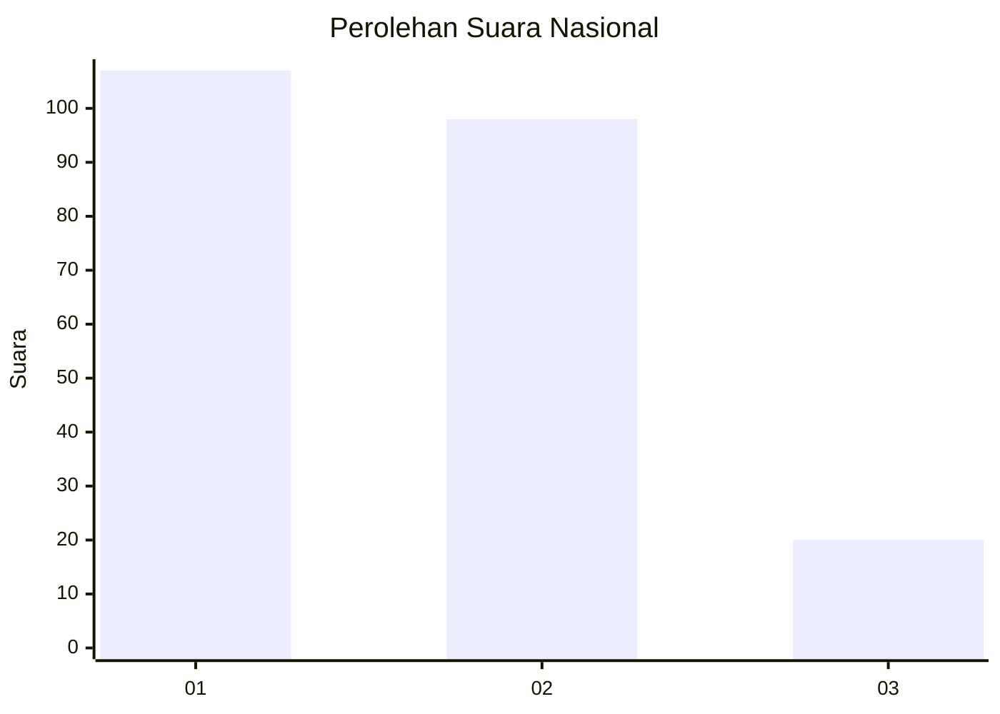
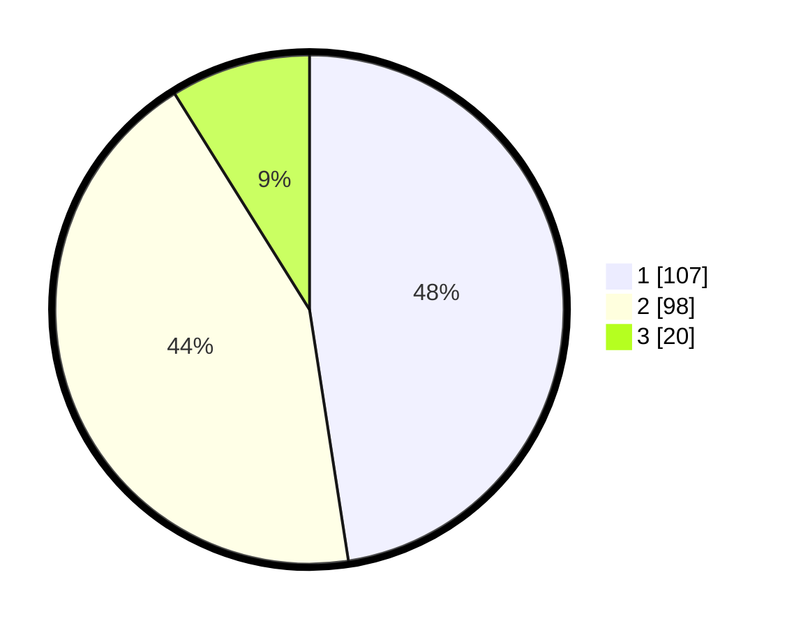

# Hasil

## Grafik

## Tabel

| No. | Nama Paslon    | Suara | Suara (raw) | Persentase |
|:--- |:-------------- | -----:| -----------:| ----------:|
| 1   | ANIES MUHAIMIN | 107   | [107][p-1]  | 47,56      |
| 2   | PRABOWO GIBRAN | 98    | [98][p-2]   | 43,56      |
| 3   | GANJAR MAHFUD  | 20    | [20][p-3]   | 8,89       |

[p-1]: https://github.com/gigit-pemilu/pemilu-2024/blob/main/pilpres/hitung-suara/sub/16-sumatera-selatan/sub/71-kota-palembang/sub/06-ilir-timur-dua/sub/1006-tiga-ilir/sub/037-tps/sub/paslon-1.txt
[p-2]: https://github.com/gigit-pemilu/pemilu-2024/blob/main/pilpres/hitung-suara/sub/16-sumatera-selatan/sub/71-kota-palembang/sub/06-ilir-timur-dua/sub/1006-tiga-ilir/sub/037-tps/sub/paslon-2.txt
[p-3]: https://github.com/gigit-pemilu/pemilu-2024/blob/main/pilpres/hitung-suara/sub/16-sumatera-selatan/sub/71-kota-palembang/sub/06-ilir-timur-dua/sub/1006-tiga-ilir/sub/037-tps/sub/paslon-3.txt

## Foto C Plano

https://sirekap-obj-formc.kpu.go.id/d338/pemilu/ppwp/16/71/06/10/06/1671061006037-20240214-235938--8cfd1754-2f10-4b22-9c5a-0c34bcc89557.jpg

https://sirekap-obj-formc.kpu.go.id/d338/pemilu/ppwp/16/71/06/10/06/1671061006037-20240215-000020--56a66b6c-1ff5-4853-bce7-bc5bccaf6812.jpg

https://sirekap-obj-formc.kpu.go.id/d338/pemilu/ppwp/16/71/06/10/06/1671061006037-20240215-000214--458c1ff0-c407-4fbb-bf2f-bd4627307fc1.jpg

## Metadata

| Key        | Value               |
| ---------- | ------------------- |
| Time Stamp | 2024-02-24 22:31:28 |

