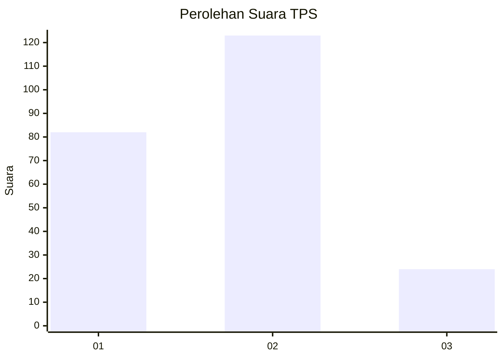
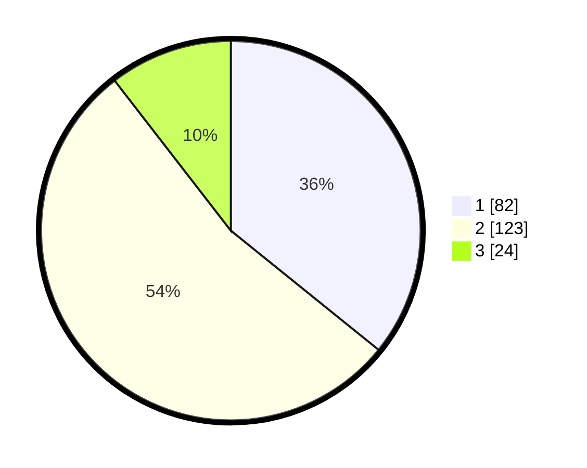

# Hasil

## Grafik

## Tabel

| No. | Nama Paslon    | Suara | Suara (raw) | Persentase |
|:--- |:-------------- | -----:| -----------:| ----------:|
| 1   | ANIES MUHAIMIN | 82    | [82][p-1]   | 35,81      |
| 2   | PRABOWO GIBRAN | 123   | [123][p-2]  | 53,71      |
| 3   | GANJAR MAHFUD  | 24    | [24][p-3]   | 10,48      |

[p-1]: https://github.com/gigit-pemilu/pemilu-2024-16-sumatera-selatan/blob/main/pilpres/hitung-suara/sub/16-sumatera-selatan/sub/71-kota-palembang/sub/06-ilir-timur-dua/sub/1006-tiga-ilir/sub/039-tps/sub/paslon-1.txt
[p-2]: https://github.com/gigit-pemilu/pemilu-2024-16-sumatera-selatan/blob/main/pilpres/hitung-suara/sub/16-sumatera-selatan/sub/71-kota-palembang/sub/06-ilir-timur-dua/sub/1006-tiga-ilir/sub/039-tps/sub/paslon-2.txt
[p-3]: https://github.com/gigit-pemilu/pemilu-2024-16-sumatera-selatan/blob/main/pilpres/hitung-suara/sub/16-sumatera-selatan/sub/71-kota-palembang/sub/06-ilir-timur-dua/sub/1006-tiga-ilir/sub/039-tps/sub/paslon-3.txt

## Foto C Plano

https://sirekap-obj-formc.kpu.go.id/5ca0/pemilu/ppwp/16/71/06/10/06/1671061006039-20240218-141517--3e2139bf-3f28-45c7-af5e-69dd4b98c591.jpg

https://sirekap-obj-formc.kpu.go.id/5ca0/pemilu/ppwp/16/71/06/10/06/1671061006039-20240218-141659--43669959-04b7-4b4d-bf64-eedb81d9d36e.jpg

https://sirekap-obj-formc.kpu.go.id/5ca0/pemilu/ppwp/16/71/06/10/06/1671061006039-20240218-141609--5f141c16-e40f-4001-b09c-e0c0f3158a3a.jpg

## Metadata

| Key        | Value               |
| ---------- | ------------------- |
| Time Stamp | 2024-02-25 21:00:00 |

