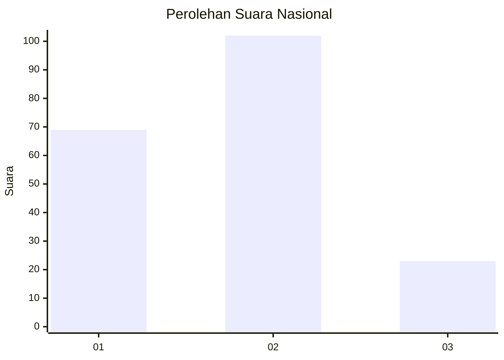
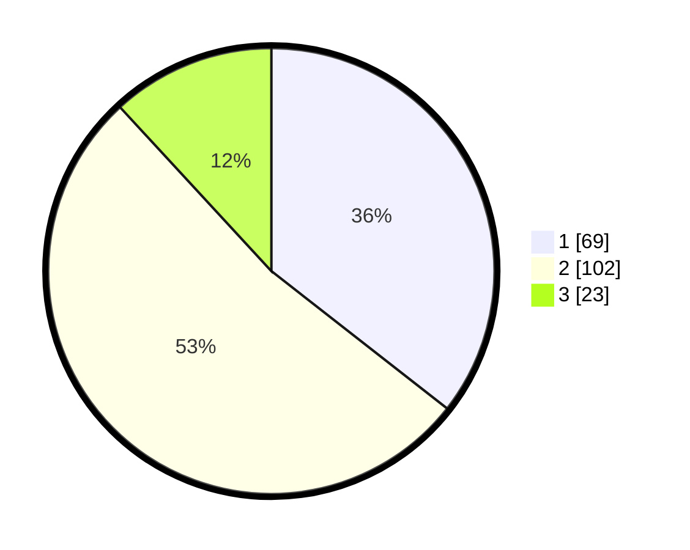

# Hasil

## Grafik

## Tabel

| No. | Nama Paslon    | Suara | Suara (raw) | Persentase |
|:--- |:-------------- | -----:| -----------:| ----------:|
| 1   | ANIES MUHAIMIN | 69    | [69][p-1]   | 35,57      |
| 2   | PRABOWO GIBRAN | 102   | [102][p-2]  | 52,58      |
| 3   | GANJAR MAHFUD  | 23    | [23][p-3]   | 11,86      |

[p-1]: https://github.com/gigit-pemilu/pemilu-2024/blob/main/pilpres/hitung-suara/sub/16-sumatera-selatan/sub/71-kota-palembang/sub/06-ilir-timur-dua/sub/1007-satu-ilir/sub/003-tps/sub/paslon-1.txt
[p-2]: https://github.com/gigit-pemilu/pemilu-2024/blob/main/pilpres/hitung-suara/sub/16-sumatera-selatan/sub/71-kota-palembang/sub/06-ilir-timur-dua/sub/1007-satu-ilir/sub/003-tps/sub/paslon-2.txt
[p-3]: https://github.com/gigit-pemilu/pemilu-2024/blob/main/pilpres/hitung-suara/sub/16-sumatera-selatan/sub/71-kota-palembang/sub/06-ilir-timur-dua/sub/1007-satu-ilir/sub/003-tps/sub/paslon-3.txt

## Foto C Plano

https://sirekap-obj-formc.kpu.go.id/7cbd/pemilu/ppwp/16/71/06/10/07/1671061007003-20240222-103149--46fc8e29-e667-435d-b61a-48b862ae4759.jpg

https://sirekap-obj-formc.kpu.go.id/7cbd/pemilu/ppwp/16/71/06/10/07/1671061007003-20240222-103416--322cd150-a6e7-4a04-bd98-02acadfccbb3.jpg

https://sirekap-obj-formc.kpu.go.id/7cbd/pemilu/ppwp/16/71/06/10/07/1671061007003-20240222-103525--10940e1c-4f0a-4479-b016-9487696da5b8.jpg

## Metadata

| Key        | Value               |
| ---------- | ------------------- |
| Time Stamp | 2024-02-25 16:00:00 |

