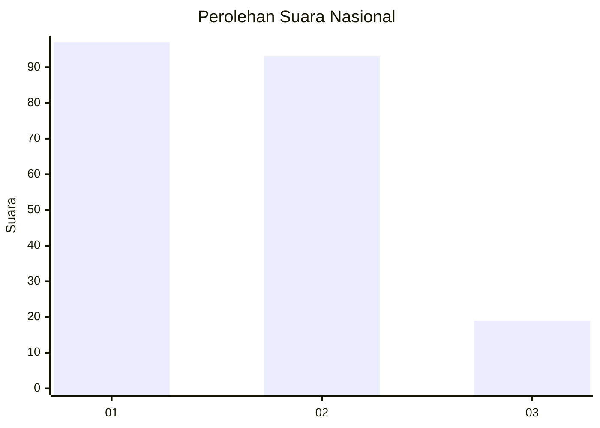
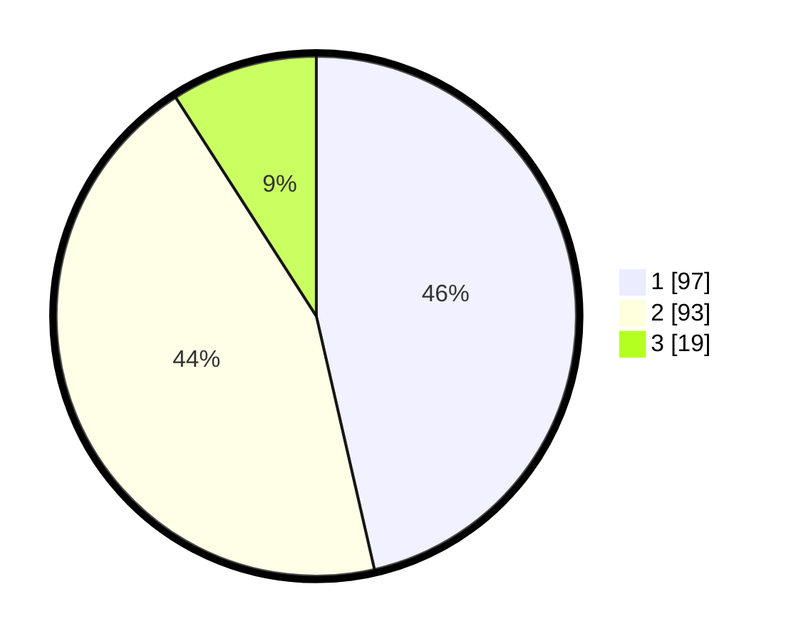

# Hasil

## Grafik

## Tabel

| No. | Nama Paslon    | Suara | Suara (raw) | Persentase |
|:--- |:-------------- | -----:| -----------:| ----------:|
| 1   | ANIES MUHAIMIN | 97    | [97][p-1]   | 46,41      |
| 2   | PRABOWO GIBRAN | 93    | [93][p-2]   | 44,50      |
| 3   | GANJAR MAHFUD  | 19    | [19][p-3]   | 9,09       |

[p-1]: https://github.com/gigit-pemilu/pemilu-2024/blob/main/pilpres/hitung-suara/sub/16-sumatera-selatan/sub/71-kota-palembang/sub/06-ilir-timur-dua/sub/1007-satu-ilir/sub/006-tps/sub/paslon-1.txt
[p-2]: https://github.com/gigit-pemilu/pemilu-2024/blob/main/pilpres/hitung-suara/sub/16-sumatera-selatan/sub/71-kota-palembang/sub/06-ilir-timur-dua/sub/1007-satu-ilir/sub/006-tps/sub/paslon-2.txt
[p-3]: https://github.com/gigit-pemilu/pemilu-2024/blob/main/pilpres/hitung-suara/sub/16-sumatera-selatan/sub/71-kota-palembang/sub/06-ilir-timur-dua/sub/1007-satu-ilir/sub/006-tps/sub/paslon-3.txt

## Foto C Plano

https://sirekap-obj-formc.kpu.go.id/07d6/pemilu/ppwp/16/71/06/10/07/1671061007006-20240222-104529--e7969a3b-e598-4260-bc56-15427fd678b6.jpg

https://sirekap-obj-formc.kpu.go.id/07d6/pemilu/ppwp/16/71/06/10/07/1671061007006-20240222-104613--a723447b-79ec-435d-8454-de69b7524d14.jpg

https://sirekap-obj-formc.kpu.go.id/07d6/pemilu/ppwp/16/71/06/10/07/1671061007006-20240222-104649--7e595e0c-1b47-4413-ada1-6bf31948e494.jpg

## Metadata

| Key        | Value               |
| ---------- | ------------------- |
| Time Stamp | 2024-02-24 22:31:28 |

