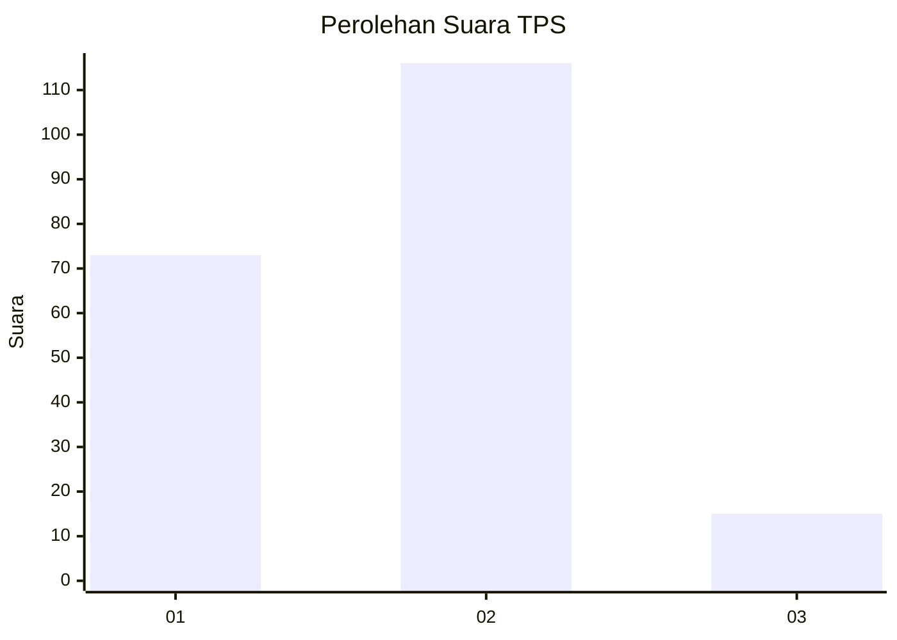
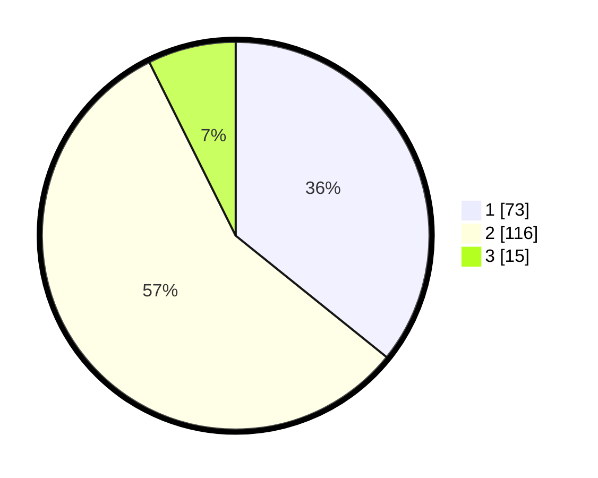

# Hasil

## Grafik

## Tabel

| No. | Nama Paslon    | Suara | Suara (raw) | Persentase |
|:--- |:-------------- | -----:| -----------:| ----------:|
| 1   | ANIES MUHAIMIN | 73    | [73][p-1]   | 35,78      |
| 2   | PRABOWO GIBRAN | 116   | [116][p-2]  | 56,86      |
| 3   | GANJAR MAHFUD  | 15    | [15][p-3]   | 7,35       |

[p-1]: https://github.com/gigit-pemilu/pemilu-2024-16-sumatera-selatan/blob/main/pilpres/hitung-suara/sub/16-sumatera-selatan/sub/71-kota-palembang/sub/06-ilir-timur-dua/sub/1008-dua-ilir/sub/008-tps/sub/paslon-1.txt
[p-2]: https://github.com/gigit-pemilu/pemilu-2024-16-sumatera-selatan/blob/main/pilpres/hitung-suara/sub/16-sumatera-selatan/sub/71-kota-palembang/sub/06-ilir-timur-dua/sub/1008-dua-ilir/sub/008-tps/sub/paslon-2.txt
[p-3]: https://github.com/gigit-pemilu/pemilu-2024-16-sumatera-selatan/blob/main/pilpres/hitung-suara/sub/16-sumatera-selatan/sub/71-kota-palembang/sub/06-ilir-timur-dua/sub/1008-dua-ilir/sub/008-tps/sub/paslon-3.txt

## Foto C Plano

https://sirekap-obj-formc.kpu.go.id/915f/pemilu/ppwp/16/71/06/10/08/1671061008008-20240214-231049--aff29ddc-ba81-4253-aa49-ecde1b9d796c.jpg

https://sirekap-obj-formc.kpu.go.id/915f/pemilu/ppwp/16/71/06/10/08/1671061008008-20240214-192931--bd007cd1-cbfc-46b2-929c-69f201a5bdcc.jpg

https://sirekap-obj-formc.kpu.go.id/915f/pemilu/ppwp/16/71/06/10/08/1671061008008-20240214-195016--570a5cd2-844d-4107-9a4f-791d36556901.jpg

## Metadata

| Key        | Value               |
| ---------- | ------------------- |
| Time Stamp | 2024-02-15 09:00:24 |

