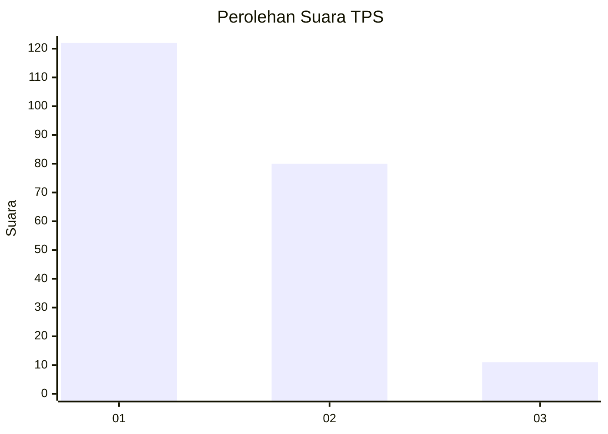
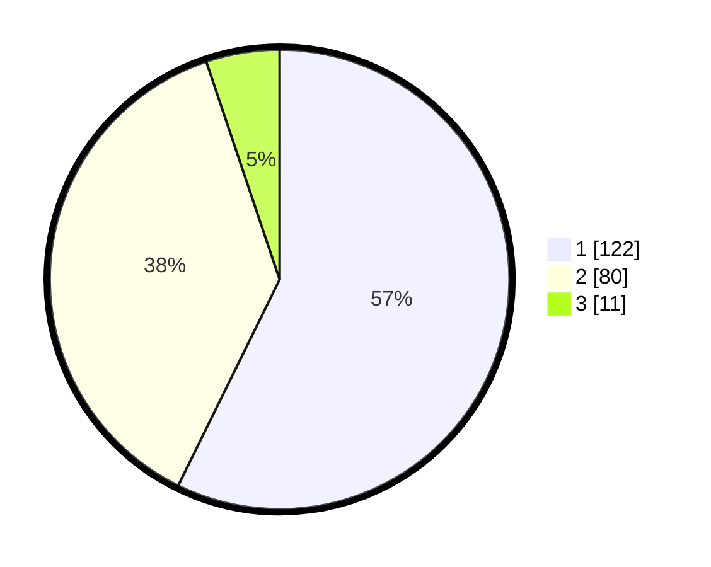

# Hasil

## Grafik

## Tabel

| No. | Nama Paslon    | Suara | Suara (raw) | Persentase |
|:--- |:-------------- | -----:| -----------:| ----------:|
| 1   | ANIES MUHAIMIN | 122   | [122][p-1]  | 57,28      |
| 2   | PRABOWO GIBRAN | 80    | [80][p-2]   | 37,56      |
| 3   | GANJAR MAHFUD  | 11    | [11][p-3]   | 5,16       |

[p-1]: https://github.com/gigit-pemilu/pemilu-2024-16-sumatera-selatan/blob/main/pilpres/hitung-suara/sub/16-sumatera-selatan/sub/71-kota-palembang/sub/06-ilir-timur-dua/sub/1008-dua-ilir/sub/047-tps/sub/paslon-1.txt
[p-2]: https://github.com/gigit-pemilu/pemilu-2024-16-sumatera-selatan/blob/main/pilpres/hitung-suara/sub/16-sumatera-selatan/sub/71-kota-palembang/sub/06-ilir-timur-dua/sub/1008-dua-ilir/sub/047-tps/sub/paslon-2.txt
[p-3]: https://github.com/gigit-pemilu/pemilu-2024-16-sumatera-selatan/blob/main/pilpres/hitung-suara/sub/16-sumatera-selatan/sub/71-kota-palembang/sub/06-ilir-timur-dua/sub/1008-dua-ilir/sub/047-tps/sub/paslon-3.txt

## Foto C Plano

https://sirekap-obj-formc.kpu.go.id/15f2/pemilu/ppwp/16/71/06/10/08/1671061008047-20240218-133716--fc4b1a8f-533e-4ef4-aa1a-bd40aa5154b0.jpg

https://sirekap-obj-formc.kpu.go.id/15f2/pemilu/ppwp/16/71/06/10/08/1671061008047-20240218-133757--95225faf-ac05-48f4-849f-889173543aa4.jpg

https://sirekap-obj-formc.kpu.go.id/15f2/pemilu/ppwp/16/71/06/10/08/1671061008047-20240218-133845--158f98c6-24e3-4f1f-bc5c-27de46063d42.jpg

## Metadata

| Key        | Value               |
| ---------- | ------------------- |
| Time Stamp | 2024-02-24 22:31:28 |

