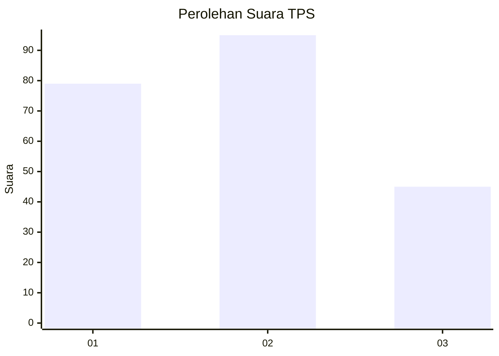
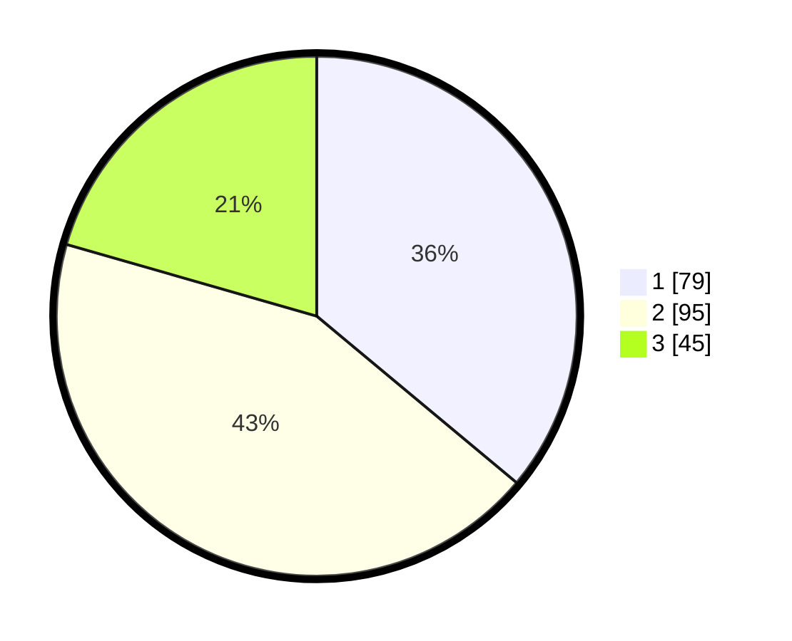

# Hasil

## Grafik

## Tabel

| No. | Nama Paslon    | Suara | Suara (raw) | Persentase |
|:--- |:-------------- | -----:| -----------:| ----------:|
| 1   | ANIES MUHAIMIN | 79    | [79][p-1]   | 36,07      |
| 2   | PRABOWO GIBRAN | 95    | [95][p-2]   | 43,38      |
| 3   | GANJAR MAHFUD  | 45    | [45][p-3]   | 20,55      |

[p-1]: https://github.com/gigit-pemilu/pemilu-2024-16-sumatera-selatan/blob/main/pilpres/hitung-suara/sub/16-sumatera-selatan/sub/71-kota-palembang/sub/06-ilir-timur-dua/sub/1008-dua-ilir/sub/052-tps/sub/paslon-1.txt
[p-2]: https://github.com/gigit-pemilu/pemilu-2024-16-sumatera-selatan/blob/main/pilpres/hitung-suara/sub/16-sumatera-selatan/sub/71-kota-palembang/sub/06-ilir-timur-dua/sub/1008-dua-ilir/sub/052-tps/sub/paslon-2.txt
[p-3]: https://github.com/gigit-pemilu/pemilu-2024-16-sumatera-selatan/blob/main/pilpres/hitung-suara/sub/16-sumatera-selatan/sub/71-kota-palembang/sub/06-ilir-timur-dua/sub/1008-dua-ilir/sub/052-tps/sub/paslon-3.txt

## Foto C Plano

https://sirekap-obj-formc.kpu.go.id/0d17/pemilu/ppwp/16/71/06/10/08/1671061008052-20240218-134709--7332d2f9-aed2-4e76-b1e3-037d75bc6db5.jpg

https://sirekap-obj-formc.kpu.go.id/0d17/pemilu/ppwp/16/71/06/10/08/1671061008052-20240218-134748--c5f91923-3cd3-4a0e-8cde-dd136e6ab5a4.jpg

https://sirekap-obj-formc.kpu.go.id/0d17/pemilu/ppwp/16/71/06/10/08/1671061008052-20240218-134827--06c64bdb-e91e-4d83-8ea5-ddebb197c6ed.jpg

## Metadata

| Key        | Value               |
| ---------- | ------------------- |
| Time Stamp | 2024-02-24 22:31:28 |

