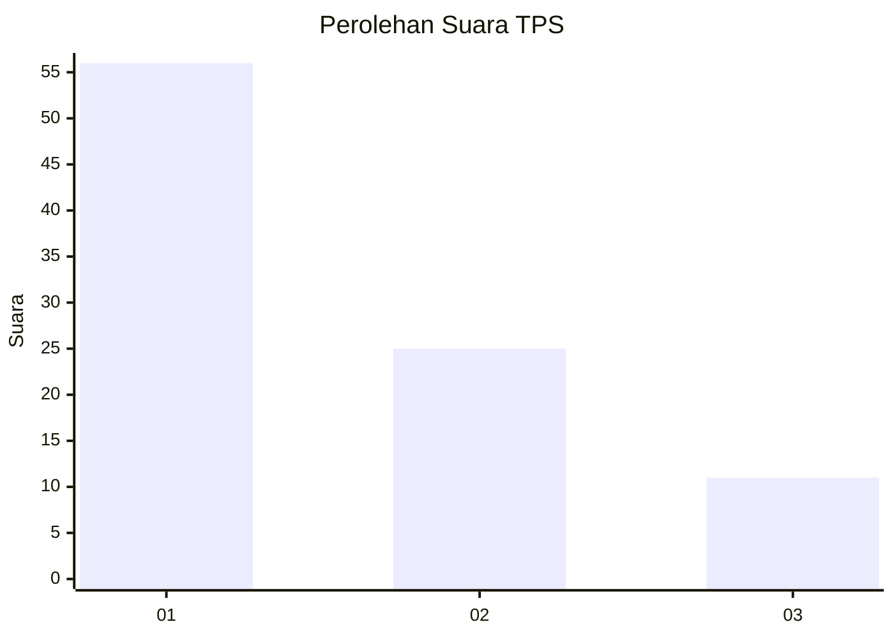
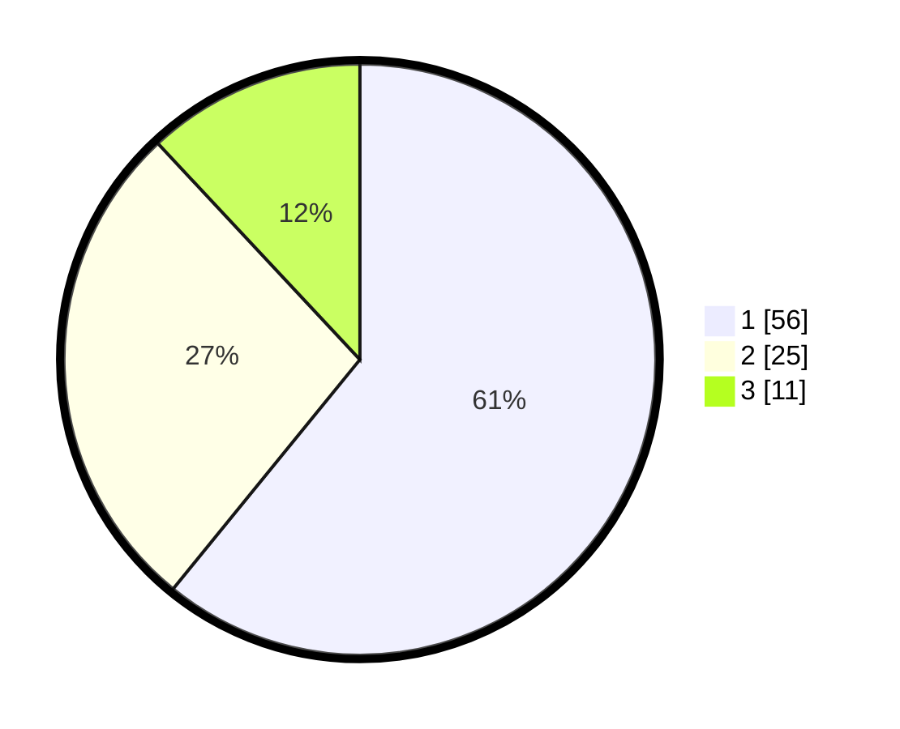

# Hasil

## Grafik

## Tabel

| No. | Nama Paslon    | Suara | Suara (raw) | Persentase |
|:--- |:-------------- | -----:| -----------:| ----------:|
| 1   | ANIES MUHAIMIN | 56    | [56][p-1]   | 60,87      |
| 2   | PRABOWO GIBRAN | 25    | [25][p-2]   | 27,17      |
| 3   | GANJAR MAHFUD  | 11    | [11][p-3]   | 11,96      |

[p-1]: https://github.com/gigit-pemilu/pemilu-2024-16-sumatera-selatan/blob/main/pilpres/hitung-suara/sub/16-sumatera-selatan/sub/71-kota-palembang/sub/06-ilir-timur-dua/sub/1009-lawangkidul/sub/004-tps/sub/paslon-1.txt
[p-2]: https://github.com/gigit-pemilu/pemilu-2024-16-sumatera-selatan/blob/main/pilpres/hitung-suara/sub/16-sumatera-selatan/sub/71-kota-palembang/sub/06-ilir-timur-dua/sub/1009-lawangkidul/sub/004-tps/sub/paslon-2.txt
[p-3]: https://github.com/gigit-pemilu/pemilu-2024-16-sumatera-selatan/blob/main/pilpres/hitung-suara/sub/16-sumatera-selatan/sub/71-kota-palembang/sub/06-ilir-timur-dua/sub/1009-lawangkidul/sub/004-tps/sub/paslon-3.txt

## Foto C Plano

https://sirekap-obj-formc.kpu.go.id/838b/pemilu/ppwp/16/71/06/10/09/1671061009004-20240221-110316--b9ea218f-82cc-4f22-a5e6-43554552bf20.jpg

https://sirekap-obj-formc.kpu.go.id/838b/pemilu/ppwp/16/71/06/10/09/1671061009004-20240221-110358--acd9dd51-2f35-49cf-859b-5f3ea38e9967.jpg

https://sirekap-obj-formc.kpu.go.id/838b/pemilu/ppwp/16/71/06/10/09/1671061009004-20240221-110438--b10de726-5c1f-4f70-878d-490f55ca1f9b.jpg

## Metadata

| Key        | Value               |
| ---------- | ------------------- |
| Time Stamp | 2024-02-25 17:00:00 |

