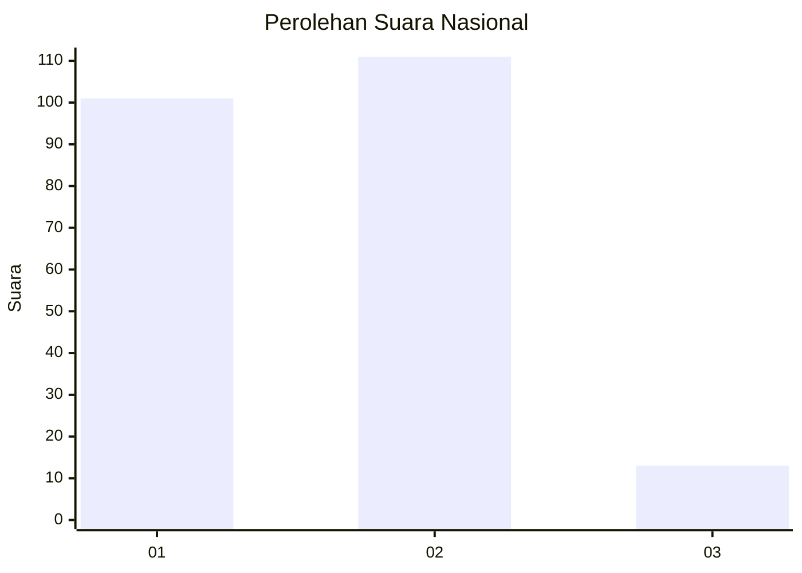
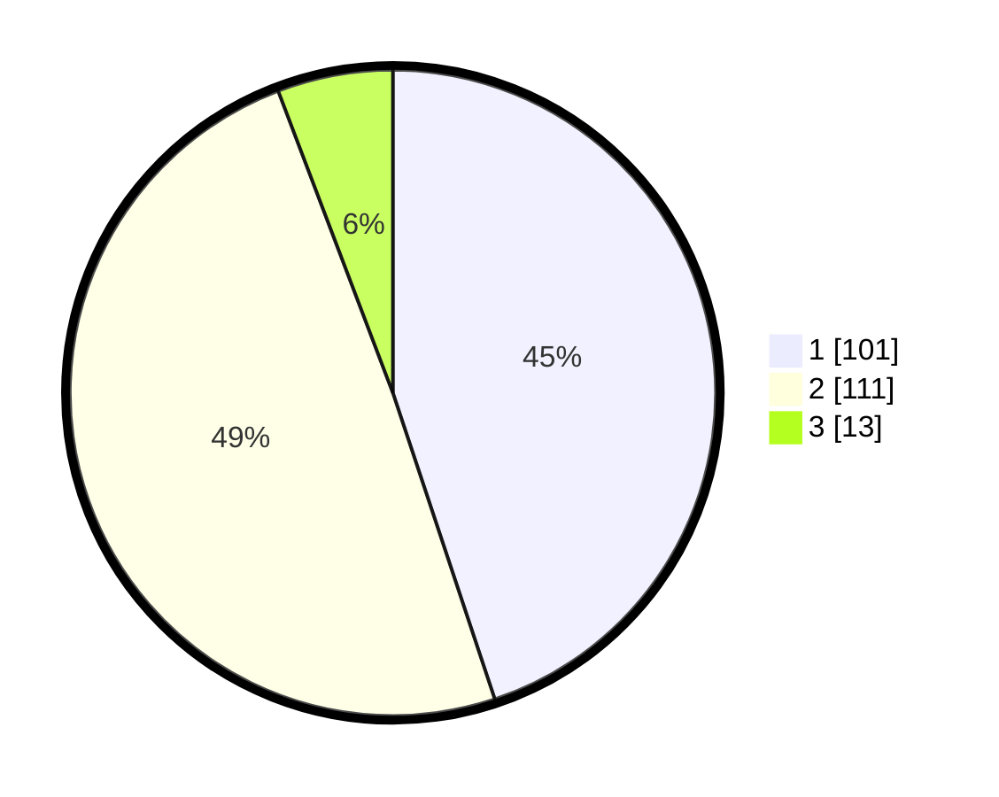

# Hasil

## Grafik

## Tabel

| No. | Nama Paslon    | Suara | Suara (raw) | Persentase |
|:--- |:-------------- | -----:| -----------:| ----------:|
| 1   | ANIES MUHAIMIN | 101   | [101][p-1]  | 44,89      |
| 2   | PRABOWO GIBRAN | 111   | [111][p-2]  | 49,33      |
| 3   | GANJAR MAHFUD  | 13    | [13][p-3]   | 5,78       |

[p-1]: https://github.com/gigit-pemilu/pemilu-2024/blob/main/pilpres/hitung-suara/sub/16-sumatera-selatan/sub/71-kota-palembang/sub/06-ilir-timur-dua/sub/1009-lawangkidul/sub/006-tps/sub/paslon-1.txt
[p-2]: https://github.com/gigit-pemilu/pemilu-2024/blob/main/pilpres/hitung-suara/sub/16-sumatera-selatan/sub/71-kota-palembang/sub/06-ilir-timur-dua/sub/1009-lawangkidul/sub/006-tps/sub/paslon-2.txt
[p-3]: https://github.com/gigit-pemilu/pemilu-2024/blob/main/pilpres/hitung-suara/sub/16-sumatera-selatan/sub/71-kota-palembang/sub/06-ilir-timur-dua/sub/1009-lawangkidul/sub/006-tps/sub/paslon-3.txt

## Foto C Plano

https://sirekap-obj-formc.kpu.go.id/e1c1/pemilu/ppwp/16/71/06/10/09/1671061009006-20240214-214615--619775b9-0702-4320-b74f-a46f39829b8f.jpg

https://sirekap-obj-formc.kpu.go.id/e1c1/pemilu/ppwp/16/71/06/10/09/1671061009006-20240214-195953--20a34e67-eb64-4d4d-a807-bfc2427f5548.jpg

https://sirekap-obj-formc.kpu.go.id/e1c1/pemilu/ppwp/16/71/06/10/09/1671061009006-20240214-155352--6ef86ae1-0c66-4d34-8d43-6a227fb0d7b3.jpg

## Metadata

| Key        | Value               |
| ---------- | ------------------- |
| Time Stamp | 2024-02-15 00:41:44 |

