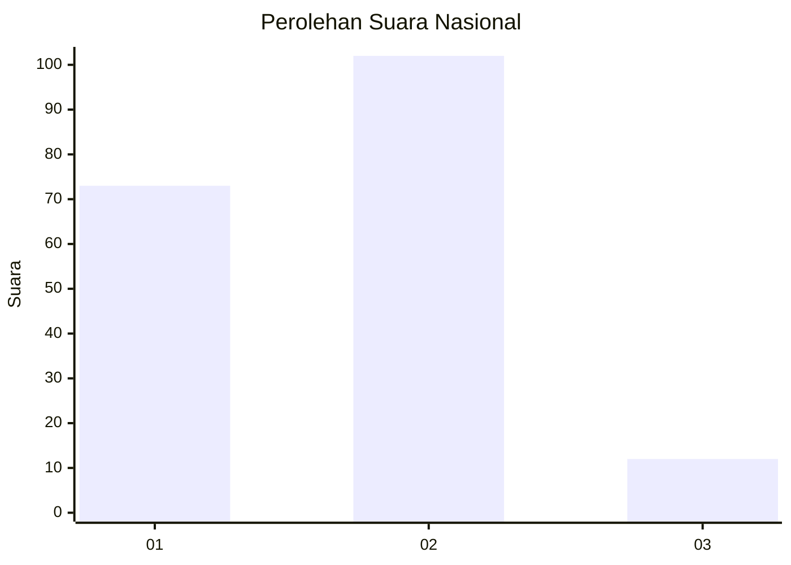

# Hasil

## Grafik

## Tabel

| No. | Nama Paslon    | Suara | Suara (raw) | Persentase |
|:--- |:-------------- | -----:| -----------:| ----------:|
| 1   | ANIES MUHAIMIN | 73    | [73][p-1]   | 39,04      |
| 2   | PRABOWO GIBRAN | 102   | [102][p-2]  | 54,55      |
| 3   | GANJAR MAHFUD  | 12    | [12][p-3]   | 6,42       |

[p-1]: https://github.com/gigit-pemilu/pemilu-2024/blob/main/pilpres/hitung-suara/sub/16-sumatera-selatan/sub/71-kota-palembang/sub/06-ilir-timur-dua/sub/1009-lawangkidul/sub/010-tps/sub/paslon-1.txt
[p-2]: https://github.com/gigit-pemilu/pemilu-2024/blob/main/pilpres/hitung-suara/sub/16-sumatera-selatan/sub/71-kota-palembang/sub/06-ilir-timur-dua/sub/1009-lawangkidul/sub/010-tps/sub/paslon-2.txt
[p-3]: https://github.com/gigit-pemilu/pemilu-2024/blob/main/pilpres/hitung-suara/sub/16-sumatera-selatan/sub/71-kota-palembang/sub/06-ilir-timur-dua/sub/1009-lawangkidul/sub/010-tps/sub/paslon-3.txt

## Foto C Plano

https://sirekap-obj-formc.kpu.go.id/17c1/pemilu/ppwp/16/71/06/10/09/1671061009010-20240221-111648--a2747c0b-74b5-456f-951e-4e9e8ee56aa3.jpg

https://sirekap-obj-formc.kpu.go.id/17c1/pemilu/ppwp/16/71/06/10/09/1671061009010-20240221-111741--3cdc085b-0225-4030-8a78-aba43244b81b.jpg

https://sirekap-obj-formc.kpu.go.id/17c1/pemilu/ppwp/16/71/06/10/09/1671061009010-20240221-111820--18e59ee4-d52a-4a20-b495-9b8bb2ce028f.jpg

## Metadata

| Key        | Value               |
| ---------- | ------------------- |
| Time Stamp | 2024-02-24 22:31:28 |

