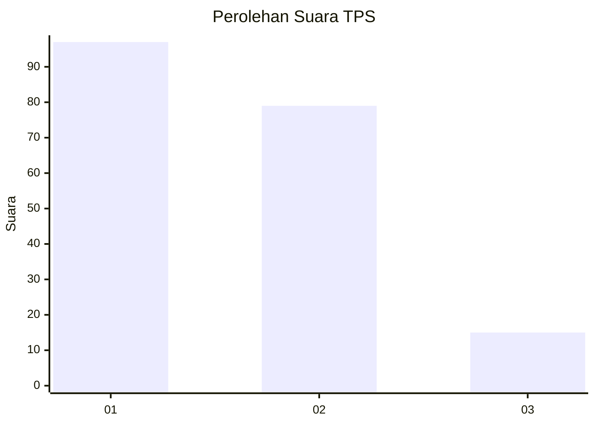
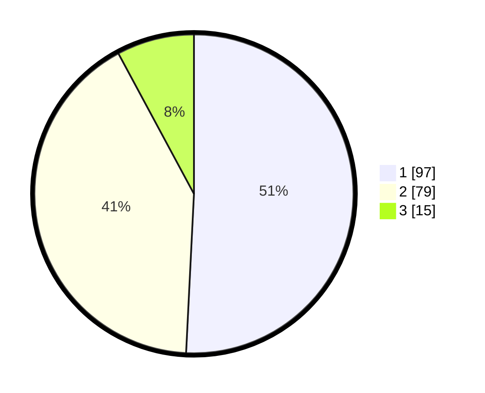

# Hasil

## Grafik

## Tabel

| No. | Nama Paslon    | Suara | Suara (raw) | Persentase |
|:--- |:-------------- | -----:| -----------:| ----------:|
| 1   | ANIES MUHAIMIN | 97    | [97][p-1]   | 50,79      |
| 2   | PRABOWO GIBRAN | 79    | [79][p-2]   | 41,36      |
| 3   | GANJAR MAHFUD  | 15    | [15][p-3]   | 7,85       |

[p-1]: https://github.com/gigit-pemilu/pemilu-2024-16-sumatera-selatan/blob/main/pilpres/hitung-suara/sub/16-sumatera-selatan/sub/71-kota-palembang/sub/06-ilir-timur-dua/sub/1012-sungaibuah/sub/005-tps/sub/paslon-1.txt
[p-2]: https://github.com/gigit-pemilu/pemilu-2024-16-sumatera-selatan/blob/main/pilpres/hitung-suara/sub/16-sumatera-selatan/sub/71-kota-palembang/sub/06-ilir-timur-dua/sub/1012-sungaibuah/sub/005-tps/sub/paslon-2.txt
[p-3]: https://github.com/gigit-pemilu/pemilu-2024-16-sumatera-selatan/blob/main/pilpres/hitung-suara/sub/16-sumatera-selatan/sub/71-kota-palembang/sub/06-ilir-timur-dua/sub/1012-sungaibuah/sub/005-tps/sub/paslon-3.txt

## Foto C Plano

https://sirekap-obj-formc.kpu.go.id/3e6b/pemilu/ppwp/16/71/06/10/12/1671061012005-20240221-224515--fa6b73df-d689-4469-87e4-852480f573f9.jpg

https://sirekap-obj-formc.kpu.go.id/3e6b/pemilu/ppwp/16/71/06/10/12/1671061012005-20240221-224447--0f8ebf08-9ee7-43f8-a2de-a5641ec72479.jpg

https://sirekap-obj-formc.kpu.go.id/3e6b/pemilu/ppwp/16/71/06/10/12/1671061012005-20240221-224419--1bf5a181-530b-4ff7-8c8e-863123ab5a8c.jpg

## Metadata

| Key        | Value               |
| ---------- | ------------------- |
| Time Stamp | 2024-02-25 11:00:00 |

