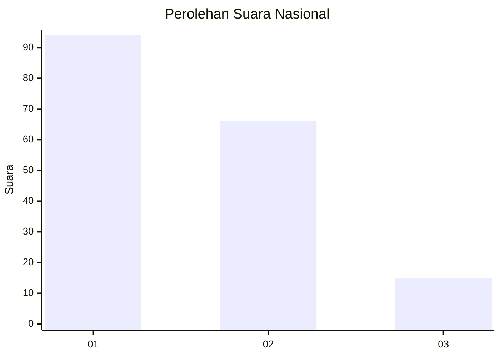
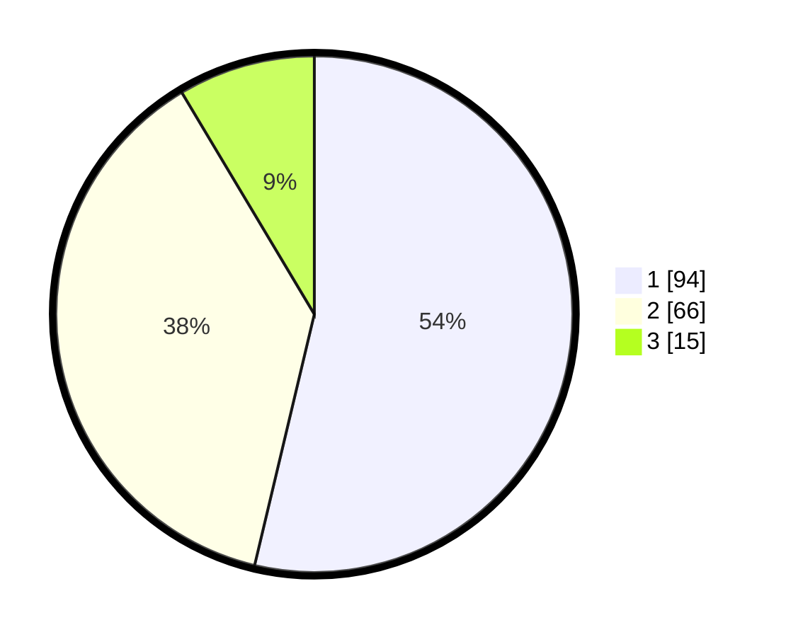

# Hasil

## Grafik

## Tabel

| No. | Nama Paslon    | Suara | Suara (raw) | Persentase |
|:--- |:-------------- | -----:| -----------:| ----------:|
| 1   | ANIES MUHAIMIN | 94    | [94][p-1]   | 53,71      |
| 2   | PRABOWO GIBRAN | 66    | [66][p-2]   | 37,71      |
| 3   | GANJAR MAHFUD  | 15    | [15][p-3]   | 8,57       |

[p-1]: https://github.com/gigit-pemilu/pemilu-2024/blob/main/pilpres/hitung-suara/sub/16-sumatera-selatan/sub/71-kota-palembang/sub/06-ilir-timur-dua/sub/1012-sungaibuah/sub/006-tps/sub/paslon-1.txt
[p-2]: https://github.com/gigit-pemilu/pemilu-2024/blob/main/pilpres/hitung-suara/sub/16-sumatera-selatan/sub/71-kota-palembang/sub/06-ilir-timur-dua/sub/1012-sungaibuah/sub/006-tps/sub/paslon-2.txt
[p-3]: https://github.com/gigit-pemilu/pemilu-2024/blob/main/pilpres/hitung-suara/sub/16-sumatera-selatan/sub/71-kota-palembang/sub/06-ilir-timur-dua/sub/1012-sungaibuah/sub/006-tps/sub/paslon-3.txt

## Foto C Plano

https://sirekap-obj-formc.kpu.go.id/5f67/pemilu/ppwp/16/71/06/10/12/1671061012006-20240221-225104--424840de-01a3-48d4-972d-3b84fd599c5b.jpg

https://sirekap-obj-formc.kpu.go.id/5f67/pemilu/ppwp/16/71/06/10/12/1671061012006-20240221-225122--14dc5d2f-ce6f-499d-a80c-4e0df1264d42.jpg

https://sirekap-obj-formc.kpu.go.id/5f67/pemilu/ppwp/16/71/06/10/12/1671061012006-20240221-225139--e4db0c80-684c-417f-93d4-644cc2fe621f.jpg

## Metadata

| Key        | Value               |
| ---------- | ------------------- |
| Time Stamp | 2024-02-25 15:00:00 |

