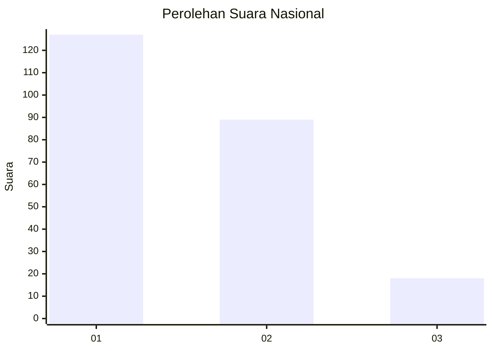
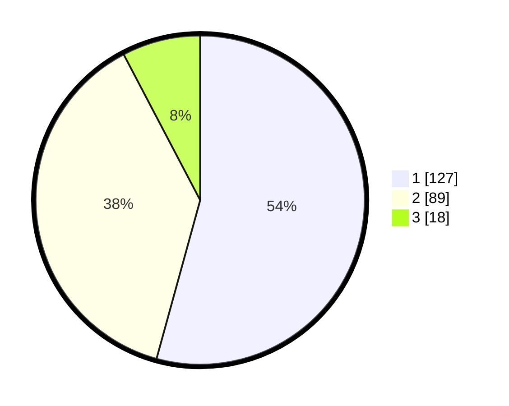

# Hasil

## Grafik

## Tabel

| No. | Nama Paslon    | Suara | Suara (raw) | Persentase |
|:--- |:-------------- | -----:| -----------:| ----------:|
| 1   | ANIES MUHAIMIN | 127   | [127][p-1]  | 54,27      |
| 2   | PRABOWO GIBRAN | 89    | [89][p-2]   | 38,03      |
| 3   | GANJAR MAHFUD  | 18    | [18][p-3]   | 7,69       |

[p-1]: https://github.com/gigit-pemilu/pemilu-2024/blob/main/pilpres/hitung-suara/sub/16-sumatera-selatan/sub/71-kota-palembang/sub/06-ilir-timur-dua/sub/1012-sungaibuah/sub/018-tps/sub/paslon-1.txt
[p-2]: https://github.com/gigit-pemilu/pemilu-2024/blob/main/pilpres/hitung-suara/sub/16-sumatera-selatan/sub/71-kota-palembang/sub/06-ilir-timur-dua/sub/1012-sungaibuah/sub/018-tps/sub/paslon-2.txt
[p-3]: https://github.com/gigit-pemilu/pemilu-2024/blob/main/pilpres/hitung-suara/sub/16-sumatera-selatan/sub/71-kota-palembang/sub/06-ilir-timur-dua/sub/1012-sungaibuah/sub/018-tps/sub/paslon-3.txt

## Foto C Plano

https://sirekap-obj-formc.kpu.go.id/0593/pemilu/ppwp/16/71/06/10/12/1671061012018-20240221-224938--b2e8952c-6ad8-49ea-95a7-a6f5924f07a4.jpg

https://sirekap-obj-formc.kpu.go.id/0593/pemilu/ppwp/16/71/06/10/12/1671061012018-20240221-224956--f3e8f217-c556-46bd-9810-40de4a90cdf6.jpg

https://sirekap-obj-formc.kpu.go.id/0593/pemilu/ppwp/16/71/06/10/12/1671061012018-20240221-225015--a9c73f10-1707-40ce-a750-f655d4e100b9.jpg

## Metadata

| Key        | Value               |
| ---------- | ------------------- |
| Time Stamp | 2024-02-25 16:00:00 |

