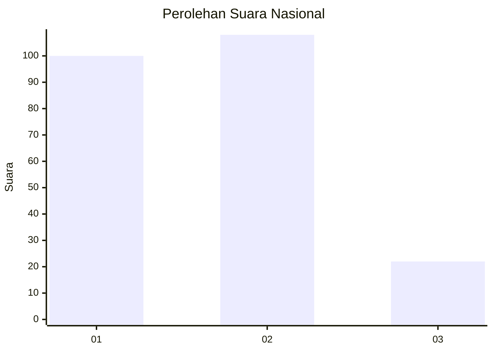
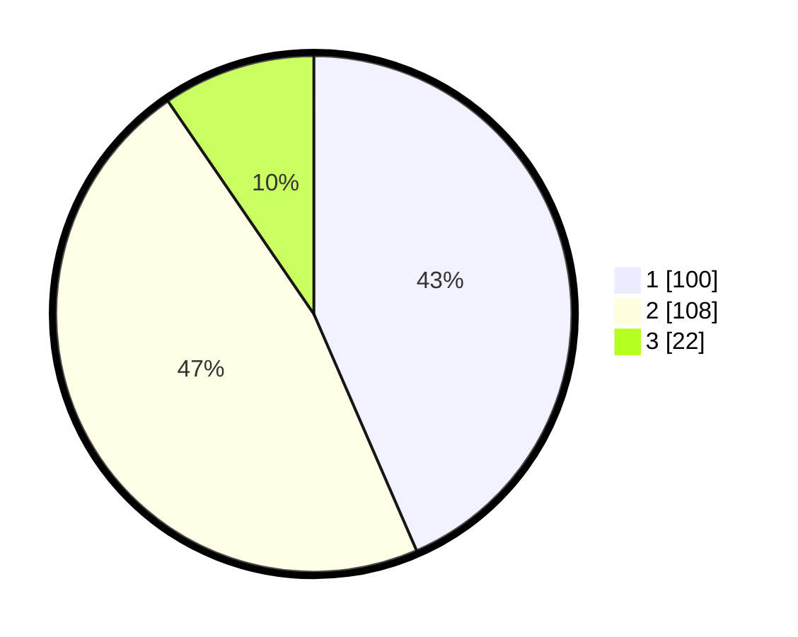

# Hasil

## Grafik

## Tabel

| No. | Nama Paslon    | Suara | Suara (raw) | Persentase |
|:--- |:-------------- | -----:| -----------:| ----------:|
| 1   | ANIES MUHAIMIN | 100   | [100][p-1]  | 43,48      |
| 2   | PRABOWO GIBRAN | 108   | [108][p-2]  | 46,96      |
| 3   | GANJAR MAHFUD  | 22    | [22][p-3]   | 9,57       |

[p-1]: https://github.com/gigit-pemilu/pemilu-2024/blob/main/pilpres/hitung-suara/sub/16-sumatera-selatan/sub/71-kota-palembang/sub/06-ilir-timur-dua/sub/1012-sungaibuah/sub/019-tps/sub/paslon-1.txt
[p-2]: https://github.com/gigit-pemilu/pemilu-2024/blob/main/pilpres/hitung-suara/sub/16-sumatera-selatan/sub/71-kota-palembang/sub/06-ilir-timur-dua/sub/1012-sungaibuah/sub/019-tps/sub/paslon-2.txt
[p-3]: https://github.com/gigit-pemilu/pemilu-2024/blob/main/pilpres/hitung-suara/sub/16-sumatera-selatan/sub/71-kota-palembang/sub/06-ilir-timur-dua/sub/1012-sungaibuah/sub/019-tps/sub/paslon-3.txt

## Foto C Plano

https://sirekap-obj-formc.kpu.go.id/a834/pemilu/ppwp/16/71/06/10/12/1671061012019-20240221-213901--ccce0d53-1f9a-430c-8bb7-ba3128e5ec79.jpg

https://sirekap-obj-formc.kpu.go.id/a834/pemilu/ppwp/16/71/06/10/12/1671061012019-20240221-213920--1c937790-1aed-40ba-a940-d137b49a9490.jpg

https://sirekap-obj-formc.kpu.go.id/a834/pemilu/ppwp/16/71/06/10/12/1671061012019-20240221-213942--1284770f-157c-45d8-9425-55e7032e3e8c.jpg

## Metadata

| Key        | Value               |
| ---------- | ------------------- |
| Time Stamp | 2024-02-25 15:00:00 |

