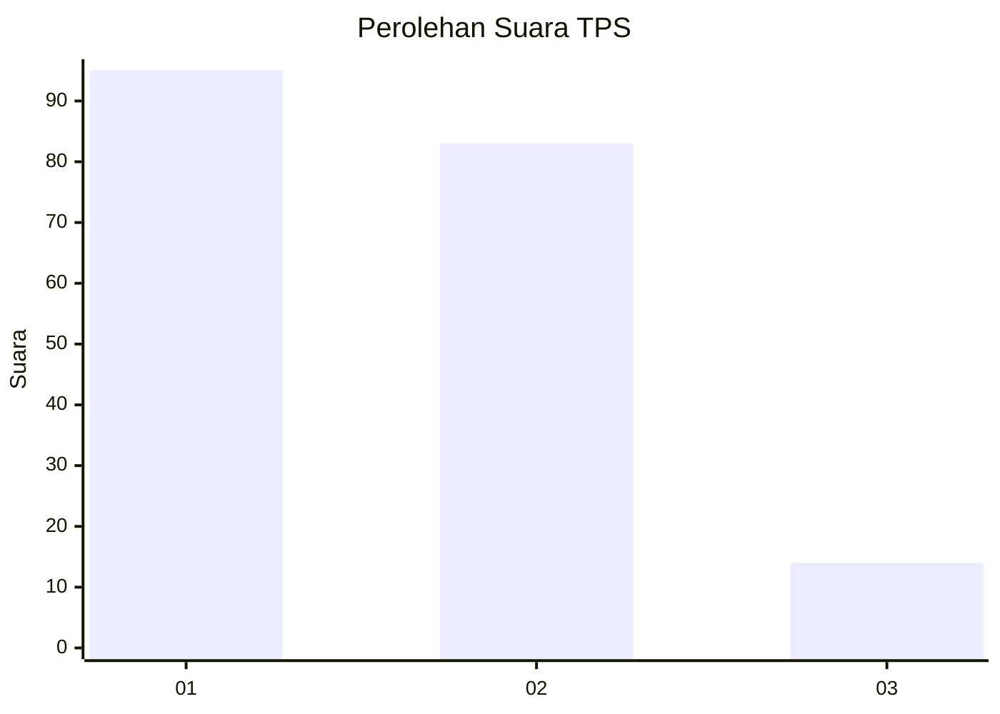
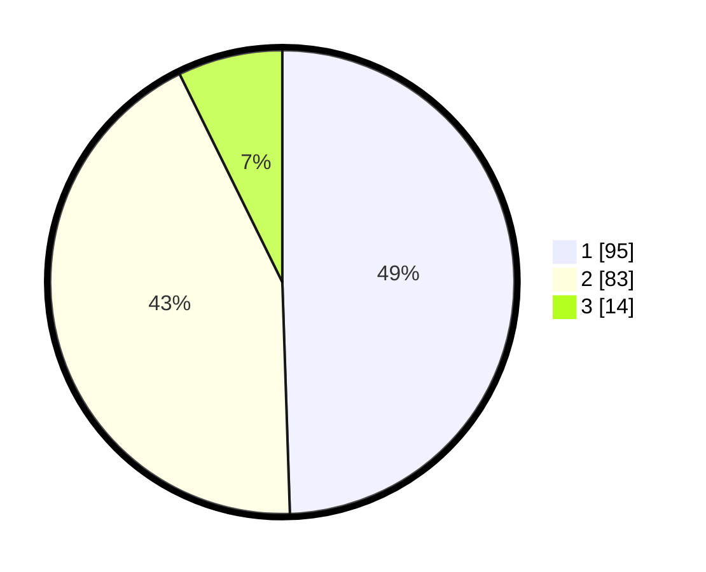

# Hasil

## Grafik

## Tabel

| No. | Nama Paslon    | Suara | Suara (raw) | Persentase |
|:--- |:-------------- | -----:| -----------:| ----------:|
| 1   | ANIES MUHAIMIN | 95    | [95][p-1]   | 49,48      |
| 2   | PRABOWO GIBRAN | 83    | [83][p-2]   | 43,23      |
| 3   | GANJAR MAHFUD  | 14    | [14][p-3]   | 7,29       |

[p-1]: https://github.com/gigit-pemilu/pemilu-2024-16-sumatera-selatan/blob/main/pilpres/hitung-suara/sub/16-sumatera-selatan/sub/71-kota-palembang/sub/06-ilir-timur-dua/sub/1012-sungaibuah/sub/022-tps/sub/paslon-1.txt
[p-2]: https://github.com/gigit-pemilu/pemilu-2024-16-sumatera-selatan/blob/main/pilpres/hitung-suara/sub/16-sumatera-selatan/sub/71-kota-palembang/sub/06-ilir-timur-dua/sub/1012-sungaibuah/sub/022-tps/sub/paslon-2.txt
[p-3]: https://github.com/gigit-pemilu/pemilu-2024-16-sumatera-selatan/blob/main/pilpres/hitung-suara/sub/16-sumatera-selatan/sub/71-kota-palembang/sub/06-ilir-timur-dua/sub/1012-sungaibuah/sub/022-tps/sub/paslon-3.txt

## Foto C Plano

https://sirekap-obj-formc.kpu.go.id/a3c0/pemilu/ppwp/16/71/06/10/12/1671061012022-20240221-210803--2a58e143-a809-48a8-9cdf-1c0356247fa4.jpg

https://sirekap-obj-formc.kpu.go.id/a3c0/pemilu/ppwp/16/71/06/10/12/1671061012022-20240221-210850--d181c274-9c5b-4289-88fa-f207a26ed196.jpg

https://sirekap-obj-formc.kpu.go.id/a3c0/pemilu/ppwp/16/71/06/10/12/1671061012022-20240221-211003--78074125-dc7f-4493-b76f-d61745325e10.jpg

## Metadata

| Key        | Value               |
| ---------- | ------------------- |
| Time Stamp | 2024-02-24 22:31:28 |

