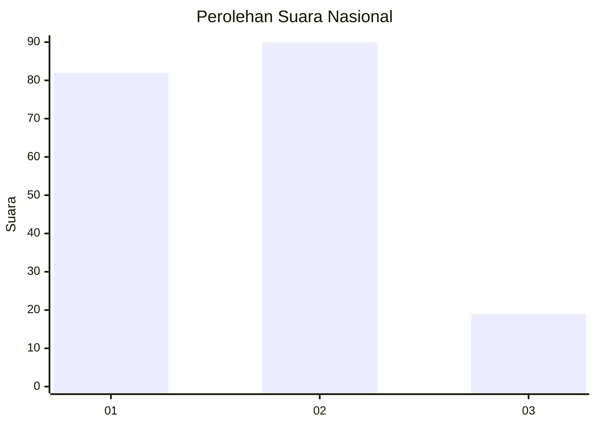
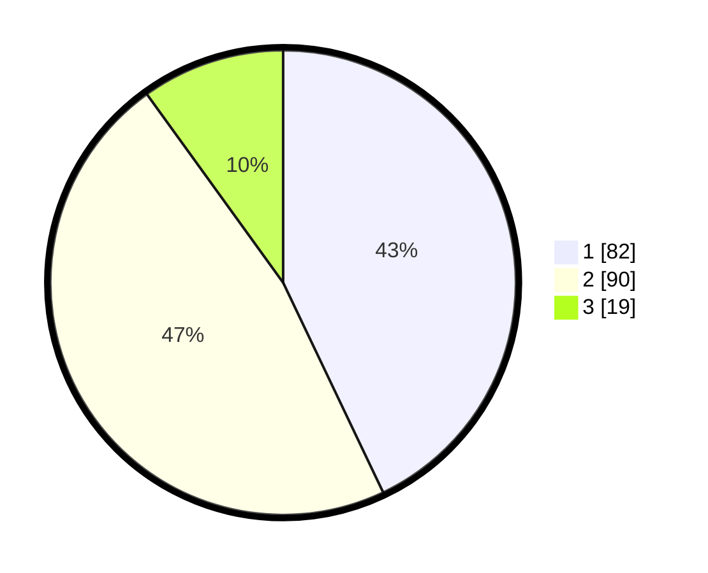

# Hasil

## Grafik

## Tabel

| No. | Nama Paslon    | Suara | Suara (raw) | Persentase |
|:--- |:-------------- | -----:| -----------:| ----------:|
| 1   | ANIES MUHAIMIN | 82    | [82][p-1]   | 42,93      |
| 2   | PRABOWO GIBRAN | 90    | [90][p-2]   | 47,12      |
| 3   | GANJAR MAHFUD  | 19    | [19][p-3]   | 9,95       |

[p-1]: https://github.com/gigit-pemilu/pemilu-2024/blob/main/pilpres/hitung-suara/sub/16-sumatera-selatan/sub/71-kota-palembang/sub/06-ilir-timur-dua/sub/1012-sungaibuah/sub/023-tps/sub/paslon-1.txt
[p-2]: https://github.com/gigit-pemilu/pemilu-2024/blob/main/pilpres/hitung-suara/sub/16-sumatera-selatan/sub/71-kota-palembang/sub/06-ilir-timur-dua/sub/1012-sungaibuah/sub/023-tps/sub/paslon-2.txt
[p-3]: https://github.com/gigit-pemilu/pemilu-2024/blob/main/pilpres/hitung-suara/sub/16-sumatera-selatan/sub/71-kota-palembang/sub/06-ilir-timur-dua/sub/1012-sungaibuah/sub/023-tps/sub/paslon-3.txt

## Foto C Plano

https://sirekap-obj-formc.kpu.go.id/1eec/pemilu/ppwp/16/71/06/10/12/1671061012023-20240221-213505--1cd9372b-5aa5-481e-bf20-9f5857531c5f.jpg

https://sirekap-obj-formc.kpu.go.id/1eec/pemilu/ppwp/16/71/06/10/12/1671061012023-20240221-213542--d45c5131-15bd-41ac-b8e7-fe5fcd32d199.jpg

https://sirekap-obj-formc.kpu.go.id/1eec/pemilu/ppwp/16/71/06/10/12/1671061012023-20240221-213559--de72de69-68e7-4486-9e8c-8a969ca15306.jpg

## Metadata

| Key        | Value               |
| ---------- | ------------------- |
| Time Stamp | 2024-02-25 16:00:00 |

