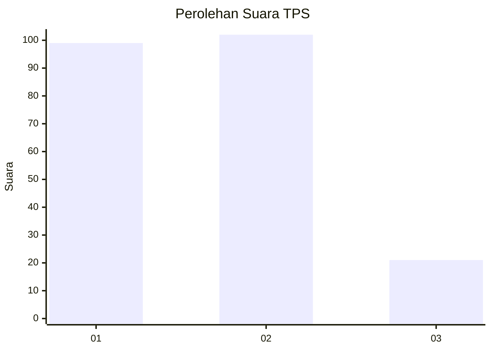
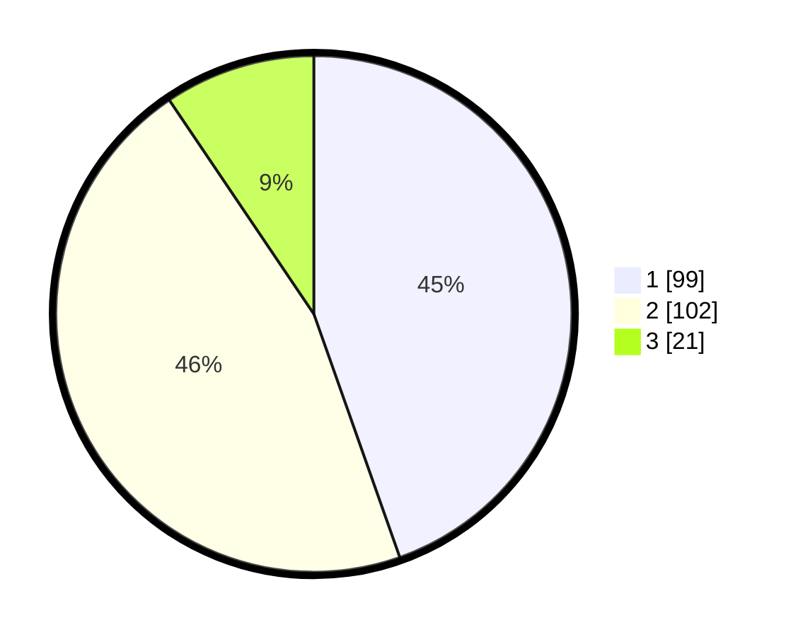

# Hasil

## Grafik

## Tabel

| No. | Nama Paslon    | Suara | Suara (raw) | Persentase |
|:--- |:-------------- | -----:| -----------:| ----------:|
| 1   | ANIES MUHAIMIN | 99    | [99][p-1]   | 44,59      |
| 2   | PRABOWO GIBRAN | 102   | [102][p-2]  | 45,95      |
| 3   | GANJAR MAHFUD  | 21    | [21][p-3]   | 9,46       |

[p-1]: https://github.com/gigit-pemilu/pemilu-2024-16-sumatera-selatan/blob/main/pilpres/hitung-suara/sub/16-sumatera-selatan/sub/71-kota-palembang/sub/06-ilir-timur-dua/sub/1012-sungaibuah/sub/029-tps/sub/paslon-1.txt
[p-2]: https://github.com/gigit-pemilu/pemilu-2024-16-sumatera-selatan/blob/main/pilpres/hitung-suara/sub/16-sumatera-selatan/sub/71-kota-palembang/sub/06-ilir-timur-dua/sub/1012-sungaibuah/sub/029-tps/sub/paslon-2.txt
[p-3]: https://github.com/gigit-pemilu/pemilu-2024-16-sumatera-selatan/blob/main/pilpres/hitung-suara/sub/16-sumatera-selatan/sub/71-kota-palembang/sub/06-ilir-timur-dua/sub/1012-sungaibuah/sub/029-tps/sub/paslon-3.txt

## Foto C Plano

https://sirekap-obj-formc.kpu.go.id/0ae3/pemilu/ppwp/16/71/06/10/12/1671061012029-20240221-212809--1e3b2096-4b72-4eb4-a3a1-c54818bf19dd.jpg

https://sirekap-obj-formc.kpu.go.id/0ae3/pemilu/ppwp/16/71/06/10/12/1671061012029-20240221-212826--6d975c14-835e-48a6-920e-57f37c083fb2.jpg

https://sirekap-obj-formc.kpu.go.id/0ae3/pemilu/ppwp/16/71/06/10/12/1671061012029-20240221-212846--3dbffd41-9054-4949-8f8b-3481ee2f375e.jpg

## Metadata

| Key        | Value               |
| ---------- | ------------------- |
| Time Stamp | 2024-02-24 22:31:28 |

