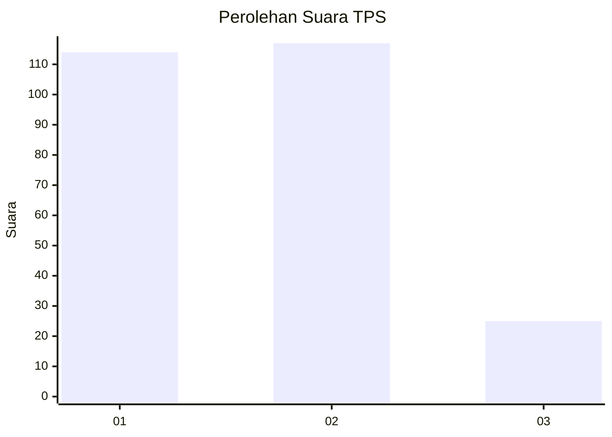
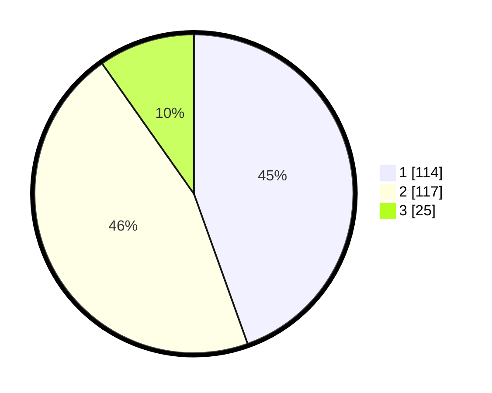

# Hasil

## Grafik

## Tabel

| No. | Nama Paslon    | Suara | Suara (raw) | Persentase |
|:--- |:-------------- | -----:| -----------:| ----------:|
| 1   | ANIES MUHAIMIN | 114   | [114][p-1]  | 44,53      |
| 2   | PRABOWO GIBRAN | 117   | [117][p-2]  | 45,70      |
| 3   | GANJAR MAHFUD  | 25    | [25][p-3]   | 9,77       |

[p-1]: https://github.com/gigit-pemilu/pemilu-2024-16-sumatera-selatan/blob/main/pilpres/hitung-suara/sub/16-sumatera-selatan/sub/71-kota-palembang/sub/06-ilir-timur-dua/sub/1012-sungaibuah/sub/030-tps/sub/paslon-1.txt
[p-2]: https://github.com/gigit-pemilu/pemilu-2024-16-sumatera-selatan/blob/main/pilpres/hitung-suara/sub/16-sumatera-selatan/sub/71-kota-palembang/sub/06-ilir-timur-dua/sub/1012-sungaibuah/sub/030-tps/sub/paslon-2.txt
[p-3]: https://github.com/gigit-pemilu/pemilu-2024-16-sumatera-selatan/blob/main/pilpres/hitung-suara/sub/16-sumatera-selatan/sub/71-kota-palembang/sub/06-ilir-timur-dua/sub/1012-sungaibuah/sub/030-tps/sub/paslon-3.txt

## Foto C Plano

https://sirekap-obj-formc.kpu.go.id/1867/pemilu/ppwp/16/71/06/10/12/1671061012030-20240221-223522--644fd59f-ff4b-405e-a5d5-f4733b6f4c10.jpg

https://sirekap-obj-formc.kpu.go.id/1867/pemilu/ppwp/16/71/06/10/12/1671061012030-20240221-223540--3e844e33-8bc1-4cb8-bf3d-4300a89651fc.jpg

https://sirekap-obj-formc.kpu.go.id/1867/pemilu/ppwp/16/71/06/10/12/1671061012030-20240221-223558--c700d2c2-fd57-4981-a0eb-b7ff7bc5bed0.jpg

## Metadata

| Key        | Value               |
| ---------- | ------------------- |
| Time Stamp | 2024-02-24 22:31:28 |

