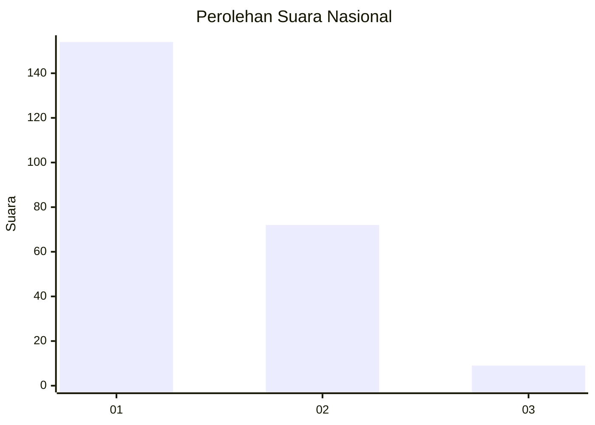
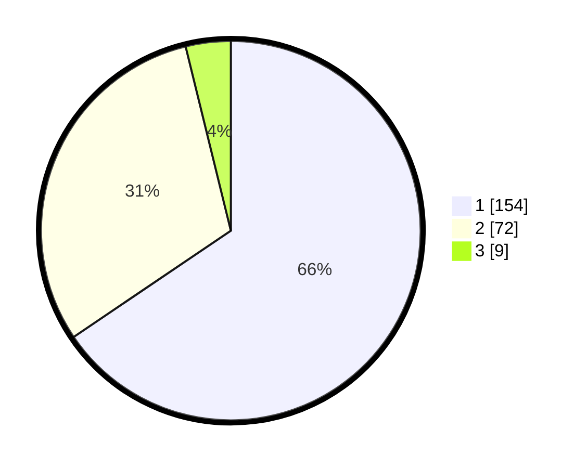

# Hasil

## Grafik

## Tabel

| No. | Nama Paslon    | Suara | Suara (raw) | Persentase |
|:--- |:-------------- | -----:| -----------:| ----------:|
| 1   | ANIES MUHAIMIN | 154   | [154][p-1]  | 65,53      |
| 2   | PRABOWO GIBRAN | 72    | [72][p-2]   | 30,64      |
| 3   | GANJAR MAHFUD  | 9     | [9][p-3]    | 3,83       |

[p-1]: https://github.com/gigit-pemilu/pemilu-2024/blob/main/pilpres/hitung-suara/sub/16-sumatera-selatan/sub/71-kota-palembang/sub/06-ilir-timur-dua/sub/1012-sungaibuah/sub/034-tps/sub/paslon-1.txt
[p-2]: https://github.com/gigit-pemilu/pemilu-2024/blob/main/pilpres/hitung-suara/sub/16-sumatera-selatan/sub/71-kota-palembang/sub/06-ilir-timur-dua/sub/1012-sungaibuah/sub/034-tps/sub/paslon-2.txt
[p-3]: https://github.com/gigit-pemilu/pemilu-2024/blob/main/pilpres/hitung-suara/sub/16-sumatera-selatan/sub/71-kota-palembang/sub/06-ilir-timur-dua/sub/1012-sungaibuah/sub/034-tps/sub/paslon-3.txt

## Foto C Plano

https://sirekap-obj-formc.kpu.go.id/1a30/pemilu/ppwp/16/71/06/10/12/1671061012034-20240221-214710--85902d4c-e280-4ff7-bd9b-8f4fe906f05f.jpg

https://sirekap-obj-formc.kpu.go.id/1a30/pemilu/ppwp/16/71/06/10/12/1671061012034-20240221-214729--df943dda-90f1-4d5d-b127-2e5b2eeef143.jpg

https://sirekap-obj-formc.kpu.go.id/1a30/pemilu/ppwp/16/71/06/10/12/1671061012034-20240221-214745--980537ff-2375-4a94-8d91-a45000e3f1d1.jpg

## Metadata

| Key        | Value               |
| ---------- | ------------------- |
| Time Stamp | 2024-02-25 18:00:00 |

