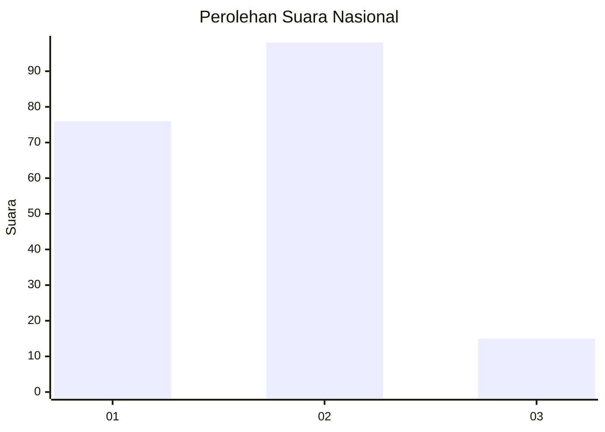

# Hasil

## Grafik

## Tabel

| No. | Nama Paslon    | Suara | Suara (raw) | Persentase |
|:--- |:-------------- | -----:| -----------:| ----------:|
| 1   | ANIES MUHAIMIN | 76    | [76][p-1]   | 40,21      |
| 2   | PRABOWO GIBRAN | 98    | [98][p-2]   | 51,85      |
| 3   | GANJAR MAHFUD  | 15    | [15][p-3]   | 7,94       |

[p-1]: https://github.com/gigit-pemilu/pemilu-2024/blob/main/pilpres/hitung-suara/sub/16-sumatera-selatan/sub/71-kota-palembang/sub/06-ilir-timur-dua/sub/1012-sungaibuah/sub/040-tps/sub/paslon-1.txt
[p-2]: https://github.com/gigit-pemilu/pemilu-2024/blob/main/pilpres/hitung-suara/sub/16-sumatera-selatan/sub/71-kota-palembang/sub/06-ilir-timur-dua/sub/1012-sungaibuah/sub/040-tps/sub/paslon-2.txt
[p-3]: https://github.com/gigit-pemilu/pemilu-2024/blob/main/pilpres/hitung-suara/sub/16-sumatera-selatan/sub/71-kota-palembang/sub/06-ilir-timur-dua/sub/1012-sungaibuah/sub/040-tps/sub/paslon-3.txt

## Foto C Plano

https://sirekap-obj-formc.kpu.go.id/de02/pemilu/ppwp/16/71/06/10/12/1671061012040-20240221-222824--7d5ba309-bc09-4a0f-bf29-d80005c58092.jpg

https://sirekap-obj-formc.kpu.go.id/de02/pemilu/ppwp/16/71/06/10/12/1671061012040-20240221-222853--63646906-b43e-479d-9855-c3786d584930.jpg

https://sirekap-obj-formc.kpu.go.id/de02/pemilu/ppwp/16/71/06/10/12/1671061012040-20240221-223007--972a95f5-a0c1-48fe-ba53-7fb1a49dd201.jpg

## Metadata

| Key        | Value               |
| ---------- | ------------------- |
| Time Stamp | 2024-02-25 21:00:00 |

