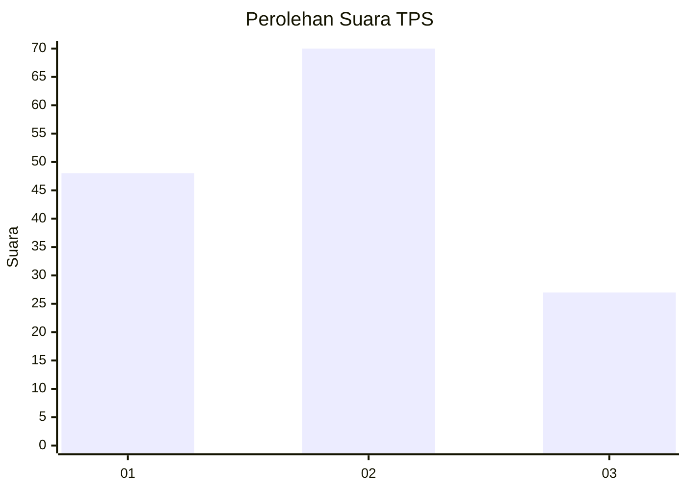
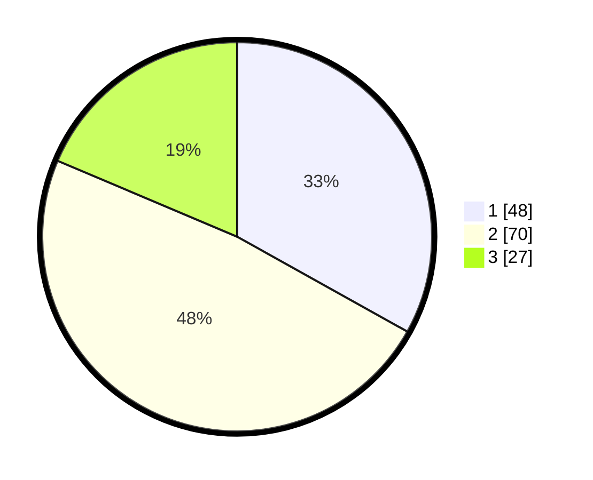

# Hasil

## Grafik

## Tabel

| No. | Nama Paslon    | Suara | Suara (raw) | Persentase |
|:--- |:-------------- | -----:| -----------:| ----------:|
| 1   | ANIES MUHAIMIN | 48    | [48][p-1]   | 33,10      |
| 2   | PRABOWO GIBRAN | 70    | [70][p-2]   | 48,28      |
| 3   | GANJAR MAHFUD  | 27    | [27][p-3]   | 18,62      |

[p-1]: https://github.com/gigit-pemilu/pemilu-2024-16-sumatera-selatan/blob/main/pilpres/hitung-suara/sub/16-sumatera-selatan/sub/71-kota-palembang/sub/07-sukarami/sub/1004-sukajaya/sub/040-tps/sub/paslon-1.txt
[p-2]: https://github.com/gigit-pemilu/pemilu-2024-16-sumatera-selatan/blob/main/pilpres/hitung-suara/sub/16-sumatera-selatan/sub/71-kota-palembang/sub/07-sukarami/sub/1004-sukajaya/sub/040-tps/sub/paslon-2.txt
[p-3]: https://github.com/gigit-pemilu/pemilu-2024-16-sumatera-selatan/blob/main/pilpres/hitung-suara/sub/16-sumatera-selatan/sub/71-kota-palembang/sub/07-sukarami/sub/1004-sukajaya/sub/040-tps/sub/paslon-3.txt

## Foto C Plano

https://sirekap-obj-formc.kpu.go.id/d170/pemilu/ppwp/16/71/07/10/04/1671071004040-20240214-204359--a7ba2058-a4d2-49ed-bc88-b2eb3b4c20aa.jpg

https://sirekap-obj-formc.kpu.go.id/d170/pemilu/ppwp/16/71/07/10/04/1671071004040-20240214-204438--9701a200-222c-4c2f-895f-9fdf27df0636.jpg

https://sirekap-obj-formc.kpu.go.id/d170/pemilu/ppwp/16/71/07/10/04/1671071004040-20240214-204518--e6e9276f-5be2-4d44-a4f4-e67b8f7604c4.jpg

## Metadata

| Key        | Value               |
| ---------- | ------------------- |
| Time Stamp | 2024-02-26 14:00:00 |

