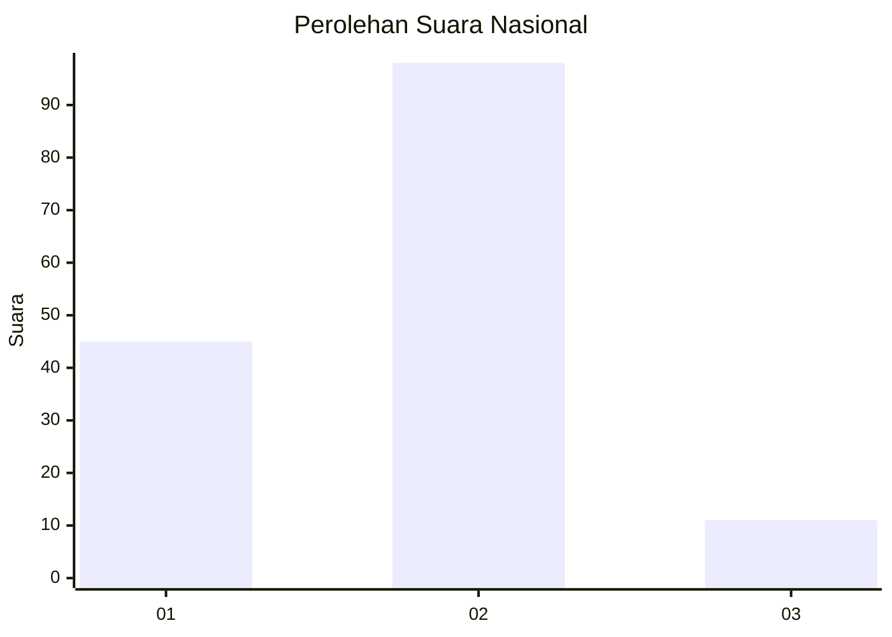
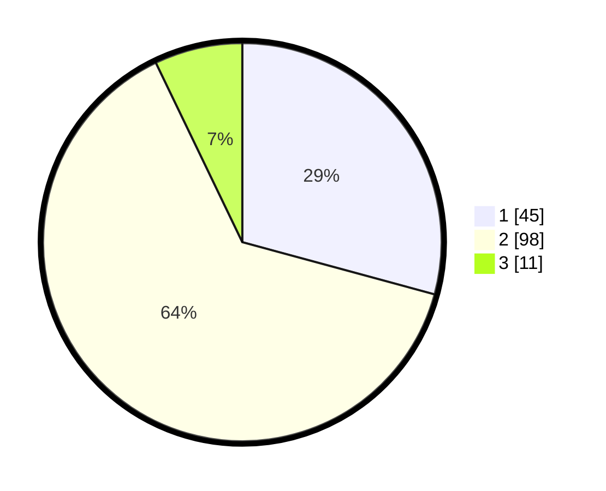

# Hasil

## Grafik

## Tabel

| No. | Nama Paslon    | Suara | Suara (raw) | Persentase |
|:--- |:-------------- | -----:| -----------:| ----------:|
| 1   | ANIES MUHAIMIN | 45    | [45][p-1]   | 29,22      |
| 2   | PRABOWO GIBRAN | 98    | [98][p-2]   | 63,64      |
| 3   | GANJAR MAHFUD  | 11    | [11][p-3]   | 7,14       |

[p-1]: https://github.com/gigit-pemilu/pemilu-2024/blob/main/pilpres/hitung-suara/sub/16-sumatera-selatan/sub/71-kota-palembang/sub/07-sukarami/sub/1004-sukajaya/sub/051-tps/sub/paslon-1.txt
[p-2]: https://github.com/gigit-pemilu/pemilu-2024/blob/main/pilpres/hitung-suara/sub/16-sumatera-selatan/sub/71-kota-palembang/sub/07-sukarami/sub/1004-sukajaya/sub/051-tps/sub/paslon-2.txt
[p-3]: https://github.com/gigit-pemilu/pemilu-2024/blob/main/pilpres/hitung-suara/sub/16-sumatera-selatan/sub/71-kota-palembang/sub/07-sukarami/sub/1004-sukajaya/sub/051-tps/sub/paslon-3.txt

## Foto C Plano

https://sirekap-obj-formc.kpu.go.id/9f3e/pemilu/ppwp/16/71/07/10/04/1671071004051-20240215-012808--d35538cb-d5d6-4723-8bc6-af58a9cc5f8a.jpg

https://sirekap-obj-formc.kpu.go.id/9f3e/pemilu/ppwp/16/71/07/10/04/1671071004051-20240214-193902--6d56af28-5c37-44f3-a7c2-5d63ef3e8a68.jpg

https://sirekap-obj-formc.kpu.go.id/9f3e/pemilu/ppwp/16/71/07/10/04/1671071004051-20240214-193836--a87d4f88-db51-40b5-932c-5ee34233d7c4.jpg

## Metadata

| Key        | Value               |
| ---------- | ------------------- |
| Time Stamp | 2024-02-25 14:00:00 |

