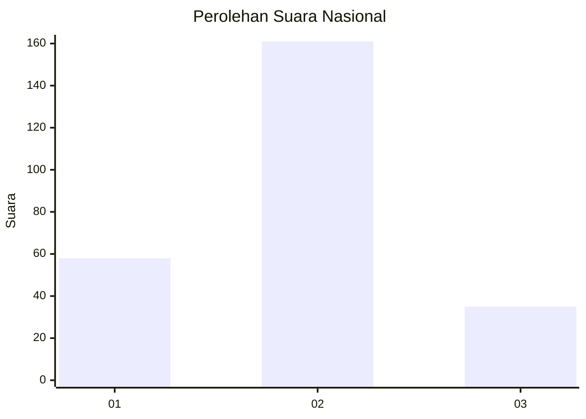
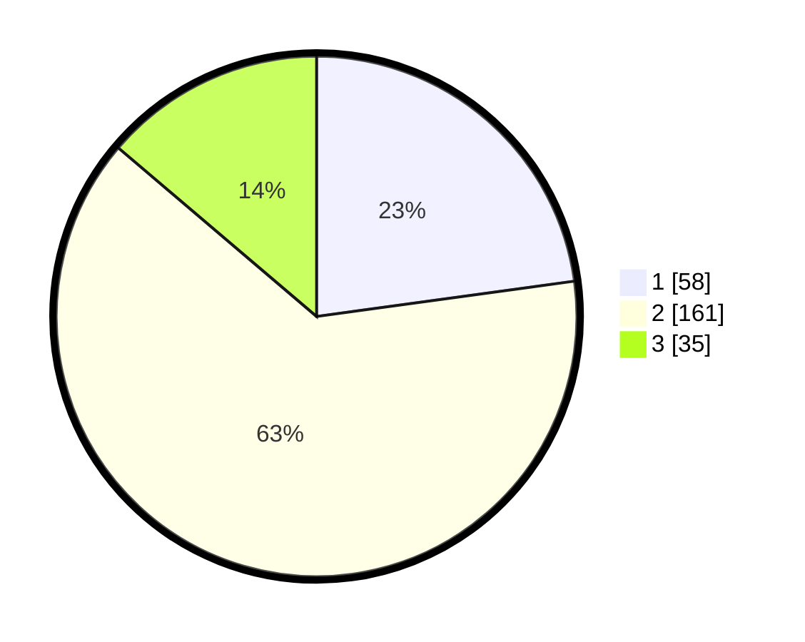

# Hasil

## Grafik

## Tabel

| No. | Nama Paslon    | Suara | Suara (raw) | Persentase |
|:--- |:-------------- | -----:| -----------:| ----------:|
| 1   | ANIES MUHAIMIN | 58    | [58][p-1]   | 22,83      |
| 2   | PRABOWO GIBRAN | 161   | [161][p-2]  | 63,39      |
| 3   | GANJAR MAHFUD  | 35    | [35][p-3]   | 13,78      |

[p-1]: https://github.com/gigit-pemilu/pemilu-2024/blob/main/pilpres/hitung-suara/sub/16-sumatera-selatan/sub/71-kota-palembang/sub/07-sukarami/sub/1004-sukajaya/sub/069-tps/sub/paslon-1.txt
[p-2]: https://github.com/gigit-pemilu/pemilu-2024/blob/main/pilpres/hitung-suara/sub/16-sumatera-selatan/sub/71-kota-palembang/sub/07-sukarami/sub/1004-sukajaya/sub/069-tps/sub/paslon-2.txt
[p-3]: https://github.com/gigit-pemilu/pemilu-2024/blob/main/pilpres/hitung-suara/sub/16-sumatera-selatan/sub/71-kota-palembang/sub/07-sukarami/sub/1004-sukajaya/sub/069-tps/sub/paslon-3.txt

## Foto C Plano

https://sirekap-obj-formc.kpu.go.id/f9ff/pemilu/ppwp/16/71/07/10/04/1671071004069-20240214-155505--742d081d-f9e5-48ab-9463-c1451bfbd4d1.jpg

https://sirekap-obj-formc.kpu.go.id/f9ff/pemilu/ppwp/16/71/07/10/04/1671071004069-20240214-155544--008bfc87-95d6-4dbb-b3f8-28b6d209714e.jpg

https://sirekap-obj-formc.kpu.go.id/f9ff/pemilu/ppwp/16/71/07/10/04/1671071004069-20240214-155615--7d58f69b-a75d-400b-ba65-8342c3614191.jpg

## Metadata

| Key        | Value               |
| ---------- | ------------------- |
| Time Stamp | 2024-02-25 00:00:00 |

