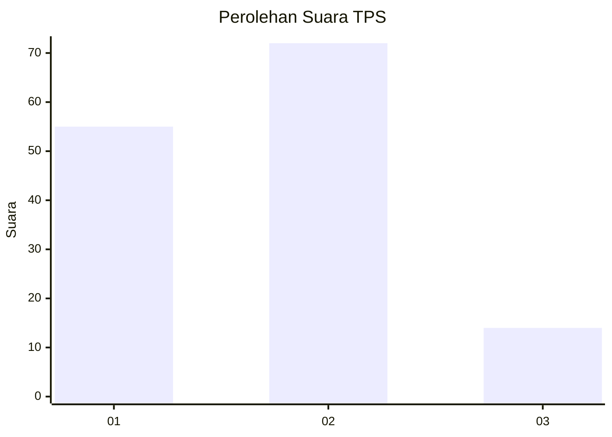
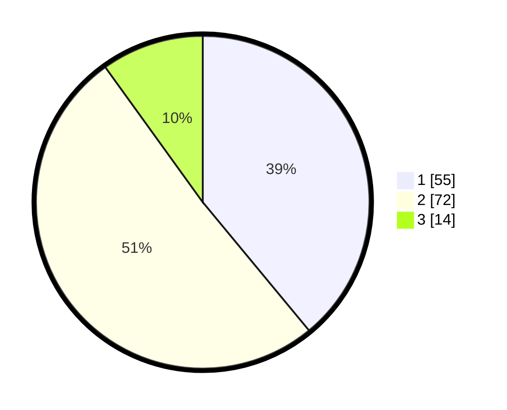

# Hasil

## Grafik

## Tabel

| No. | Nama Paslon    | Suara | Suara (raw) | Persentase |
|:--- |:-------------- | -----:| -----------:| ----------:|
| 1   | ANIES MUHAIMIN | 55    | [55][p-1]   | 39,01      |
| 2   | PRABOWO GIBRAN | 72    | [72][p-2]   | 51,06      |
| 3   | GANJAR MAHFUD  | 14    | [14][p-3]   | 9,93       |

[p-1]: https://github.com/gigit-pemilu/pemilu-2024-16-sumatera-selatan/blob/main/pilpres/hitung-suara/sub/16-sumatera-selatan/sub/71-kota-palembang/sub/07-sukarami/sub/1004-sukajaya/sub/081-tps/sub/paslon-1.txt
[p-2]: https://github.com/gigit-pemilu/pemilu-2024-16-sumatera-selatan/blob/main/pilpres/hitung-suara/sub/16-sumatera-selatan/sub/71-kota-palembang/sub/07-sukarami/sub/1004-sukajaya/sub/081-tps/sub/paslon-2.txt
[p-3]: https://github.com/gigit-pemilu/pemilu-2024-16-sumatera-selatan/blob/main/pilpres/hitung-suara/sub/16-sumatera-selatan/sub/71-kota-palembang/sub/07-sukarami/sub/1004-sukajaya/sub/081-tps/sub/paslon-3.txt

## Foto C Plano

https://sirekap-obj-formc.kpu.go.id/3f68/pemilu/ppwp/16/71/07/10/04/1671071004081-20240215-004710--b4afa1ad-a3ef-414b-9bc8-a69b19e1d5ee.jpg

https://sirekap-obj-formc.kpu.go.id/3f68/pemilu/ppwp/16/71/07/10/04/1671071004081-20240215-004727--e0c73cda-866e-4016-8da8-39a5bd2bd84b.jpg

https://sirekap-obj-formc.kpu.go.id/3f68/pemilu/ppwp/16/71/07/10/04/1671071004081-20240215-004741--6033057f-f9f5-4c8d-a649-d83ba8188909.jpg

## Metadata

| Key        | Value               |
| ---------- | ------------------- |
| Time Stamp | 2024-02-24 22:31:28 |

