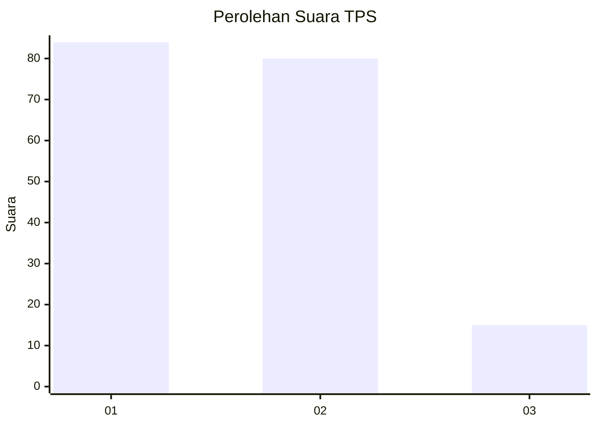
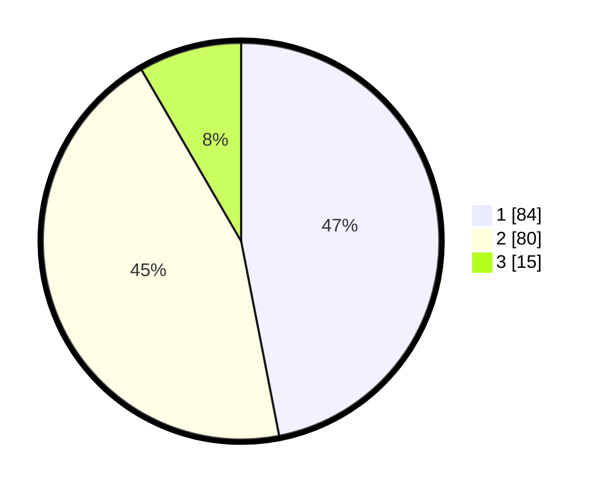

# Hasil

## Grafik

## Tabel

| No. | Nama Paslon    | Suara | Suara (raw) | Persentase |
|:--- |:-------------- | -----:| -----------:| ----------:|
| 1   | ANIES MUHAIMIN | 84    | [84][p-1]   | 46,93      |
| 2   | PRABOWO GIBRAN | 80    | [80][p-2]   | 44,69      |
| 3   | GANJAR MAHFUD  | 15    | [15][p-3]   | 8,38       |

[p-1]: https://github.com/gigit-pemilu/pemilu-2024-16-sumatera-selatan/blob/main/pilpres/hitung-suara/sub/16-sumatera-selatan/sub/71-kota-palembang/sub/07-sukarami/sub/1004-sukajaya/sub/086-tps/sub/paslon-1.txt
[p-2]: https://github.com/gigit-pemilu/pemilu-2024-16-sumatera-selatan/blob/main/pilpres/hitung-suara/sub/16-sumatera-selatan/sub/71-kota-palembang/sub/07-sukarami/sub/1004-sukajaya/sub/086-tps/sub/paslon-2.txt
[p-3]: https://github.com/gigit-pemilu/pemilu-2024-16-sumatera-selatan/blob/main/pilpres/hitung-suara/sub/16-sumatera-selatan/sub/71-kota-palembang/sub/07-sukarami/sub/1004-sukajaya/sub/086-tps/sub/paslon-3.txt

## Foto C Plano

https://sirekap-obj-formc.kpu.go.id/7d4d/pemilu/ppwp/16/71/07/10/04/1671071004086-20240214-231941--5442e061-4e08-4101-8831-09f75737e7c3.jpg

https://sirekap-obj-formc.kpu.go.id/7d4d/pemilu/ppwp/16/71/07/10/04/1671071004086-20240214-232341--b95fc0be-02e9-4b3f-9418-0b1d9ac15748.jpg

https://sirekap-obj-formc.kpu.go.id/7d4d/pemilu/ppwp/16/71/07/10/04/1671071004086-20240214-232216--4386c52e-4b6a-4350-9bd5-76a85d2effdb.jpg

## Metadata

| Key        | Value               |
| ---------- | ------------------- |
| Time Stamp | 2024-02-25 11:00:00 |

