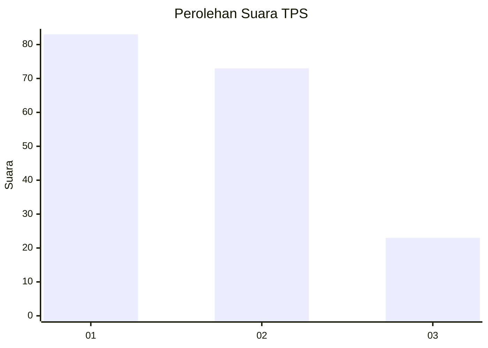
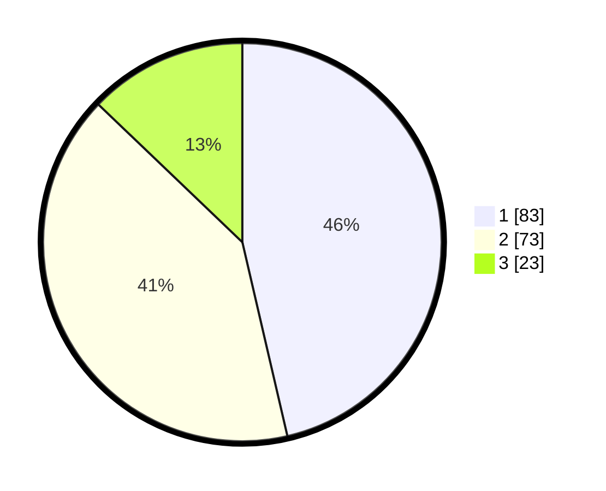

# Hasil

## Grafik

## Tabel

| No. | Nama Paslon    | Suara | Suara (raw) | Persentase |
|:--- |:-------------- | -----:| -----------:| ----------:|
| 1   | ANIES MUHAIMIN | 83    | [83][p-1]   | 46,37      |
| 2   | PRABOWO GIBRAN | 73    | [73][p-2]   | 40,78      |
| 3   | GANJAR MAHFUD  | 23    | [23][p-3]   | 12,85      |

[p-1]: https://github.com/gigit-pemilu/pemilu-2024-16-sumatera-selatan/blob/main/pilpres/hitung-suara/sub/16-sumatera-selatan/sub/71-kota-palembang/sub/07-sukarami/sub/1004-sukajaya/sub/128-tps/sub/paslon-1.txt
[p-2]: https://github.com/gigit-pemilu/pemilu-2024-16-sumatera-selatan/blob/main/pilpres/hitung-suara/sub/16-sumatera-selatan/sub/71-kota-palembang/sub/07-sukarami/sub/1004-sukajaya/sub/128-tps/sub/paslon-2.txt
[p-3]: https://github.com/gigit-pemilu/pemilu-2024-16-sumatera-selatan/blob/main/pilpres/hitung-suara/sub/16-sumatera-selatan/sub/71-kota-palembang/sub/07-sukarami/sub/1004-sukajaya/sub/128-tps/sub/paslon-3.txt

## Foto C Plano

https://sirekap-obj-formc.kpu.go.id/cfbb/pemilu/ppwp/16/71/07/10/04/1671071004128-20240214-235407--c5d64163-e6fb-48a4-9f5a-0bfc2af42248.jpg

https://sirekap-obj-formc.kpu.go.id/cfbb/pemilu/ppwp/16/71/07/10/04/1671071004128-20240214-225408--7cfeeca2-c5d3-450d-8b0d-372c86133753.jpg

https://sirekap-obj-formc.kpu.go.id/cfbb/pemilu/ppwp/16/71/07/10/04/1671071004128-20240214-225505--9ca8f0ae-d1e3-4759-974a-a92347676723.jpg

## Metadata

| Key        | Value               |
| ---------- | ------------------- |
| Time Stamp | 2024-02-25 11:00:00 |

