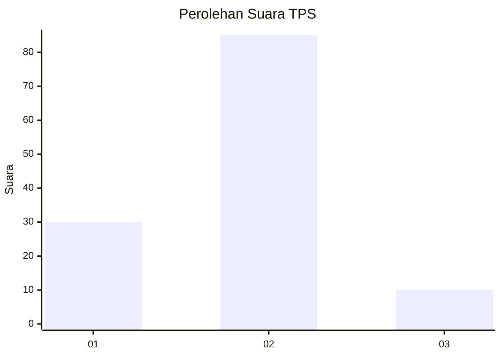
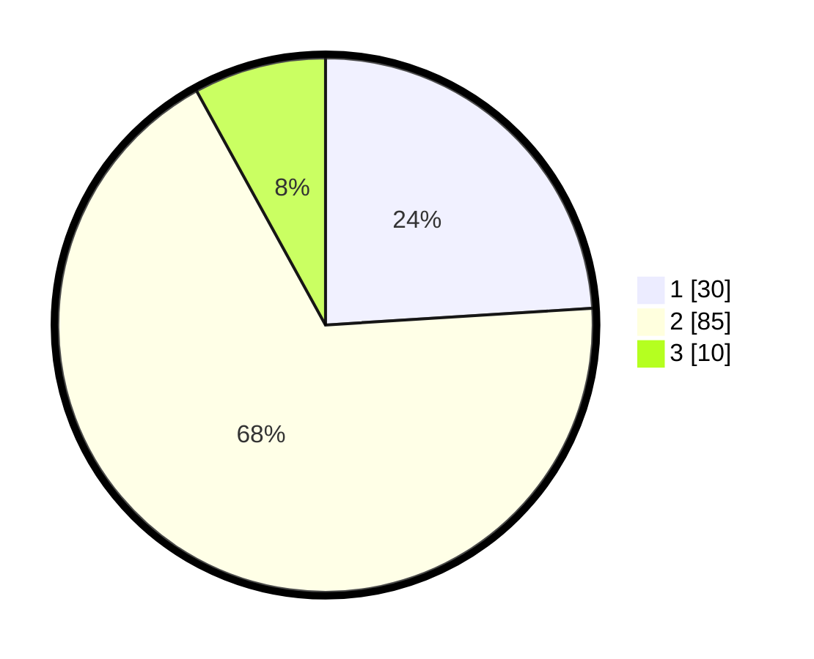

# Hasil

## Grafik

## Tabel

| No. | Nama Paslon    | Suara | Suara (raw) | Persentase |
|:--- |:-------------- | -----:| -----------:| ----------:|
| 1   | ANIES MUHAIMIN | 30    | [30][p-1]   | 24,00      |
| 2   | PRABOWO GIBRAN | 85    | [85][p-2]   | 68,00      |
| 3   | GANJAR MAHFUD  | 10    | [10][p-3]   | 8,00       |

[p-1]: https://github.com/gigit-pemilu/pemilu-2024-16-sumatera-selatan/blob/main/pilpres/hitung-suara/sub/16-sumatera-selatan/sub/71-kota-palembang/sub/07-sukarami/sub/1004-sukajaya/sub/140-tps/sub/paslon-1.txt
[p-2]: https://github.com/gigit-pemilu/pemilu-2024-16-sumatera-selatan/blob/main/pilpres/hitung-suara/sub/16-sumatera-selatan/sub/71-kota-palembang/sub/07-sukarami/sub/1004-sukajaya/sub/140-tps/sub/paslon-2.txt
[p-3]: https://github.com/gigit-pemilu/pemilu-2024-16-sumatera-selatan/blob/main/pilpres/hitung-suara/sub/16-sumatera-selatan/sub/71-kota-palembang/sub/07-sukarami/sub/1004-sukajaya/sub/140-tps/sub/paslon-3.txt

## Foto C Plano

https://sirekap-obj-formc.kpu.go.id/a533/pemilu/ppwp/16/71/07/10/04/1671071004140-20240214-194322--9b48143f-617a-46a7-bcf0-d2a2da85e8db.jpg

https://sirekap-obj-formc.kpu.go.id/a533/pemilu/ppwp/16/71/07/10/04/1671071004140-20240214-194317--bc729df1-4529-44a2-b046-0905d2f75aed.jpg

https://sirekap-obj-formc.kpu.go.id/a533/pemilu/ppwp/16/71/07/10/04/1671071004140-20240214-194311--3f5f3b27-2832-4b91-99e6-9497293fed05.jpg

## Metadata

| Key        | Value               |
| ---------- | ------------------- |
| Time Stamp | 2024-02-16 16:25:10 |

