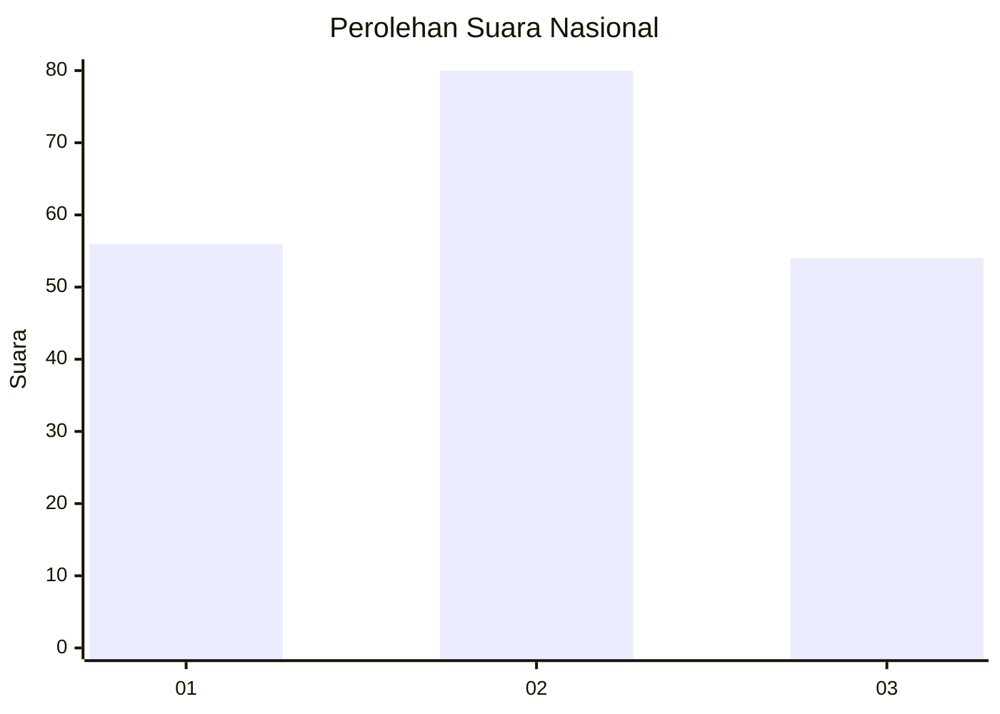
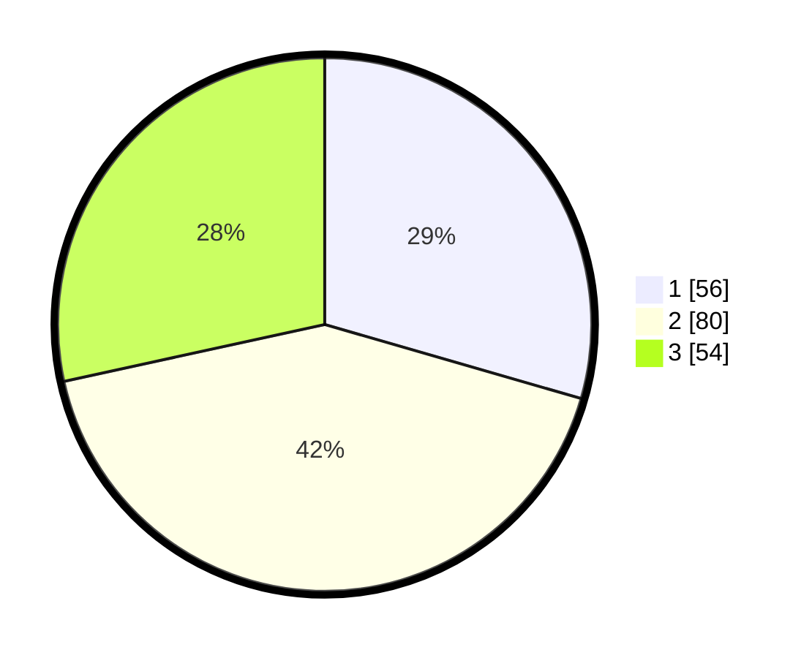

# Hasil

## Grafik

## Tabel

| No. | Nama Paslon    | Suara | Suara (raw) | Persentase |
|:--- |:-------------- | -----:| -----------:| ----------:|
| 1   | ANIES MUHAIMIN | 56    | [56][p-1]   | 29,47      |
| 2   | PRABOWO GIBRAN | 80    | [80][p-2]   | 42,11      |
| 3   | GANJAR MAHFUD  | 54    | [54][p-3]   | 28,42      |

[p-1]: https://github.com/gigit-pemilu/pemilu-2024/blob/main/pilpres/hitung-suara/sub/16-sumatera-selatan/sub/71-kota-palembang/sub/07-sukarami/sub/1007-kebunbunga/sub/003-tps/sub/paslon-1.txt
[p-2]: https://github.com/gigit-pemilu/pemilu-2024/blob/main/pilpres/hitung-suara/sub/16-sumatera-selatan/sub/71-kota-palembang/sub/07-sukarami/sub/1007-kebunbunga/sub/003-tps/sub/paslon-2.txt
[p-3]: https://github.com/gigit-pemilu/pemilu-2024/blob/main/pilpres/hitung-suara/sub/16-sumatera-selatan/sub/71-kota-palembang/sub/07-sukarami/sub/1007-kebunbunga/sub/003-tps/sub/paslon-3.txt

## Foto C Plano

https://sirekap-obj-formc.kpu.go.id/e852/pemilu/ppwp/16/71/07/10/07/1671071007003-20240214-214806--24e514db-0a80-46fa-a6f6-8a955291d674.jpg

https://sirekap-obj-formc.kpu.go.id/e852/pemilu/ppwp/16/71/07/10/07/1671071007003-20240214-214932--0f764574-c906-42dd-bfb7-9bc5167380cc.jpg

https://sirekap-obj-formc.kpu.go.id/e852/pemilu/ppwp/16/71/07/10/07/1671071007003-20240214-215100--884ae24c-456e-420d-b6f4-d78b920edeba.jpg

## Metadata

| Key        | Value               |
| ---------- | ------------------- |
| Time Stamp | 2024-02-26 14:00:00 |

