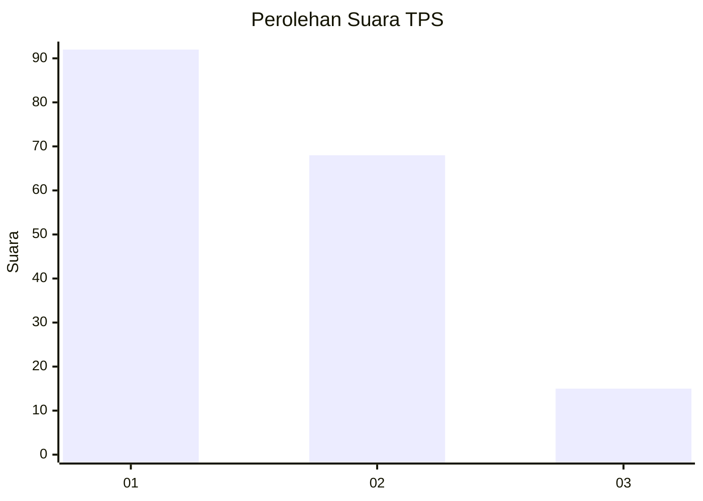
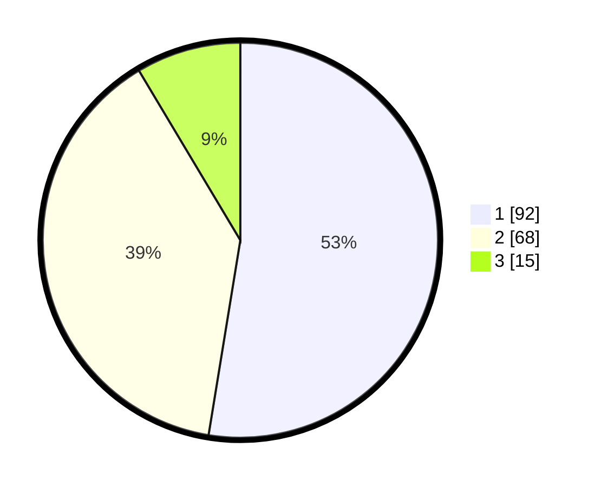

# Hasil

## Grafik

## Tabel

| No. | Nama Paslon    | Suara | Suara (raw) | Persentase |
|:--- |:-------------- | -----:| -----------:| ----------:|
| 1   | ANIES MUHAIMIN | 92    | [92][p-1]   | 52,57      |
| 2   | PRABOWO GIBRAN | 68    | [68][p-2]   | 38,86      |
| 3   | GANJAR MAHFUD  | 15    | [15][p-3]   | 8,57       |

[p-1]: https://github.com/gigit-pemilu/pemilu-2024-16-sumatera-selatan/blob/main/pilpres/hitung-suara/sub/16-sumatera-selatan/sub/71-kota-palembang/sub/07-sukarami/sub/1007-kebunbunga/sub/019-tps/sub/paslon-1.txt
[p-2]: https://github.com/gigit-pemilu/pemilu-2024-16-sumatera-selatan/blob/main/pilpres/hitung-suara/sub/16-sumatera-selatan/sub/71-kota-palembang/sub/07-sukarami/sub/1007-kebunbunga/sub/019-tps/sub/paslon-2.txt
[p-3]: https://github.com/gigit-pemilu/pemilu-2024-16-sumatera-selatan/blob/main/pilpres/hitung-suara/sub/16-sumatera-selatan/sub/71-kota-palembang/sub/07-sukarami/sub/1007-kebunbunga/sub/019-tps/sub/paslon-3.txt

## Foto C Plano

https://sirekap-obj-formc.kpu.go.id/646d/pemilu/ppwp/16/71/07/10/07/1671071007019-20240214-205058--040dc545-cb5d-46c8-954f-7674fdc84a2f.jpg

https://sirekap-obj-formc.kpu.go.id/646d/pemilu/ppwp/16/71/07/10/07/1671071007019-20240214-204938--e614e321-cbf3-4285-b7af-47dec2a3b081.jpg

https://sirekap-obj-formc.kpu.go.id/646d/pemilu/ppwp/16/71/07/10/07/1671071007019-20240214-204601--0a29a653-7b13-4124-9648-63c4c6f15fa0.jpg

## Metadata

| Key        | Value               |
| ---------- | ------------------- |
| Time Stamp | 2024-02-25 22:00:00 |

