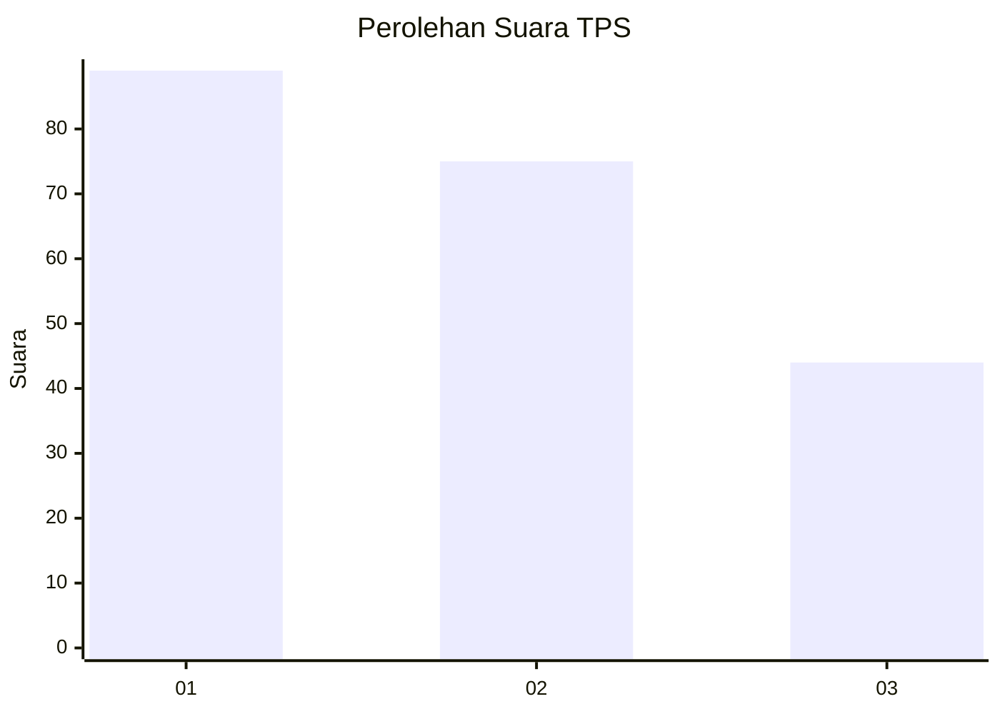
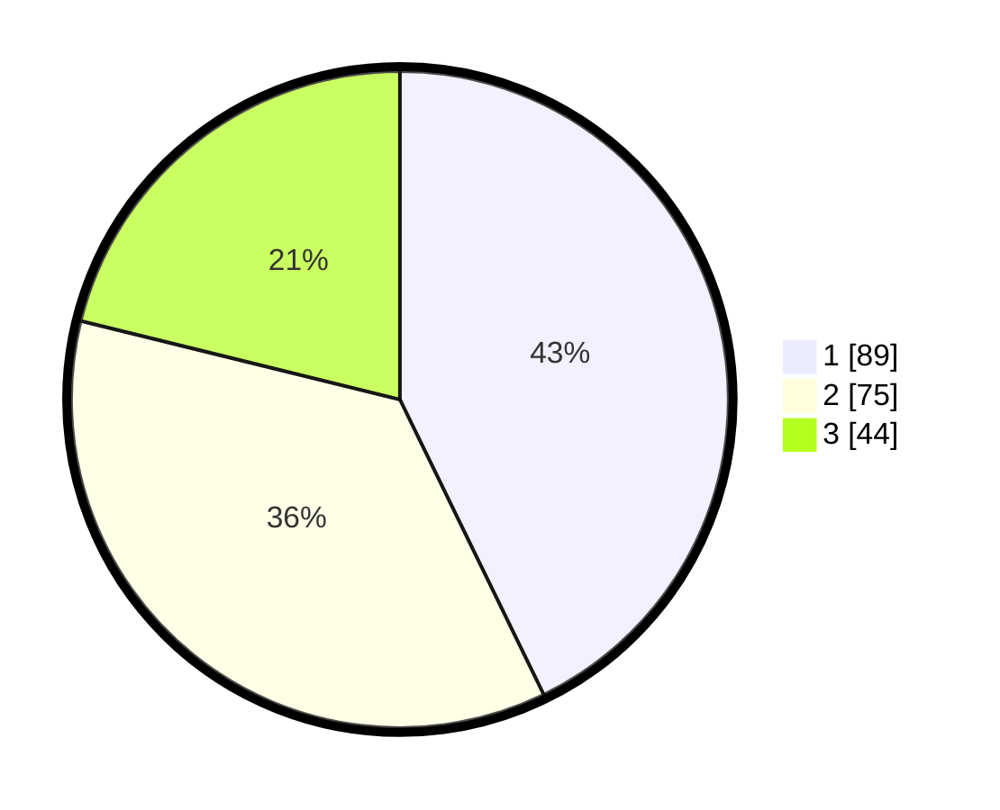

# Hasil

## Grafik

## Tabel

| No. | Nama Paslon    | Suara | Suara (raw) | Persentase |
|:--- |:-------------- | -----:| -----------:| ----------:|
| 1   | ANIES MUHAIMIN | 89    | [89][p-1]   | 42,79      |
| 2   | PRABOWO GIBRAN | 75    | [75][p-2]   | 36,06      |
| 3   | GANJAR MAHFUD  | 44    | [44][p-3]   | 21,15      |

[p-1]: https://github.com/gigit-pemilu/pemilu-2024-16-sumatera-selatan/blob/main/pilpres/hitung-suara/sub/16-sumatera-selatan/sub/71-kota-palembang/sub/07-sukarami/sub/1007-kebunbunga/sub/020-tps/sub/paslon-1.txt
[p-2]: https://github.com/gigit-pemilu/pemilu-2024-16-sumatera-selatan/blob/main/pilpres/hitung-suara/sub/16-sumatera-selatan/sub/71-kota-palembang/sub/07-sukarami/sub/1007-kebunbunga/sub/020-tps/sub/paslon-2.txt
[p-3]: https://github.com/gigit-pemilu/pemilu-2024-16-sumatera-selatan/blob/main/pilpres/hitung-suara/sub/16-sumatera-selatan/sub/71-kota-palembang/sub/07-sukarami/sub/1007-kebunbunga/sub/020-tps/sub/paslon-3.txt

## Foto C Plano

https://sirekap-obj-formc.kpu.go.id/ad60/pemilu/ppwp/16/71/07/10/07/1671071007020-20240215-022914--f547be1d-ec4e-4667-8243-f6e703f42f46.jpg

https://sirekap-obj-formc.kpu.go.id/ad60/pemilu/ppwp/16/71/07/10/07/1671071007020-20240214-155054--ddf426e8-d59f-4dd3-857f-ee04eb413a61.jpg

https://sirekap-obj-formc.kpu.go.id/ad60/pemilu/ppwp/16/71/07/10/07/1671071007020-20240214-155059--6e313e6d-cb7b-4f8d-b545-4b7135c98179.jpg

## Metadata

| Key        | Value               |
| ---------- | ------------------- |
| Time Stamp | 2024-02-15 03:06:03 |

