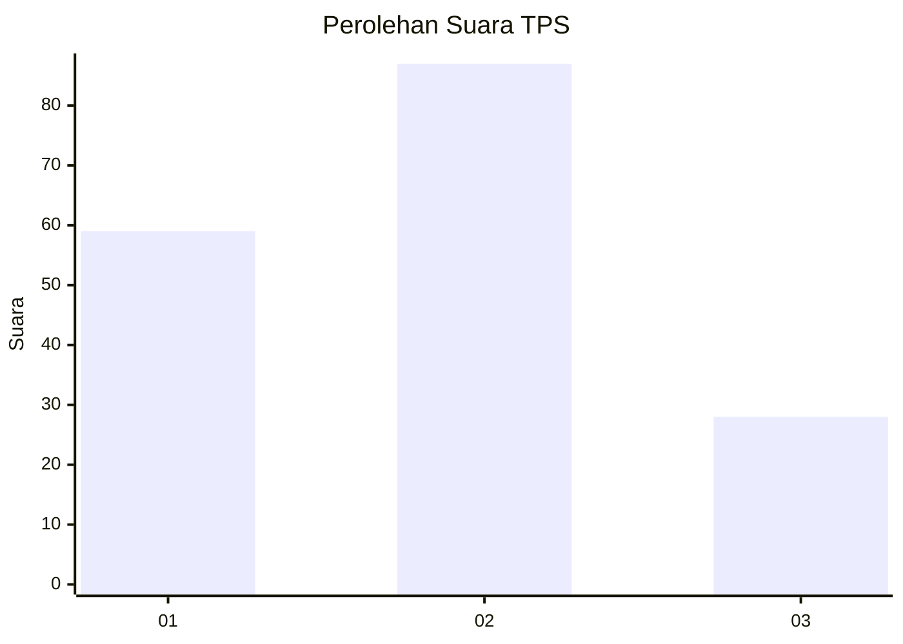
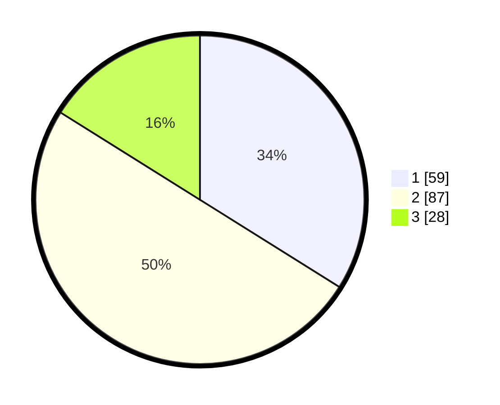

# Hasil

## Grafik

## Tabel

| No. | Nama Paslon    | Suara | Suara (raw) | Persentase |
|:--- |:-------------- | -----:| -----------:| ----------:|
| 1   | ANIES MUHAIMIN | 59    | [59][p-1]   | 33,91      |
| 2   | PRABOWO GIBRAN | 87    | [87][p-2]   | 50,00      |
| 3   | GANJAR MAHFUD  | 28    | [28][p-3]   | 16,09      |

[p-1]: https://github.com/gigit-pemilu/pemilu-2024-16-sumatera-selatan/blob/main/pilpres/hitung-suara/sub/16-sumatera-selatan/sub/71-kota-palembang/sub/07-sukarami/sub/1007-kebunbunga/sub/021-tps/sub/paslon-1.txt
[p-2]: https://github.com/gigit-pemilu/pemilu-2024-16-sumatera-selatan/blob/main/pilpres/hitung-suara/sub/16-sumatera-selatan/sub/71-kota-palembang/sub/07-sukarami/sub/1007-kebunbunga/sub/021-tps/sub/paslon-2.txt
[p-3]: https://github.com/gigit-pemilu/pemilu-2024-16-sumatera-selatan/blob/main/pilpres/hitung-suara/sub/16-sumatera-selatan/sub/71-kota-palembang/sub/07-sukarami/sub/1007-kebunbunga/sub/021-tps/sub/paslon-3.txt

## Foto C Plano

https://sirekap-obj-formc.kpu.go.id/70e9/pemilu/ppwp/16/71/07/10/07/1671071007021-20240214-211858--607f54f6-fc00-4180-9a6e-69bf5d8709db.jpg

https://sirekap-obj-formc.kpu.go.id/70e9/pemilu/ppwp/16/71/07/10/07/1671071007021-20240214-212840--439c6e6d-5201-4472-b624-ad55275cdb51.jpg

https://sirekap-obj-formc.kpu.go.id/70e9/pemilu/ppwp/16/71/07/10/07/1671071007021-20240214-212920--c0e65788-5cce-4314-8ddd-a151927387d9.jpg

## Metadata

| Key        | Value               |
| ---------- | ------------------- |
| Time Stamp | 2024-02-25 14:00:00 |

